Programming Boot Camp Learning Phase #3

# Bubble Basic #2

## 2024/11/23

---

## Preparation

- Today, we will add design and logic to the pet health management app we created last time.
- After that, we will talk about applications such as API integration and team development.
- Since we have made some modifications for today's lecture, we will have you use a duplicate of the application we have prepared on our side to align the starting point.
- We will distribute the duplicate application, so please send the email address where you created your Bubble account to `@imahashi`.
- Also, please register about five pets to check the operation.
  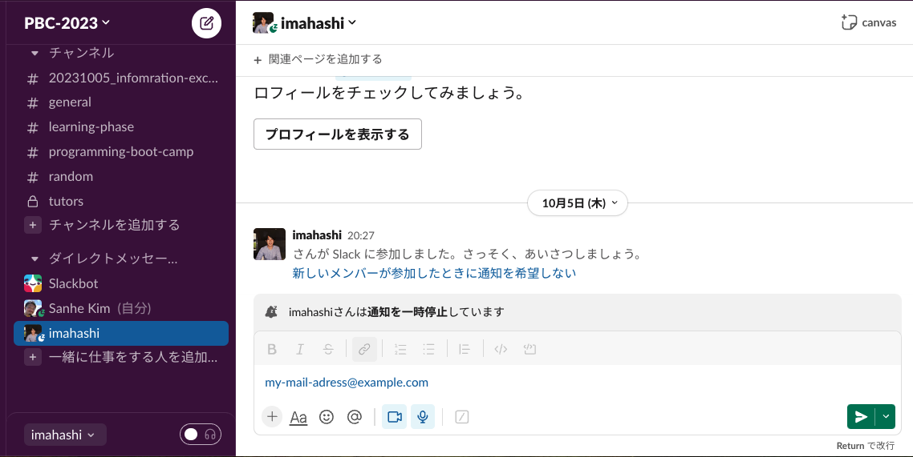

---

## Agenda

- Review of last lesson
- Create a design
- Create logic
- Connect with external systems
- Develop as a team

---

## Review of the lesson before last

- [Bubble](https://bubble.io/) is a visual programming tool that allows you to program the appearance and behavior of things by tapping on the screen.

- It is based on the premise of a web application, and is compatible with smartphones and PCs by making adjustments to the display size.

- If you missed the last lesson, catch up with this document
- https://github.com/GuildWorks/isct-pbc-2024/tree/main/docs/learning-phase-1/Bubble1/pdf

---

## Review of the previous lesson

While creating the screens for registering, listing, detailing, and recording weight of pets in the pet management application, we learned how to use Design/Workflow/Data, which are the basics of Bubble.

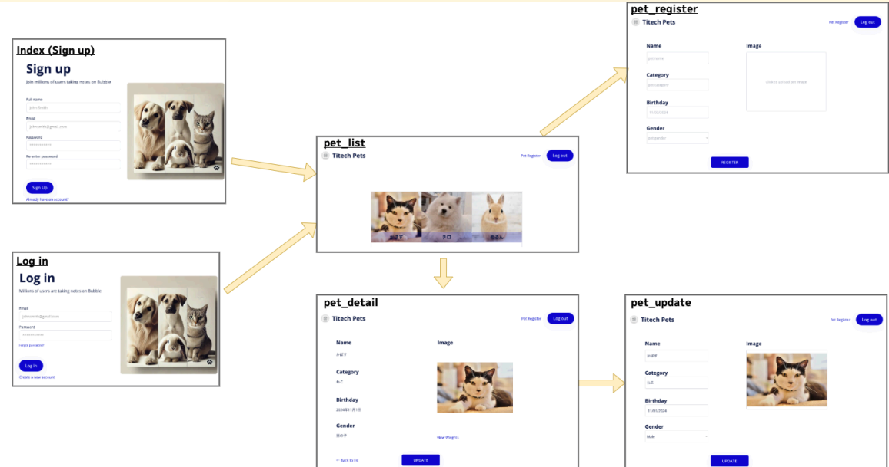

---

## What to do today

First, we will further develop the design and logic of the application from last time

---

## It will ultimately look like this

### Pet list (switch between PC/smartphone display)

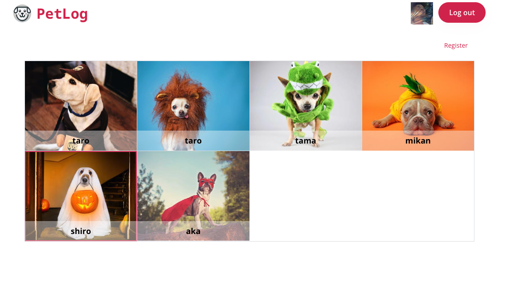

---

### Pet details (data processing and display using logic)

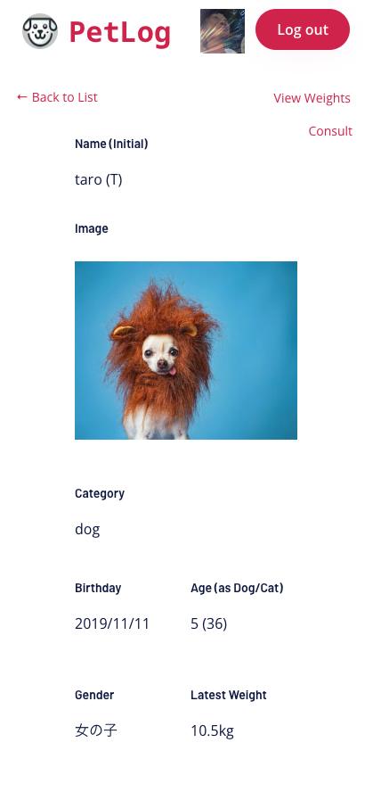

---

### Pet list for advisors (logic-based permission control)

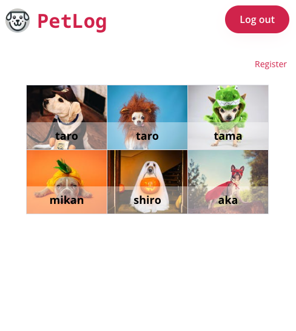

---

### AI pet advisor (integration with ChatGPT)

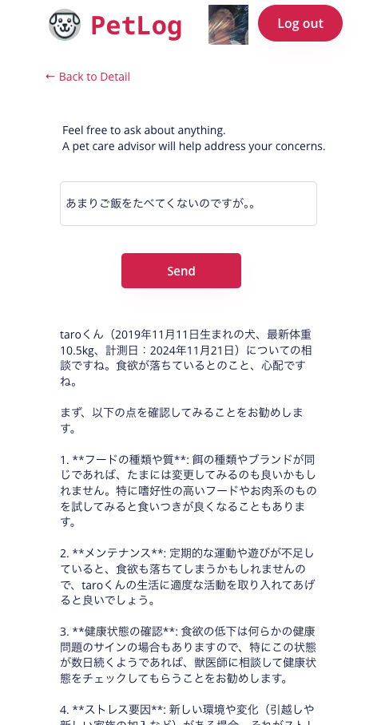

---

### Video search (integration with YouTube)

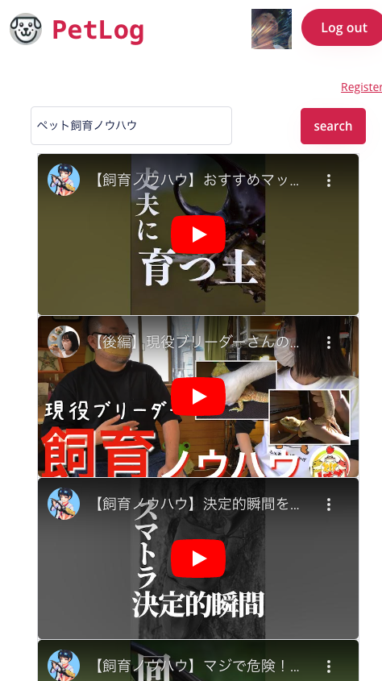

---

### Google login (integration with Google)

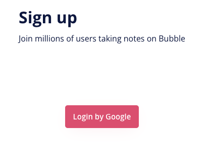

---

### Let's get started.

### First, let's create the design

---

# Let's go mobile first

This time, we will be creating the site with smartphone screen size as the main focus.

The approach of optimizing the experience and design for mobile devices is called "mobile first."

Smartphones have surpassed PCs in the use of Internet services, and depending on the service and business phase, it is often the case that smartphones and other mobile devices are prioritized.

---

# What does mobile first do?

- Responsive design: Create a design for smartphones and adjust the display for PCs and tablets.

- Touch operation priority: Mainly use fingers rather than a mouse to operate, so make buttons and links easier to press.

- Fast loading: Prioritize lightweight design while considering the speed and limitations of mobile data communication.

---

# How do you do mobile first with Bubble?

The easiest way to do this is to set the page width to a smartphone width from the development stage. Let's try it out.

---

# First, open an empty page.

- Open the app that was distributed to you today
- Click on the `Page:xxxxx` part to the right of the b logo in the upper left corner of the screen
- Click on `Add a new page...`
- Give it a name and click on `Create`. This will create an empty page.

---

# If you create it simply with the initial settings, it will be optimized for PCs

- You may not have noticed this in the previous meeting, but at this point the screen width is wider than that of a PC.
- If you simply create an application with this screen width, it will not be suitable for display on a smartphone.
- As an experiment, try placing large images side by side.

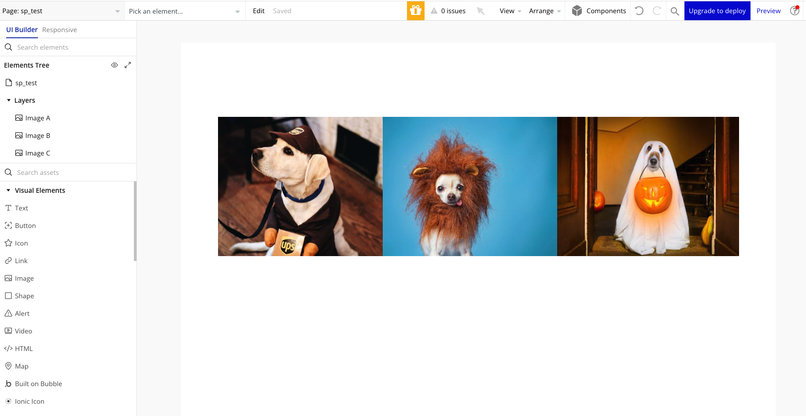

---

# Images are cut off at the smartphone screen width

Let's preview it.
It should display fine on a PC, but it will be cut off on a smartphone.

- Try narrowing the window size on your PC, or send the URL for the demo display to your smartphone and view it on your smartphone.

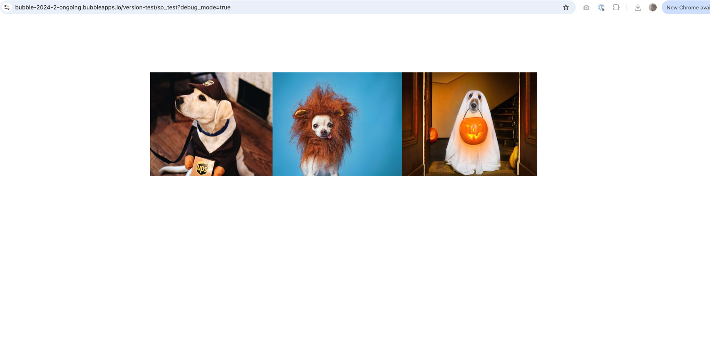　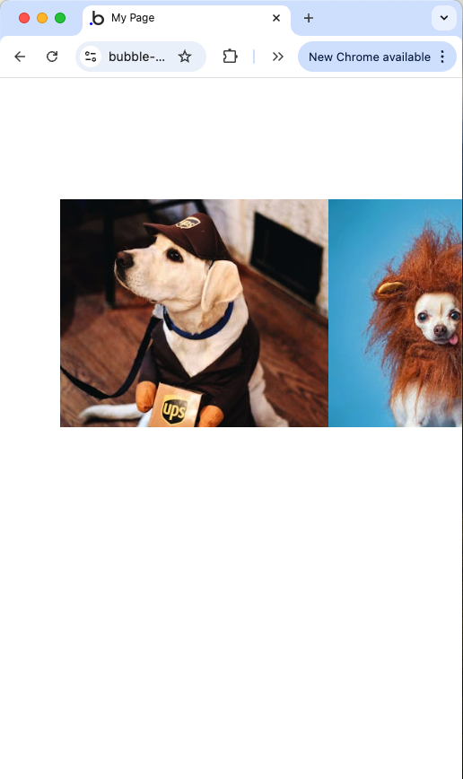

---

# Develop with smartphone screen width in mind

The simplest solution would be to make the screen not too wide by considering the smartphone screen width, but since it is difficult to develop as is, set the screen width during development to the smartphone screen width.

---

# Set to smartphone screen width

- Open the Design view of the screen you just created (it should be open)
- Click on the gray area outside the screen to select the screen itself
- Open the `Layout` tab
- Set `Width` to `400` and `Height` to `1200`.

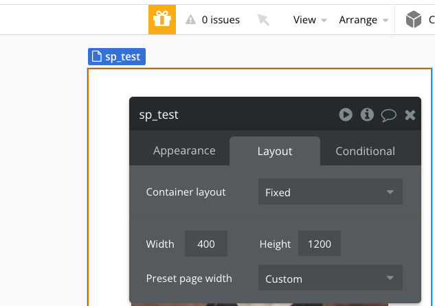

---

# Adjust the layout to fit the smartphone screen width

- Modify the images so that they are nicely aligned at that width.

- If you want to align them neatly in the center, select all of them while holding down Shift, right-click (or double-tap), and select `Center horizontally` to center them all.

It looks like this.

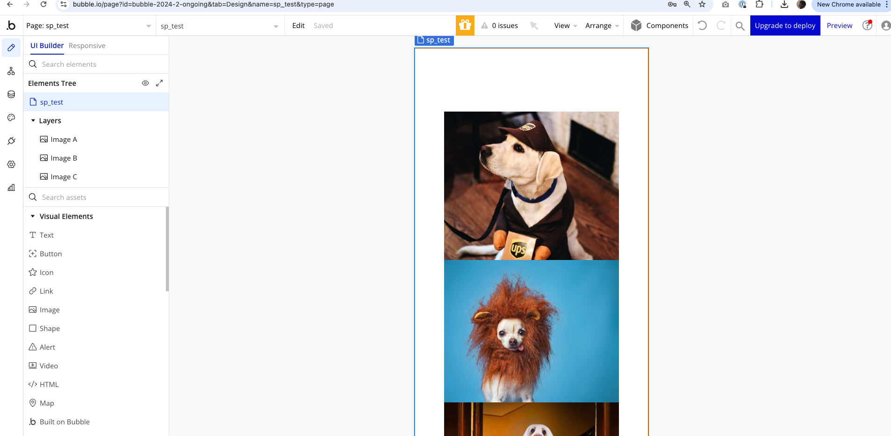

---

# It looks like this

The display is optimized for smartphones.

It's a waste of width on a PC, but it can be displayed and used on a PC. It's the simplest and most powerful solution that prioritizes mobile, and is powerful in phases where smartphones are the main focus.

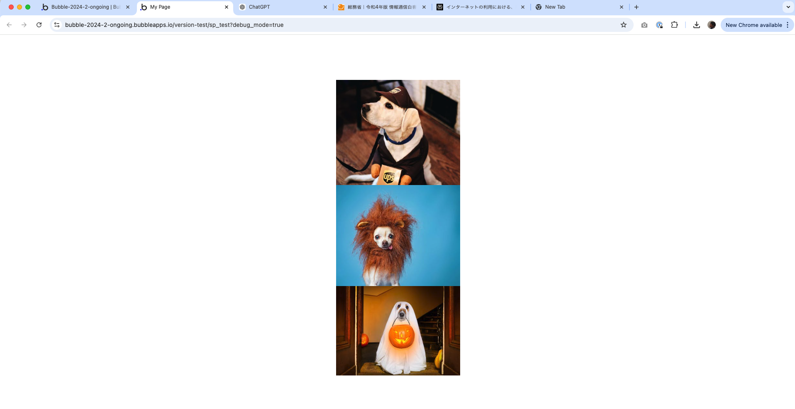　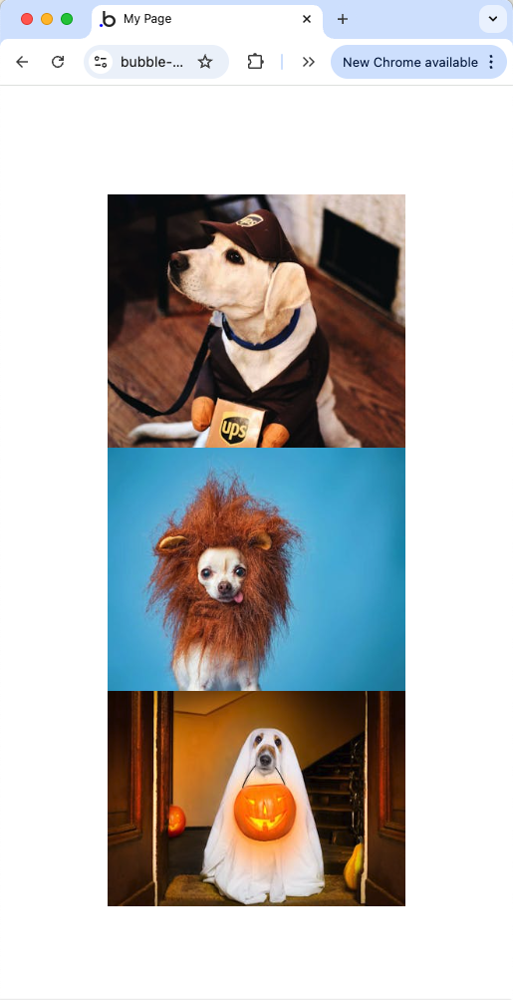

---

# About responding to various display sizes

Although it is generally called mobile, there are various display sizes.

There are smartphones and tablets. Also, even if you just say smartphones, there are smartphones with large screens like the iPhone Pro MAX and ones that can be spread out widely like the Galaxy Fold.

Since there are various display sizes, it is possible to respond more finely to all display sizes.

The method for doing this is a method called responsive web design. We will touch on this later.

---

# Let's go mobile first

The Bubble app that we are distributing to you this time is the content that Kyogoku lectured on two days ago, re-layed out with a screen width of 400 using the method mentioned above. This is what I'm using today.

Now, let's go back and talk about design.

---

### What to do when designing

- Create a screen that matches the display size

- Use a technique called responsive web design to control the appearance according to the display size

- Let's try using Style

- Edit/add Styles, or apply styles individually

---

## Create a screen that matches the display size

---

## Create a screen that matches the display size

- Web applications are used on a variety of devices, including PCs, tablets, and smartphones.

- Each device has a different display size, and there is a design technique called responsive web design to deal with these.

- This is a technique that allows elements to flexibly change appearance depending on the screen size, such as expanding/shrinking, wrapping/not wrapping, and displaying/not displaying.

- To achieve this, rather than specifying a fixed position or size, you specify rules for determining the position and size.
- In Bubble, the initial settings are fixed for positioning and size, but you can also specify various rules.

---

## Commonly used rules

The following are some commonly used rules to achieve responsive design in Bubble.

1. Positioning rules within parent elements

2. Rules for determining element size

3. Display rules

Combining these rules will achieve responsive screen design.

Note that these rules are not limited to Bubble, but are also common to web applications in general.

We will incorporate them into the screen together later, but there are some difficult concepts, so we will first explain the overview.

---

## Rule 1: Positioning rules within parent elements

This is the rule for how to position within a parent element.

In Bubble, parent elements that surround individual elements, such as groups such as repeating groups or entire pages, are called Containers.

In a Container, you can specify the positioning rules for the child elements contained within it.

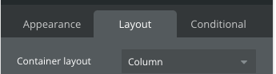

---

There are four rules for arranging child elements.

- Fixed: Specify a fixed placement location
- Align to parent: Specify a relative position to the parent element
- Row: Arrange in the row direction (horizontal direction)
- Column: Arrange in the column direction (vertical direction)

I will explain them in order.

---

## Fixed: Specify a fixed placement location

This rule specifies a fixed placement location. Specify the placement location in pixels.

This is the initial setting when placing a parent element with Bubble.

Since it is specified as a fixed location, it will not change from the specified position even if the screen width is changed. In the example below, it is protruding outside the screen.

→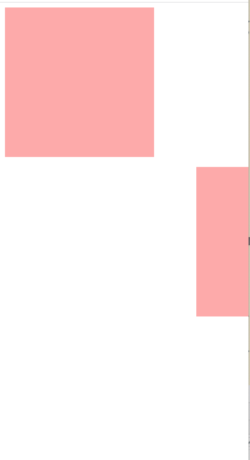

---

## Align to parent: Specify the relative position to the parent element

This is a rule that specifies the relative position to the parent element.
In Bubble, you can specify the placement location from nine areas.
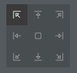

When the screen width is changed, it moves while maintaining the relative position. In the example below, when the screen width is narrowed, it moves while maintaining the relative positions of the top left, center, and bottom right.
→

---

## Row: Arrange in row direction (horizontal direction)

This is the rule for arranging in row direction (horizontal direction). Rows will wrap automatically.

In the example below, when the screen width is narrowed, the rows will wrap and as a result will be arranged vertically.

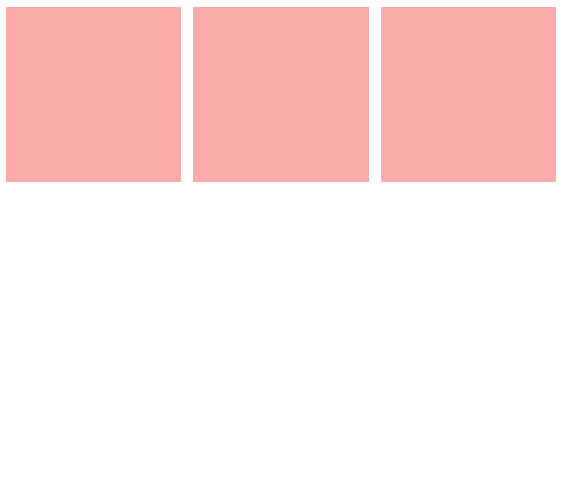→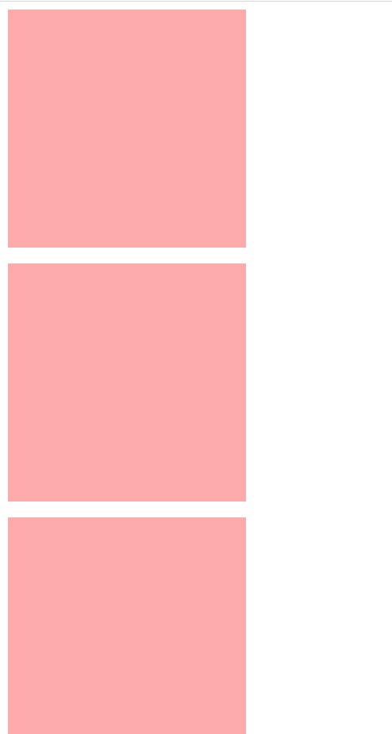

---

## Row: You can specify the horizontal (left and right) alignment within the row

You can specify the vertical alignment within the row for each element.
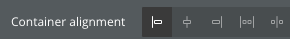 　(Left-aligned) 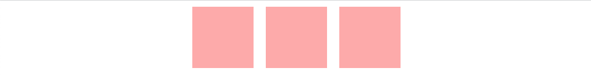　(Centered) 　(Right-aligned) 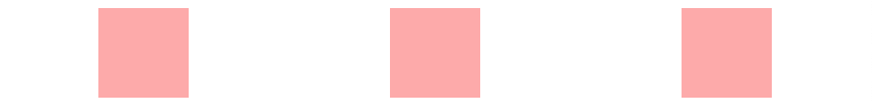　(Space-around) 　(Space-between)

---

## Row: You can specify the vertical (up and down) alignment within a row

You can specify the vertical alignment within a row.
\*This is specified for child elements, not parent elements.

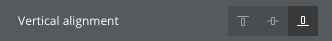
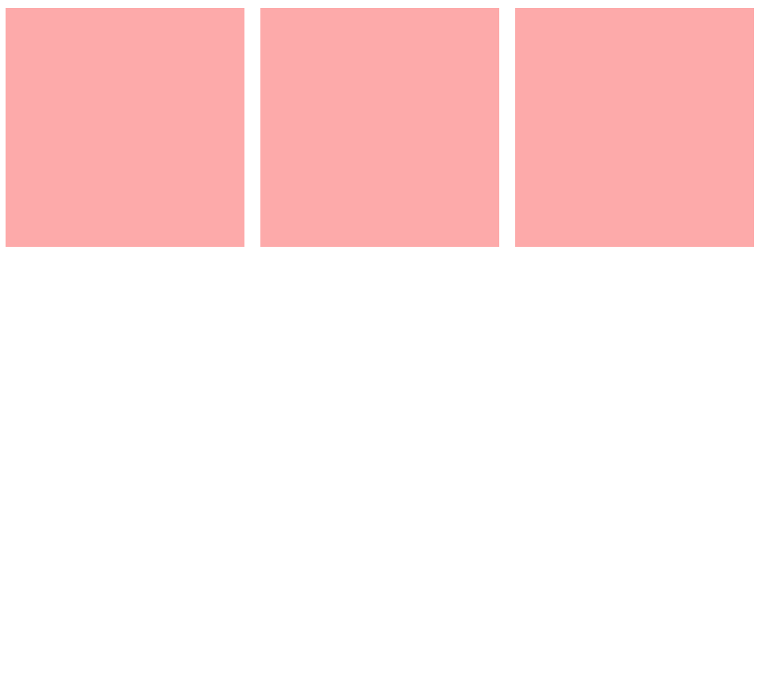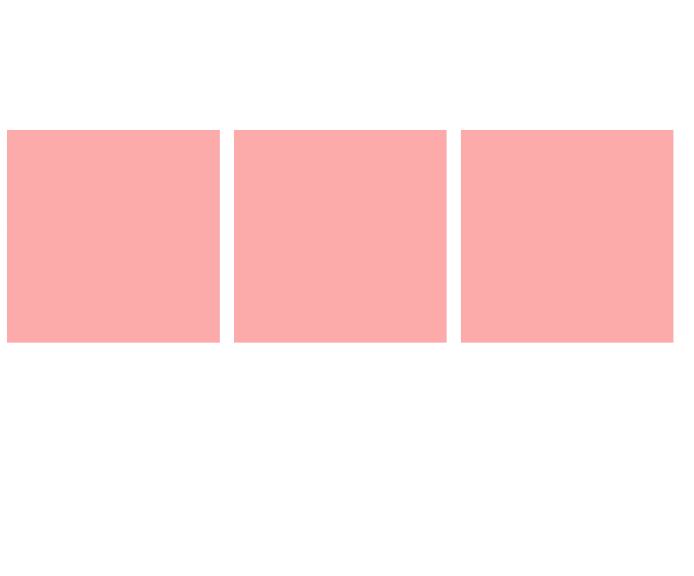

---

## Column: Arrange in columns (vertical direction)

Arrange in columns (vertical direction).

The example below is vertically aligned with left and right center alignment, and even if the screen width is reduced, the vertical alignment is maintained.
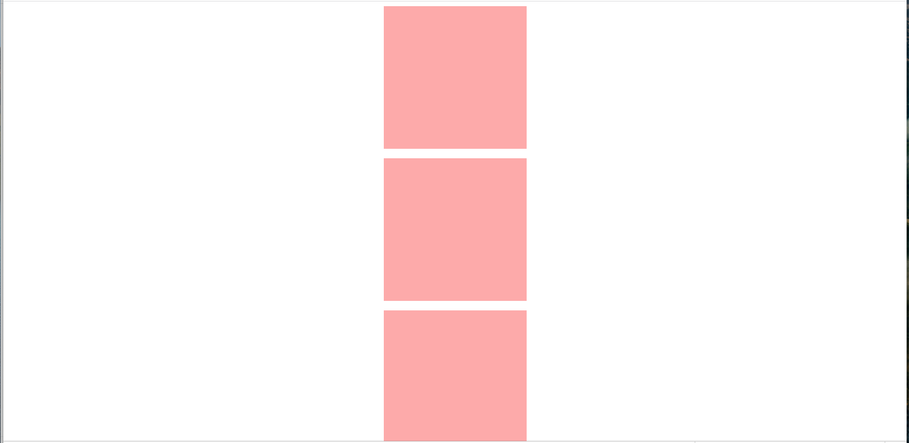→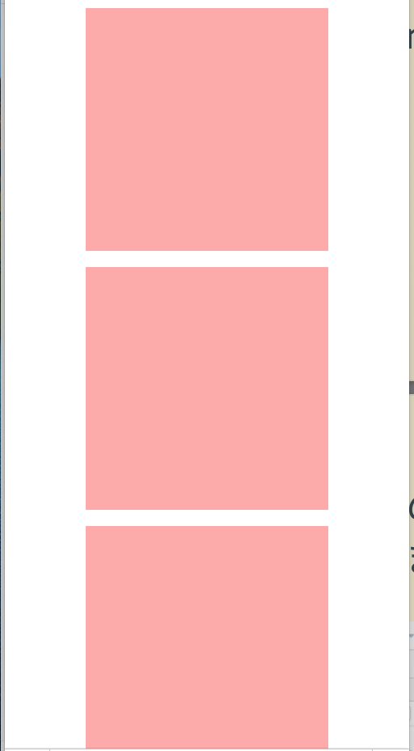

Similar to Row, you can specify horizontal and vertical alignment. (The contents that can be specified for horizontal and vertical are opposite.)

---

## Rule 1 (Recap): Placement rules within parent element

This is the rule specification for how to place it within the parent element.

There are four placement rules for child elements.

- Fixed: Specify a fixed placement location
- Align to parent: Specify the relative position to the parent element
- Row: Arrange in the row direction (horizontal direction)
- Column: Arrange in the column direction (vertical direction)

---

## Rule 2: Element size determination rule

In order to allow the size to increase or decrease depending on the screen width, specify a rule for determining the size rather than specifying a fixed size. You can mainly use one of the following two methods.

- Specify a percentage of the parent element's size

- Specify the maximum and minimum size when stretched

- \*You can also leave the maximum and minimum values ​​unspecified and leave it unlimited

---

## Percentage specification

In the example below, the width is specified to be 80% of the screen. If the screen width is reduced, the image size will also be reduced while maintaining the 80% ratio.

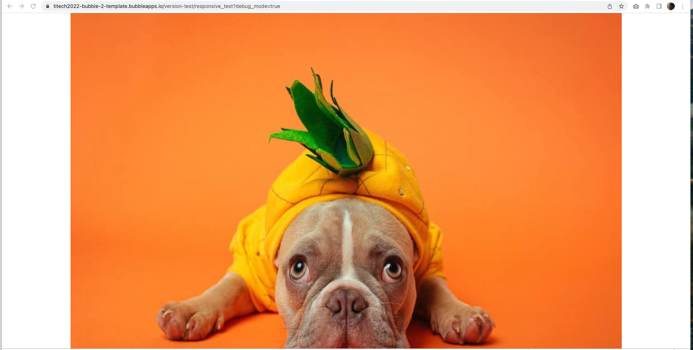→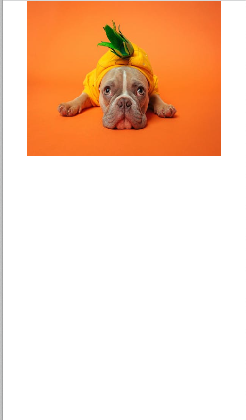

---

In the example below, the width is specified to be a maximum of 800px and a minimum of 300px.

It stretches between 300px and 800px, but even if you expand the screen, it will not become larger than 800px, and conversely, even if you narrow the screen, it will not become smaller than 300px.

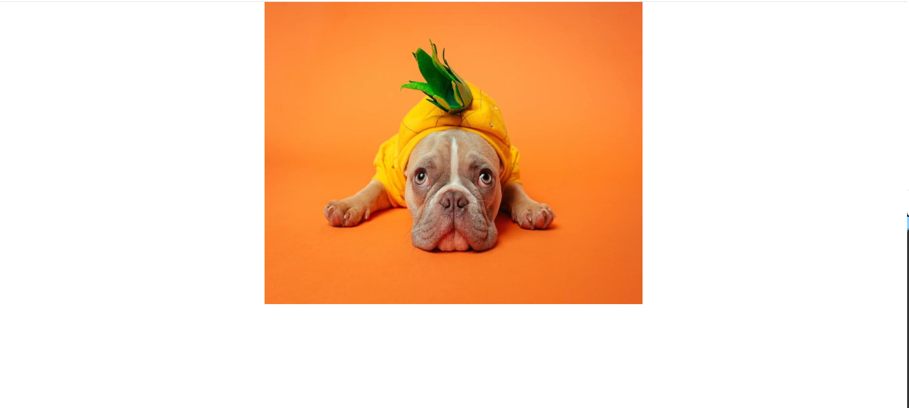 → 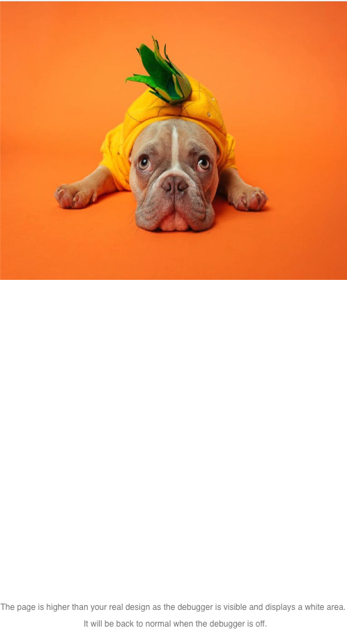

---

## Rule 3: Display/Hide Rule

You can specify the minimum and maximum screen width to toggle the display of elements on the screen.

The example below specifies that the image will not be displayed if the screen width is 992px or less.

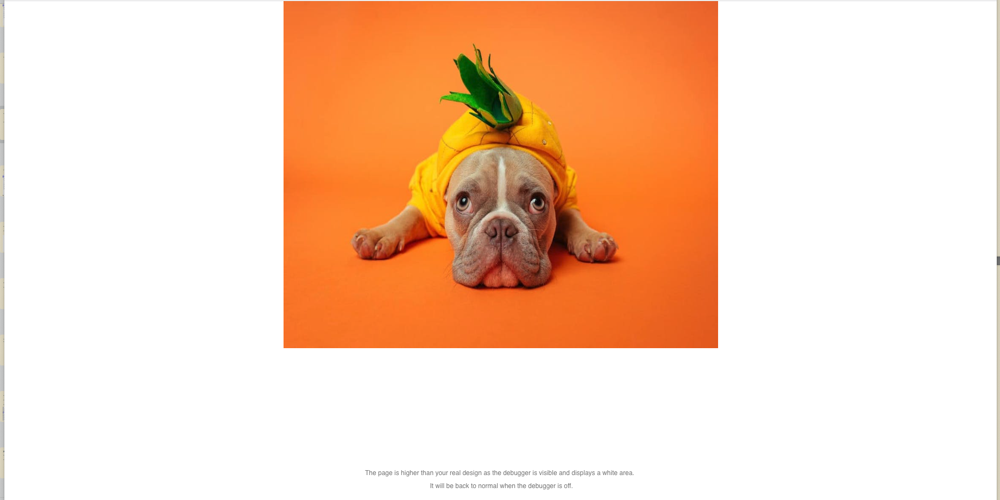 → 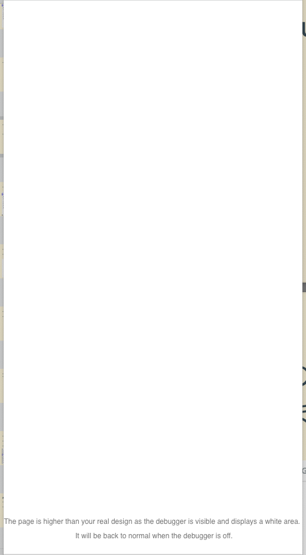

This is often used when you want to display more information only when the screen is large.

---

## Commonly used rules (review)

The following are some commonly used rules to achieve responsive design with Bubble.

1. Placement rules within parent elements
2. Rules for determining element size
3. Rules for display

Now, let's actually use it.

---

## (Review) Advance preparation

- Today, we will add design and logic to the pet health management app we created last time.
- Since we have made some modifications for today's lecture, we will have you use a duplicate of the application we have prepared on our side to ensure that you start from the same point.
- We will distribute the duplicated application, so please send the email address you used to create your Bubble account to `@imahashi`.
- Also, please register about five pets to check the operation.


---

## Apply responsive design to the pet list page

Apply responsive design to the pet list page.

Use the following rules.

1. Placement rules within the parent element
2. Element size determination rules

We will also combine size specifications and settings for responsiveness specific to repeating groups.

---

## Finished image

When supported, the number of columns will flexibly change to the screen width, and all pets can be viewed in a list.

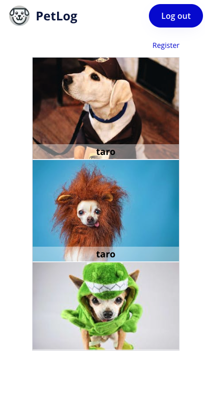→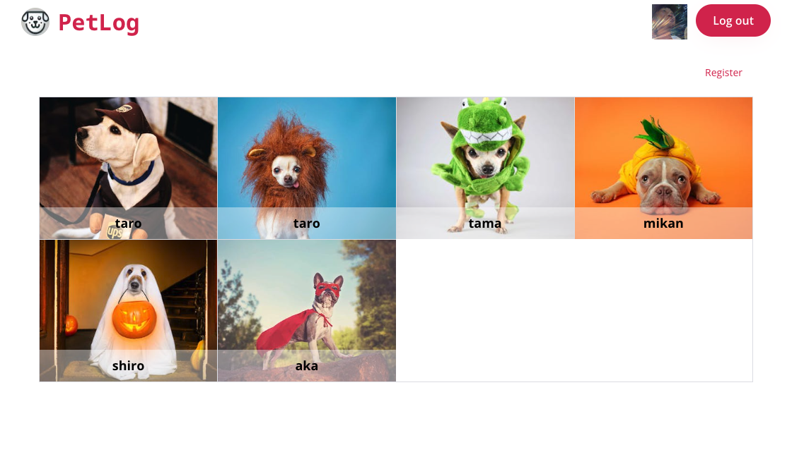

---

First, let's change the `Container layout` of the parent page.
This time, specify `Column`.

- Open the `pet_list` screen
- Double-click a blank part of the page to open the settings window for the page itself
- Specify the Layout tab in the settings window
- Change `Container layout` to `Column`

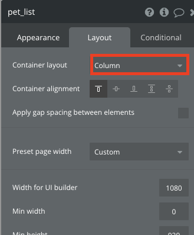

---

Then, the elements on the screen will be automatically lined up vertically.
The child elements directly under the parent element set with `Column` will be automatically aligned in the column direction (vertical direction). We will arrange them based on this arrangement.

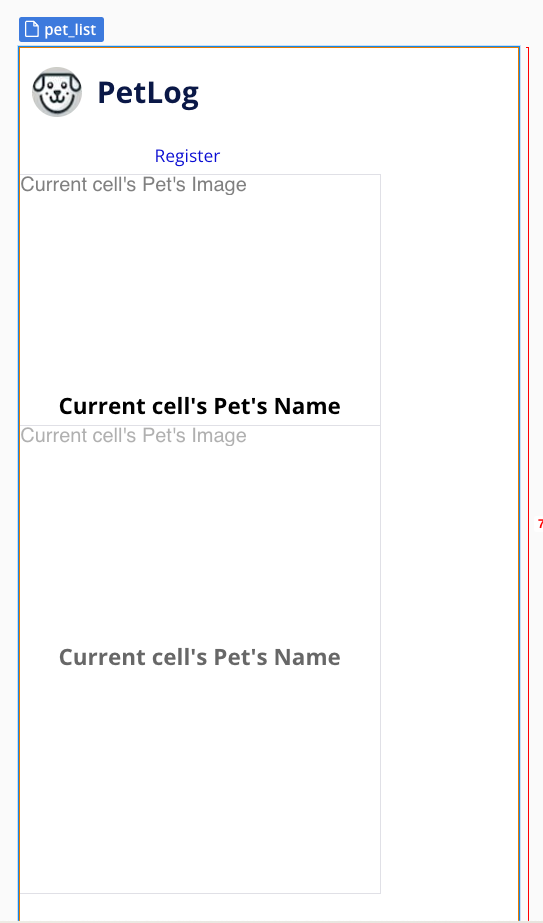

---

Next, we will enter settings for the repeating group.

- Open the repeating group `pet list` settings window and go to the `Layout` tab
- Enter the following settings
- Horizontal alignment:`centered`

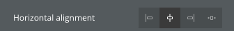

The elements directly below the pet list page are arranged in a column direction, and this repeating group will be aligned centered left and right.

---

Additionally, enter the following settings

- Make this element fixed-widtht: Unchecked
- Min width: 300px
- Max width: 1010px

The width of this repeating group is not fixed, but flexibly expands and contracts depending on the width of the parent element (here, the screen itself). However, since it is difficult to see at extreme sizes, the minimum width is set to 300px and the maximum width is set to 1010px.

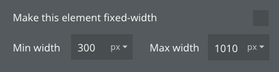

---

Enter the following settings

- Make this element fixed-height: Unchecked
- Min height: Unspecified
- Max height: Unspecified (inf) \*Probably an abbreviation for infinity
- Fit height to content: Checked

This repeating group's height is not fixed, but is set to expand and contract indefinitely to fit the contents.

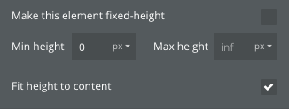

---

Next, move to the `Appearance` tab in the repeating group settings window.

Set the following:

- Set fixed number of rows: Unchecked
- Min height of row: 200px
- Set fixed number of columns: Unchecked
- Min width of column: 250px

The number of columns and rows is not fixed, but the minimum width of the rows and columns is specified. This allows the number of rows and columns to be flexibly changed depending on the size of the table while maintaining the minimum width.

---

Now, let's display the preview.

It's still ugly, but the number of columns and rows now changes according to the width of the screen and the width of the table.

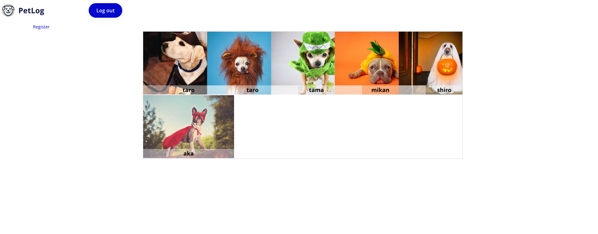　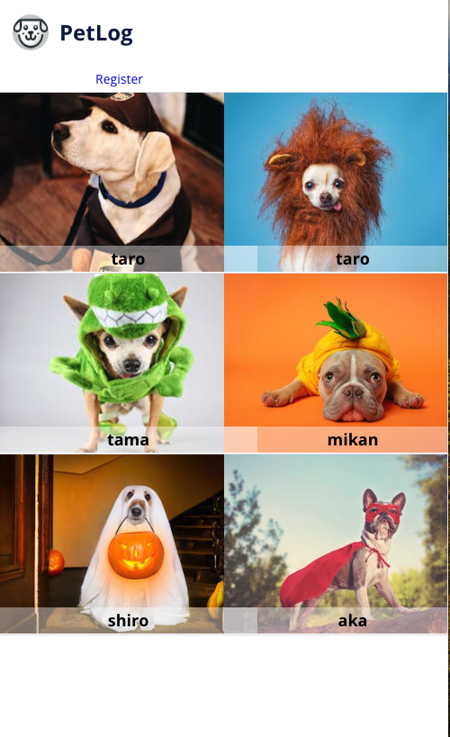

However, the cells are shifted to the left, and unintended margins are created when the width is reduced. Let's fix this.

---

Go back to the Layout tab of the repeating group settings window.

Set the following:

- Cell's container layout: Align to parent

You can now position elements relative to their parent element (in this case, each cell in the repeating group).

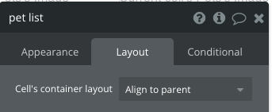

---

Next, we will lay out the elements in the cell.

The elements are overlapping and difficult to select, so we will specify them from the `Elements tree` on the left side of the screen.

- At the top of the `UI Builder` in the Design menu, there is a section called `Elements tree`.
- If `Only show hideable` is checked, uncheck it.
- \*If only `pet list` is displayed, click `+` to open the tree.

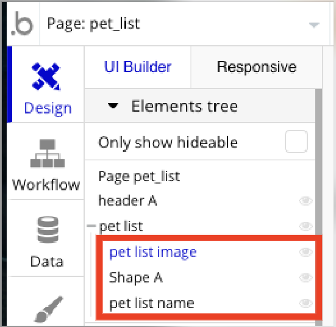

---

Now, let's start by setting `pet list image`.

- Click `pet list image` in `Elements tree` to open the settings window
- Set the same as the image on the right in the `Layout` tab.

The setting is to place it in the center of the cell and display it large to fill the cell while maintaining the aspect ratio of 4:5.

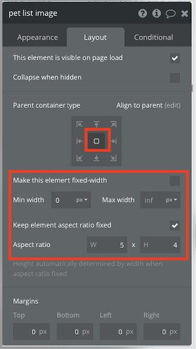

---

Next, put the same settings as the image on the right into the Layout of Shape A.

It will be placed at the bottom of the cell and displayed large to the left and right while maintaining a height of 45px.

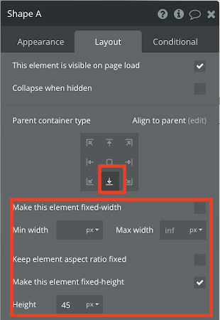

---

Next, put the same settings as the image on the right into the Layout of pet list name.

It's the same as Shape A.

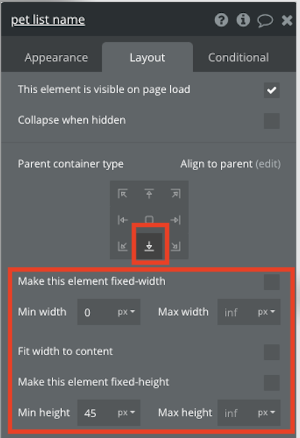

---

Preview.

Too bad. The only thing left to worry about is the header position and margins.

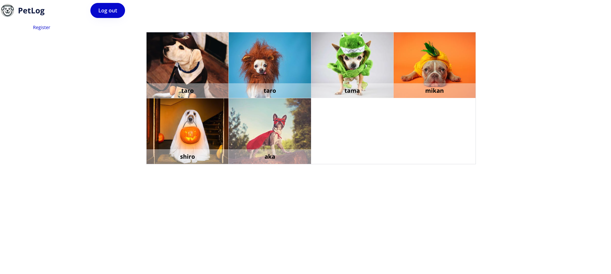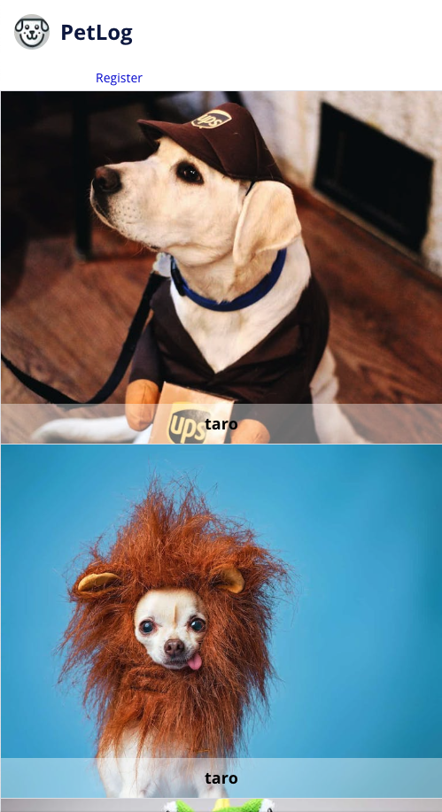

---

Open the header settings window and enter the settings on the right into `Layout`.

When arranged in columns on a page, they will be displayed centered. The width will not be fixed, but will stretch up to a maximum of 1080px depending on the page width. A margin of 20px will be left at the bottom. These are the settings.

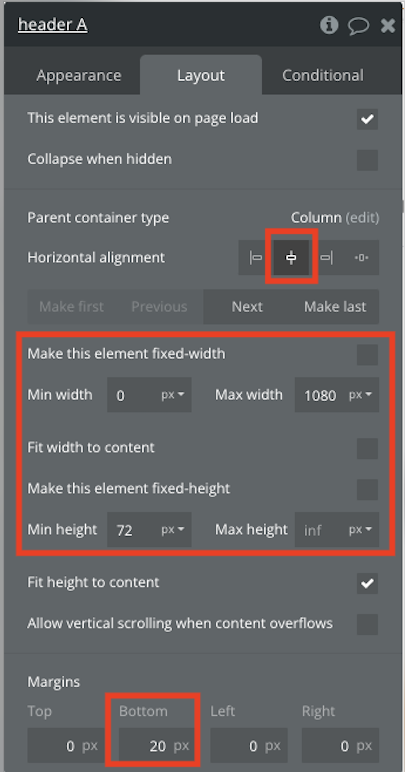

---

Next, open the settings window for the Register link and enter the settings on the right into `Layout`.

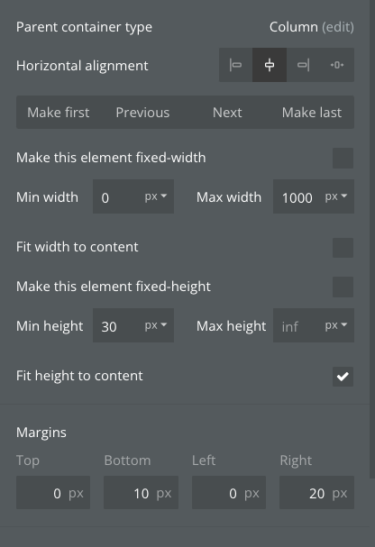

---

## About Magn and Padding

This is the first time the word Margin has appeared, so let me explain.

There are two words that describe margins: Margin and Padding, and each has the following meaning.

- Margin: The outer margin of the element's border
- Padding: The inner margin of the element's border

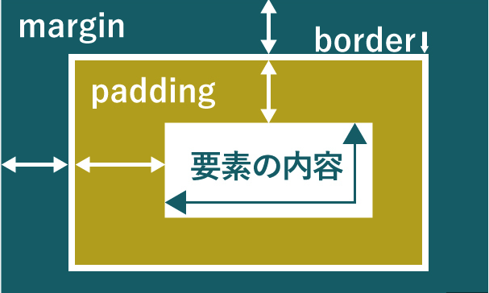

Please keep this in mind when you want to use different margins inside and outside the border.

---

In addition, we will also add margins to the repeating group.

Please set the following in the `Layout` tab of the repeating group.

This will set the top and bottom margins to 10px, and the left and right margins to 50px.

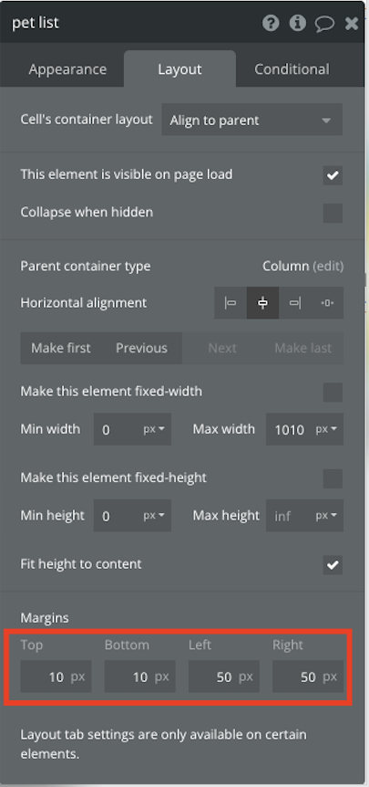

---

Now let's preview it.

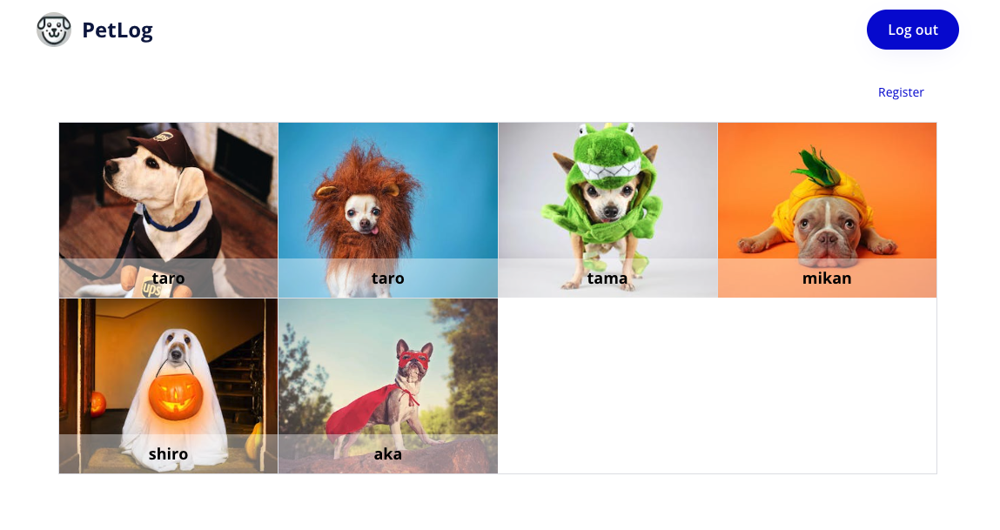

Yay!

---

### <Excercise>

## Apply responsive design to the pet details screen

The pet details screen is not able to take advantage of the wide PC screen, so let's make it responsive.

---

## Step 1: Stretch according to the screen width \*Difficulty: Medium

Hint

- Use Column to vertically arrange the placement rules within the parent element.
- Stretch each element according to the screen width.

---

## Step 2: Change the columns according to the screen width \*Difficulty: High

Hint

- Group the child elements into groups of about 2.
- Switch the columns by arranging the groups vertically or horizontally according to the screen width. (Enclose the group you want to switch columns in another group and set the layout rule to Row.)

---

## Commonly used rules (review)

The following are some commonly used rules to achieve responsive design in Bubble.

1. Layout rules within parent elements
2. Rules for determining the size of elements
3. Display rules

Combine these to apply responsive design.

---

## Let's try using Style

---

## Let's try using Style

- Up until now, we have used the styles that Bubble provides as standard.
- In an actual product, we will draw and apply a design concept that suits the product.
- From here, we will explain how to change the style.

---

## There are three main ways to apply Style.

- Edit an existing style.
- Apply a style individually.
- Add a new style.

Let's go through them in order.

---

# Edit an existing style.

First, we will change the existing style to change the color of buttons and links.

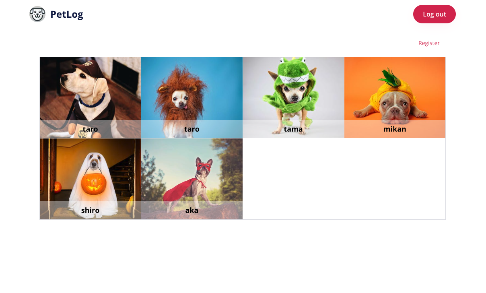

---

## Let's try using Style variables.

In Bubble, the basic colors and fonts are set as `Style variables`.

Go to `Styles` in the left menu > `Style varilables` in the tab at the top of the screen. The color specified here can be used when creating or editing a style. For example, the color setting Primary means the base color and is used in the Primary button, etc.

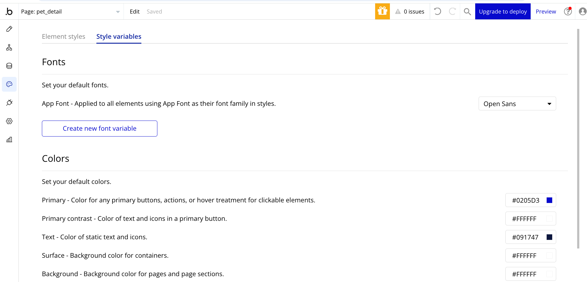

---

When you change the `Primary` setting in `Style variables`, the change is applied to all parts where it is used.

- Select `Styles` in the left menu > `Style varilables` in the tab at the top of the screen

- Change Primary. (I want a dark red, so I specify `#D62755`.)

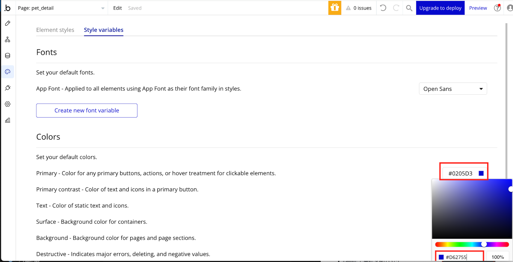

---

If you check the style of the Primary button, you will see that it has been changed.

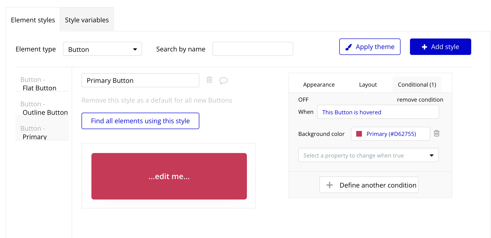

---

## Preview

Let's preview the screen.
The color of the basic buttons and links, such as the login/logout button, has changed.


---

## When to use style variables

In this way, you can change the standard base color all at once by editing `Style variables`. Also, when creating or editing a new style, you can set your own rules and use `Style variables` to make maintenance easier, such as changing them all at once later.

---

## Next, let's specify individual styles

I want to match the header logo to the base color, and make the font a little cuter.


---

b Open the menu to the right of the logo and select header

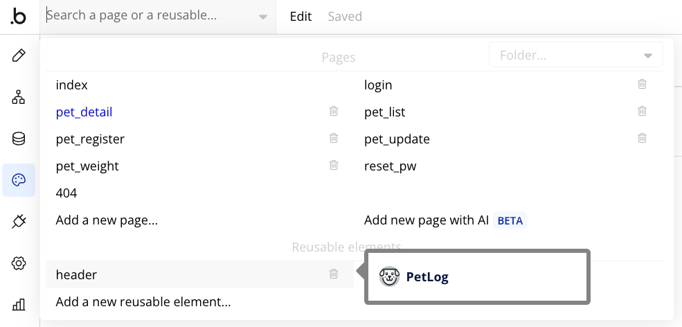

---

- ​​Double-click the logo to open the settings
- Go to the `Style` section of the settings window
- Click `Detach style` at the bottom right of the pull-down
- You can specify individual styles instead of applying the defined styles

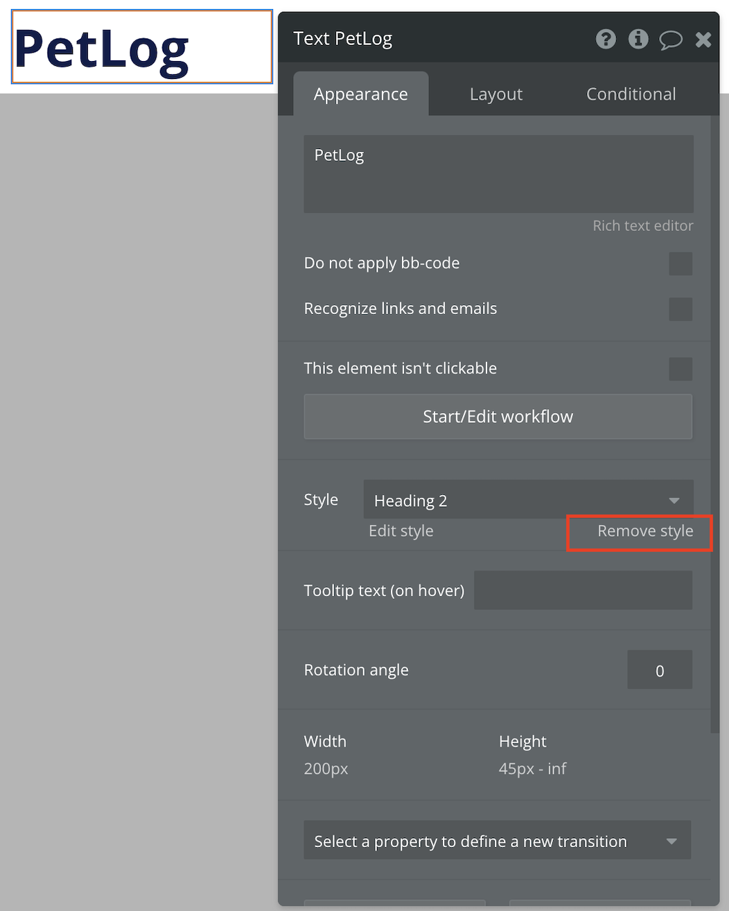

---

Specify your favorite style

- For the font color, I used the Primary color specified in `Style variables`
- I liked the font `Noto Sans Mono`, so I specified that.
- Set the size to about `32px`.

- If you change the font, the logo may be cut off, so adjust the width accordingly.

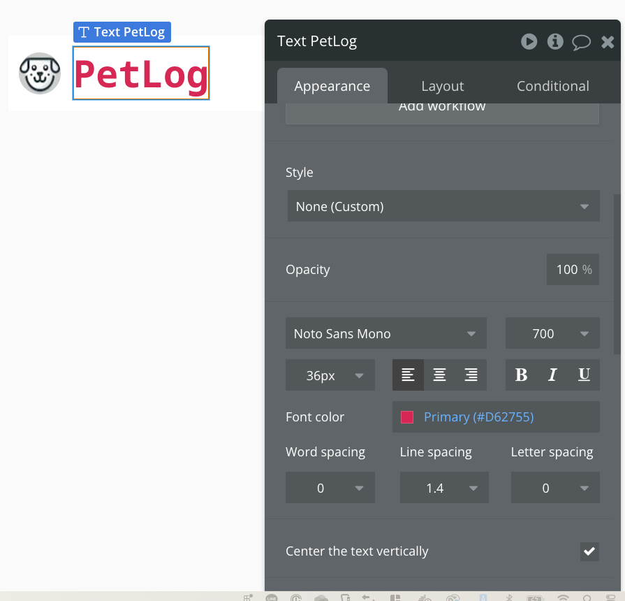

---

## Let's preview

It's changed.

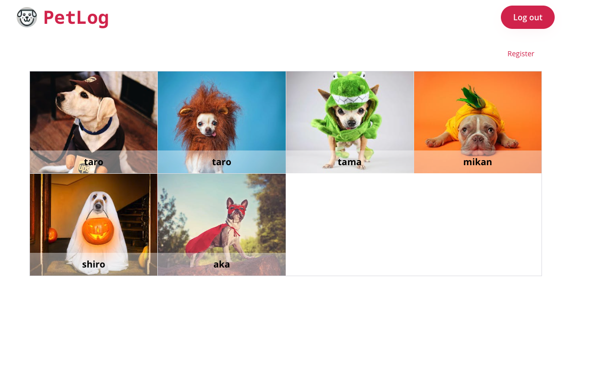

---

## Next, let's add a new style

The label is too big and bothers me, so I'm going to create a style for the label.

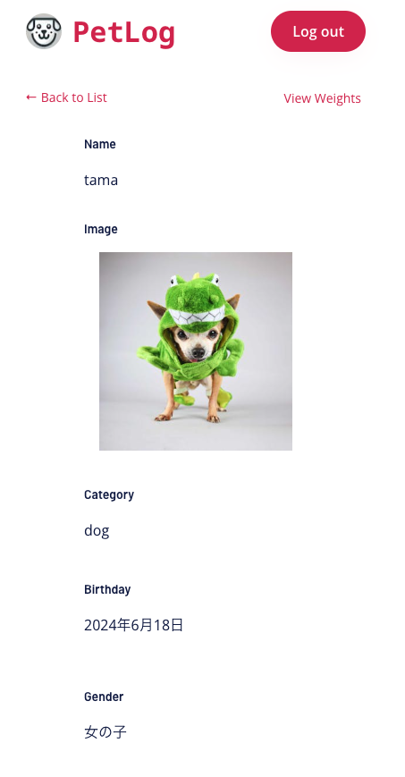

---

First, specify the style individually.

- Open pet_detail and double-click the `Image` text to open the settings
- Click `Detach style` at the bottom right of the `Style` pulldown

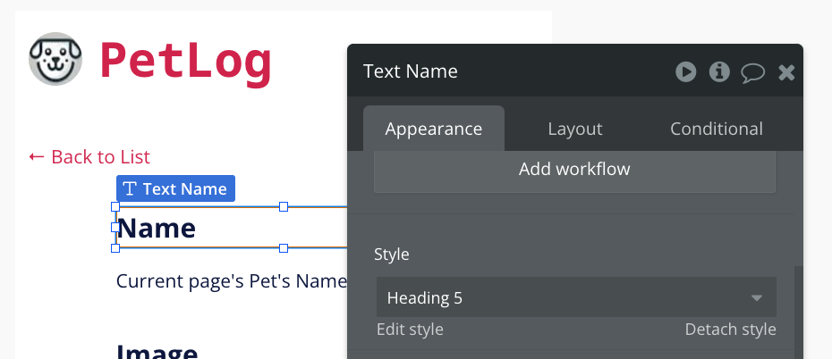

---

Set the following

- Font: `Barlow`
- Font weight: `600`
- Font size: `14`
- Check `Center the text vertically`

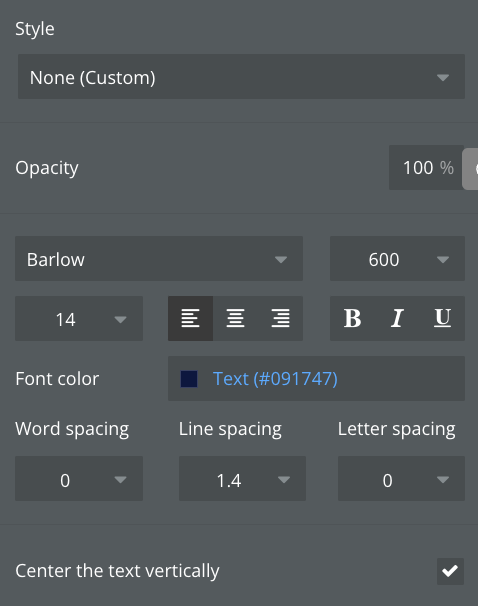

---

Next, define the specified individual styles as a common style

- Open the `Style` pulldown in the `Name` settings
- Click `Create a new style..` at the bottom

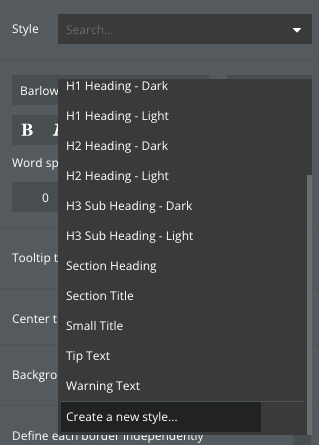

---

- ​​Enter `Label` in the Style name
- Leave `Text` for Element style to indicate that it is a text Element style
- Leave `Text Name` for Use style of and create a style based on `Text Name`

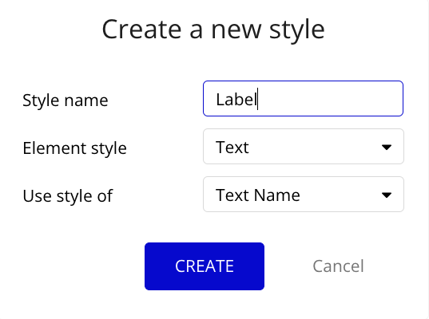

---

Label should be specified for the style.

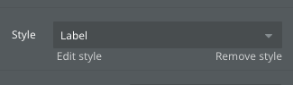

Instead of defining individually specified styles as common styles, you can define the style first, but it is easier to set individually specified styles as common styles because you can create them while checking the image in the design view.

---

Now, let's apply the defined style to other labels.

You can select multiple elements by holding down shift and selecting them, and you can operate on multiple elements at once.

- pet_detail: Image, Category, Birthday, Gender
- pet_register: Name, Image, Category, Birthday, Gender
- pet_weight_register: Weight

That's a bit much and a hassle.

If you had separated the styles from the beginning, you would have only had to change the style in one place, so it's a good idea to keep in mind that you should define styles when screen elements with different meanings appear.

---

## Let's preview


That's all for Style.

---

## Create logic

---

## Create logic

Logic is embedded in various places in the application.

- Return feedback for screen operations
- Extract and process data
- Switch screens based on permissions, and more

You can embed logic in various places in Bubble, so let's do it together.

---

## Return feedback for screen operations

---

## Return feedback for screen operations

In Bubble, you can embed logic for screen elements.

You can use it to create feedback for screen operations.

Let's add a movement that adds a red frame when you hover over the pet list.

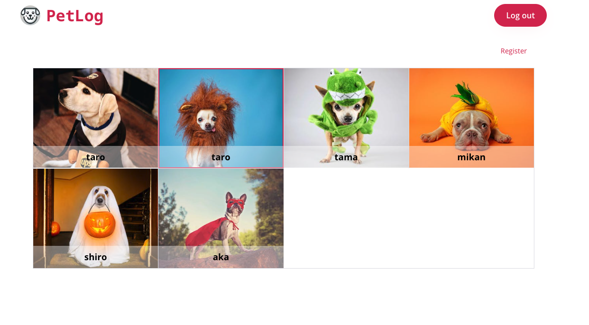

---

We will embed logic in the image element

- Open pet_list
- Click the image element of the pet image to open the settings
- Specify `Conditional` from the tab
- Click the `Define another condition` button

Here you can define the conditions and how to change the properties when the conditions are met.

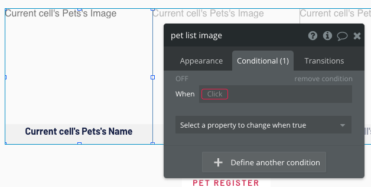

---

First, let's see what conditions can be specified.

- The relevant image Element, its parent element, and other elements on the screen
- Logged-in user
- New data search
- Current state, such as the current date, current position, page width, scroll position, etc.

You can see that it seems like you can specify various conditions like this.

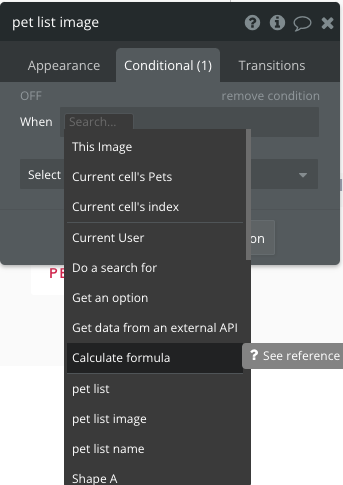

---

This time, let's simply select the relevant image `This Image`.

Then, the image state will be listed next. There are various options here, but this time select `is hovered`.

This will set the condition to when the relevant image is hovered.

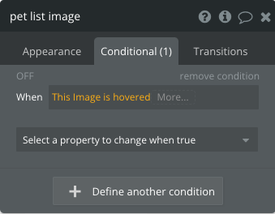

---

Next, specify which properties to change when the conditions are met.

Click `Select a property to change when true` and take a look inside.

- Image source, alt attribute

- Clickability, border, etc.

You can see that there are many things you can change.

The items listed here vary depending on the type of element.

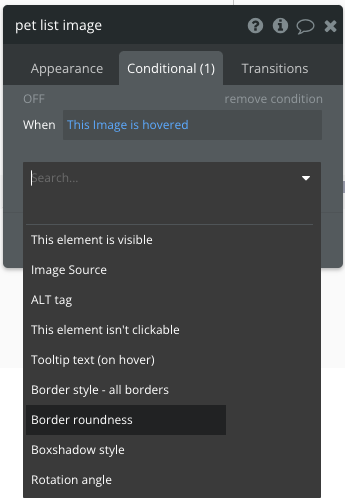

---

This time, we will add a red border when hovered.

- Click `Border style - all borders`

- Change `None` to `Solid`

- This means that the border is changed from `None` to `Show solid line`.

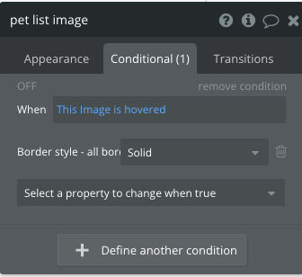

---

- ​​Select `Select a property to change when true`
- Click `Border color - all borders`
- You will be able to specify a color, so select the defined Primary
- In the same way, next specify `Border width - all boarders` and set it to `2`

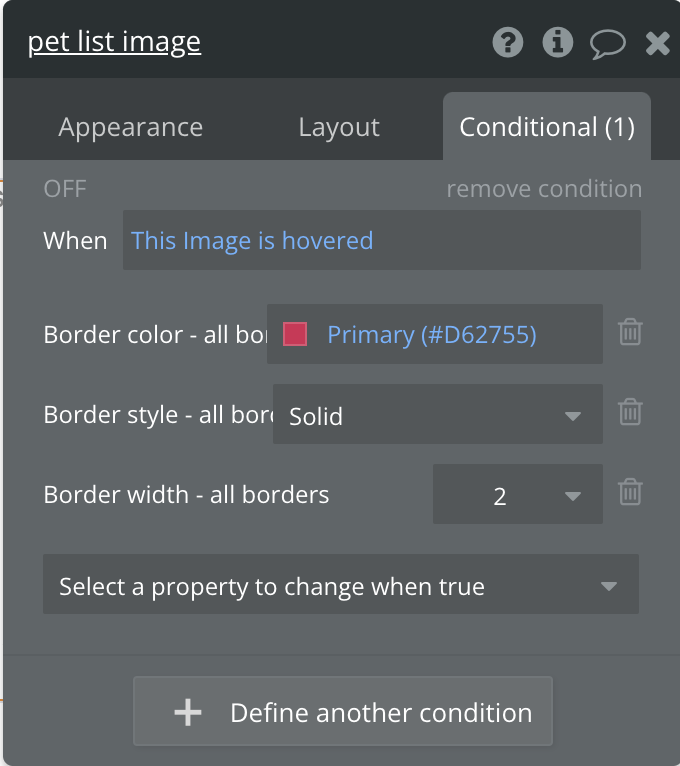

This completes the settings.

---

## Let's preview

When you hover, a red frame will appear.


In this way, you can embed logic such as returning easy-to-understand feedback to user operations and switching screen decorations depending on the state, and create a product.

---

## Extract and process data

---

## Extract and process data

You can extract only specific data, or process or calculate the acquired data.

Display the pet's initials, age, and latest weight.

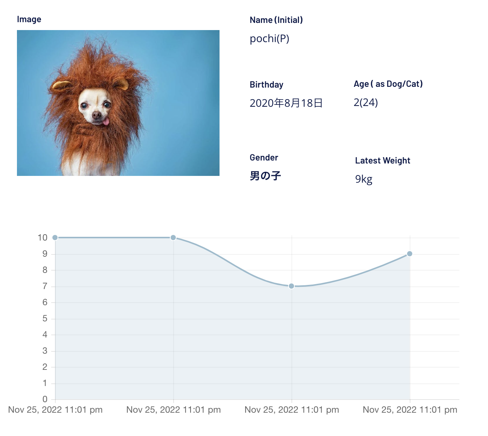

---

## Preparation

We will add elements from now on, so let's narrow the width of Name, Birthday, and Gender.

- In pet_detail, double-click Name to open the settings
- Hold down Shift and select the Name label through the Gender text element
- Click the `Layout` tab and click on the part that says `Width`
- Specify `120` for W (width)
  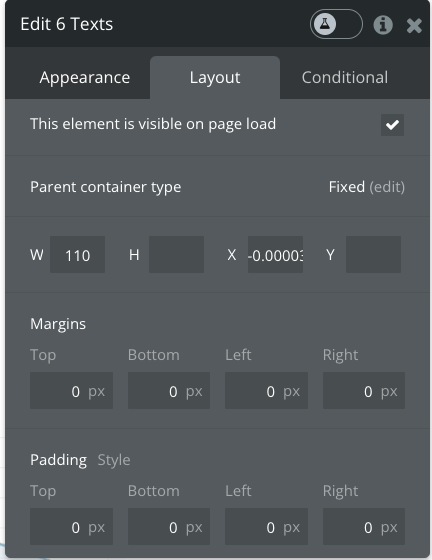

---

## First, display the initials

- Change the contents of the Name label to `Name (Initial)` so that it is clear that it contains initials
  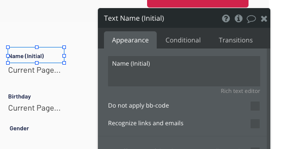

---

- ​​Select the text that displays the contents of Name
- Click on an empty part of the text input field to focus on it
- Type ` (`
- Select `Insert dynamic data`
- `Current Page Pets`>`'s Select Name`
- It should say `Search...` and you should be able to select the next step.

Here you can select various processing methods. Let's take a look.

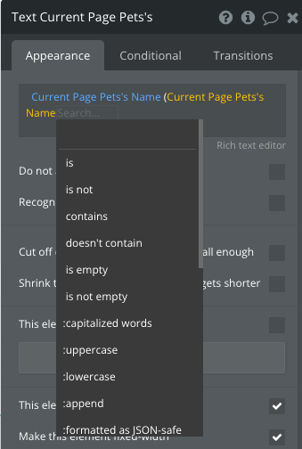

---

- ​​Select `truncated to`
- This means to cut out up to the specified number of characters
- Enter `1` and confirm with the Enter key
- `Search...` will appear again
- Select `:uppercase`
- This means to convert to uppercase
- (This is meaningless for those who have a Japanese name)
- Click on the part of the text input field where there is no text and enter `)`

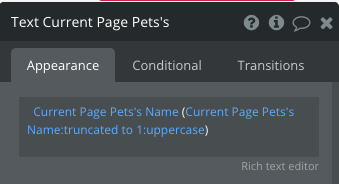

---

## Let's preview

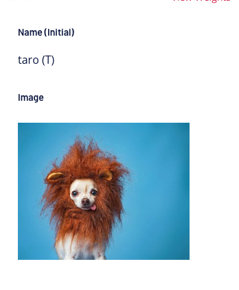

---

## Display the latest weight

- Copy and paste the Birthday label and text and place them
- Change the label to `Latest Weight`

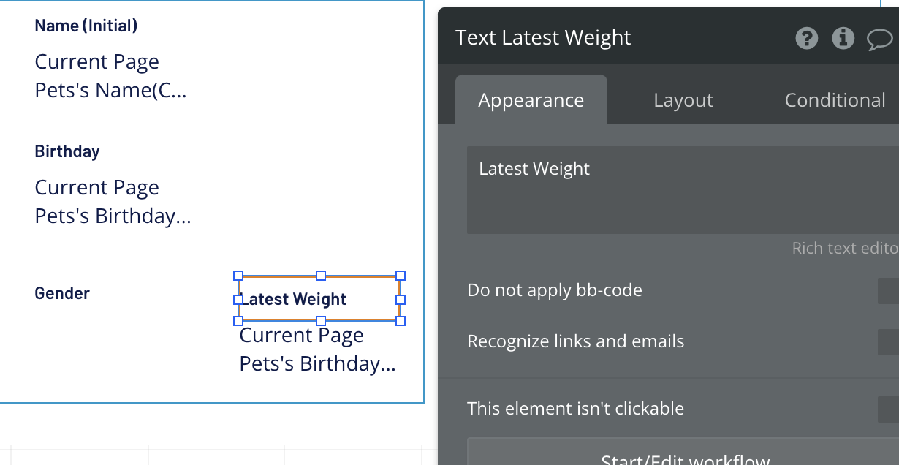

---

- ​​Open the text settings that will display the contents of Latest Weight and empty the text input area
- Focus and click `insert dynamic data`
- Click `Do a search for`
- This means searching for data

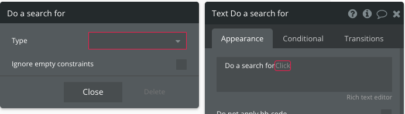

---

Specify that you want to get the weight of the pet currently displayed on the page

- Specify `PetWeightLogs` for `Type`
- Click the `Add a new constraint` button
- A condition input field will appear, so click it and specify `Pet`, `=`, and `Current Page Pets` in that order

You can obtain the data under various conditions, so let's take a look at what conditions are available

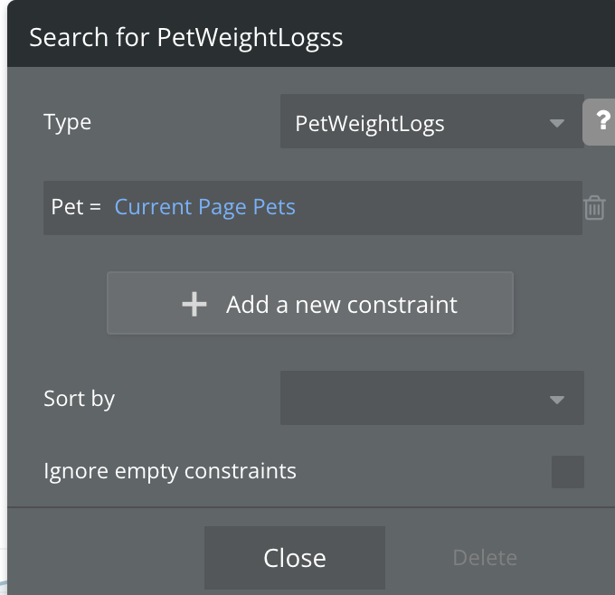

---

Specify that the data should be sorted in descending order of creation date, i.e., by the most recently created data

- Specify `WeightDate` for `Sort by`
- Specify `yes` for `Descending`
- Close

It's easy to forget to specify the sort order, but it's often important.

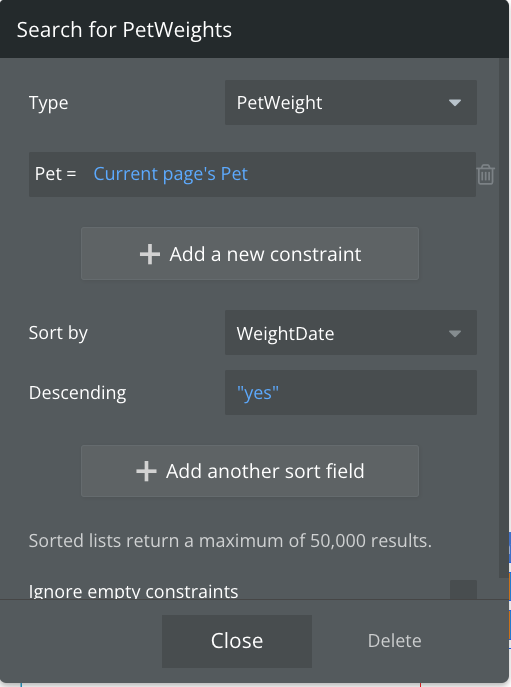

---

Display the latest weight

- Click `More` in the text input field to view the contents
- Specify `:first item` to get the first item
- Next, specify `'s WeightKg`
- Click the blank area and enter `kg`

This completes the setting of the latest weight.

Let's remember this as a method for extracting data and processing lists.

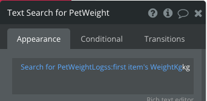

---

## Preview.

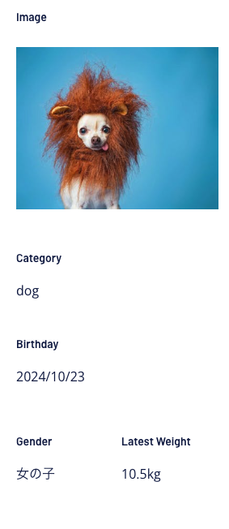

---

#### ＜ Advanced ＞

## Let's go off on a tangent and look at More on numbers and More on dates.

Bubble offers a variety of ways to process and calculate numbers and dates.

---

#### ＜ Advanced ＞

## Calculate age

Next, we'll get the age. As we saw earlier, we can process and calculate numbers and dates, but calculating age seems a bit difficult, so we'll try to do it by embedding the code directly.

By installing a plugin in Bubble, you can run simple processes using a programming language called javascript.

---

#### ＜ Advanced ＞

To embed javascript code, we'll use a plugin called `Toolbox`.
Let's install it.

- Select `Plugins` in the left menu

- Enter `tool` in the search text box (the search will take a while)

- Press the `Install` button for `Toolbox` that appears at the top of the search results

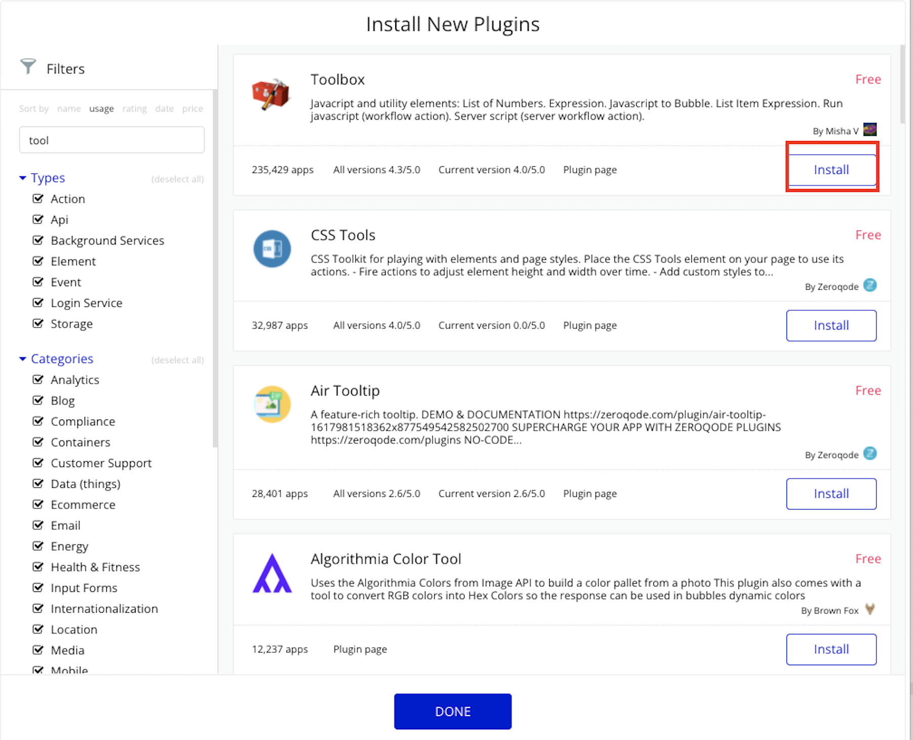

---

#### ＜ Advanced ＞

There are two main ways to embed code in Toolbox. This time, we will introduce the following two methods.

- Execute with `Run javascript` on Workflow/Receive with `Javascript to Bubble` on Design
- Use for complex processing that spans multiple lines
- Execute and receive with `Expression` on Design
- Use for one-off processing

---

#### ＜ Advanced ＞

Now, let's calculate the age.

This is done with `Run javascript`/`Javascript to Bubble`. First, load `Javascript to Bubble` on the pet_detail screen.

- Select `javascript to Bubble` from `Visual elements` in the left menu
- Place it at the bottom of the screen or somewhere else where it won't get in the way
- It's for receiving the results of javascript, so it won't be displayed when previewing or running

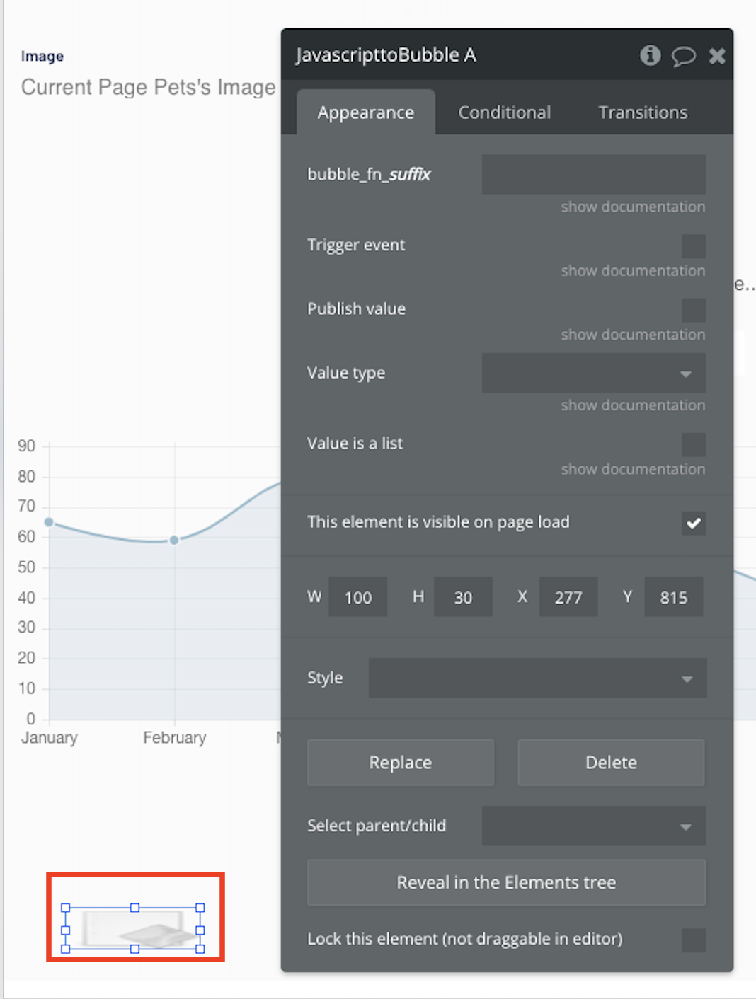

---

#### ＜ Advanced ＞

- Specify `age` for `bubble_fn_suffix`
- Check `Publish value`
- Specify `number` for `Value type`

With this, if you pass a value from javascript to the function (a block of processing) called `bubble_fn_age`, it will be received by this screen element.

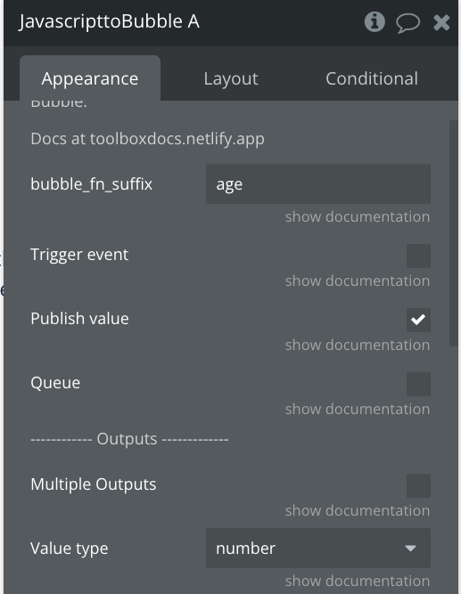

---

#### ＜ Advanced ＞

Next, define where to execute the javascript.

- Select Workflow from the left menu
- There are a row of squares, and select `Click here to an event...` from the rightmost one
- Select `General`>`Page is loaded`

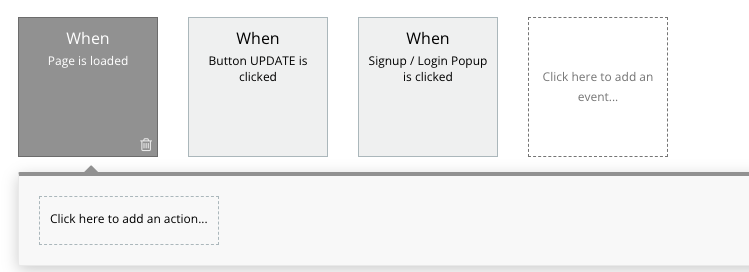

---

#### ＜ Advanced ＞

- Click `Click here to add an action...`
- Click `Plugins`>`Run javascript`
- The settings will open, so paste the code from the following page in the `Script` field

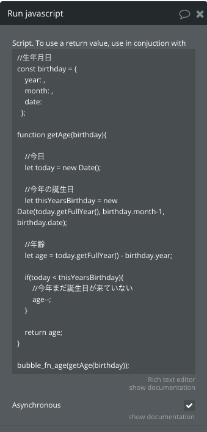

---

#### ＜ Advanced ＞

```
//Date of birth
const birthday = {
year: ,
month: ,
date:
};

function getAge(birthday){

//Today
let today = new Date();

//This year's birthday
let thisYearsBirthday = new Date(today.getFullYear(), birthday.month-1, birthday.date);

//Age
let age = today.getFullYear() - birthday.year;

if(today < thisYearsBirthday){
//Birthday not yet this year
age--;
}

return age;
}

bubble_fn_age(getAge(birthday));
```

---

#### ＜ Advanced ＞

Insert the date and year using `insert dynamic data` after `year: `, `month: `, and `date: ` on lines 3 to 5

- Place the cursor after `year: ` (before `,`)

- `insert dynamic data`>`Current Page Pets`>`'s Birthday`
- `More`>`formatted as 11/20/21`
- Specify `Custom` for `Format type`
- Specify `yyyy` for `Custom format`
- Similarly, insert `Custom format` as `m` after `month:`
- Similarly, insert `Custom format` as `d` after `date:`

※The image after input is on the next page

---

#### ＜ Advanced ＞

Image after input
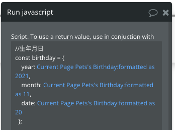

---

#### ＜ Advanced ＞

Let's place the screen elements to display

- Copy and paste the Birthday label and text
- Change the label to Age
- Specify the text content as `JavascripttoBubble A`>`'s value`

---

#### ＜ Advanced ＞

## Let's preview

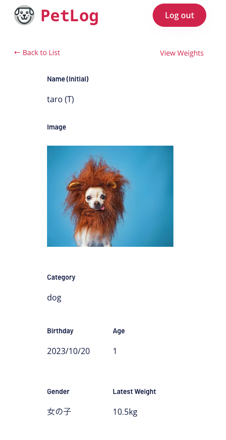

---

#### ＜ Advanced ＞

The age of dogs and cats

- Select `Expression` from Visual elements and place it next to the previous `Javascript to Bubble`

- Enter `24 + (` in Expression

- Insert `JavascripttoBubble A`>`'s value` with `insert dynamic data`

- Enter `-2) * 4` next

- Specify `number` in Result type

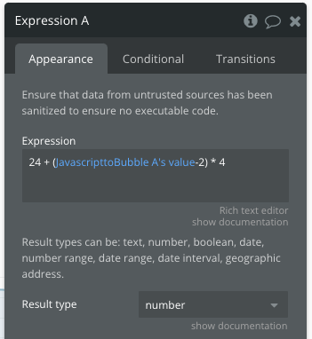

---

#### ＜ Advanced ＞

Set the display.

- Change the Age label to `Age(as Dog/Cat)` so that it is easy to understand that it includes the ages of dogs and cats.
- Enter `(` after the text originally entered in Age.
- Insert `Expression A`>`'s value` with `insert dynamic data`.
- Enter `)`.


---

#### ＜ Advanced ＞

Next, the method for calculating the age of dogs and cats seems to differ depending on the size.

The following age calculation used this time is the formula for calculating the age of small dogs over 3 years old.

`Dog and cat age = 24 + (human age − 2) × 4`

If you are interested, let's create it so that it can perform precise calculations.

---

#### ＜ Advanced ＞

## Let's preview

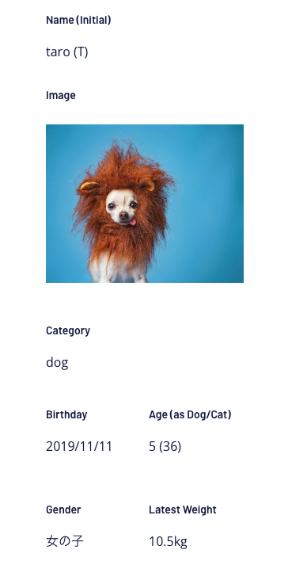

---

## Switch screens by authority

---

## Switch screens by authority

So far, we have explained how to incorporate logic in parts, such as feedback to screen operations and data extraction and processing.

Next, we will add logic that spans multiple functions.

We will do the following.

- Divide users into pet owners and pet advisors

- Owners can use the screens and functions we have created so far

- Advisors can use screens and functions exclusive to advisors

---

The development flow will be as follows:

- Add a field to the user information that can distinguish whether the user is an owner or advisor

- Allow users to select whether they are an owner or advisor when registering

- Create a list screen and details screen for advisors

- Switch the screen destination after login and sign-up depending on whether they are an owner or advisor

It takes a lot of steps, but there are many products that handle multiple user types, so be sure to learn how to do it

---

## Add a field that can distinguish users

First, make it possible to store the difference in role, whether owner or advisor, in the data.

You can store it as text, like when specifying the male or female of a pet, but it is easier to handle values ​​that are specified from a set of options by predefining the options and using them. Bubble provides a mechanism called Option set, so let's use that.

---

Let's set the options

- Go to `Data` in the left menu > `Option sets` in the tab

- Enter `Role` in `New Option set` and press the Create button

- Role will be created as a new option set

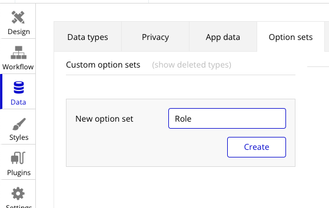

---

We will add specific options to the option set called Role. This time, we will create `Pet Owner` and `Pet Advisor`.

- Enter `Pet Owner` in `New Option` at the bottom right of the screen and press the Create button
- Similarly, enter `Pet Advisor` in `New Option` and press the Create button

The settings are now complete

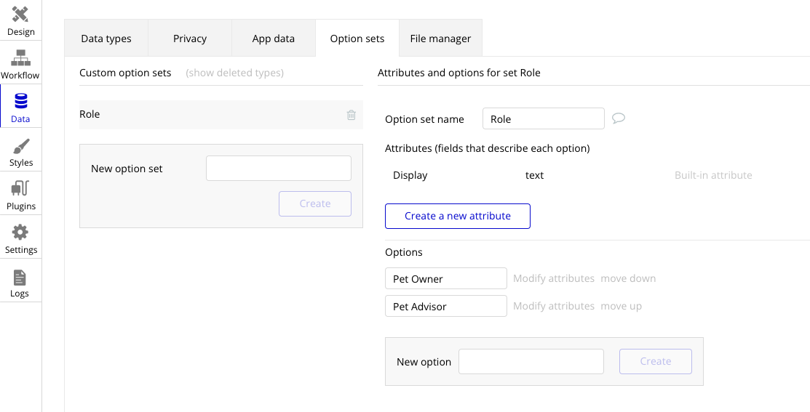

---

Next, let's add a role as a user attribute

- Go to `Data` in the left menu > `Data types` in the tab

- Select `User`

- Click the `Create a new field` button at the bottom right of the screen

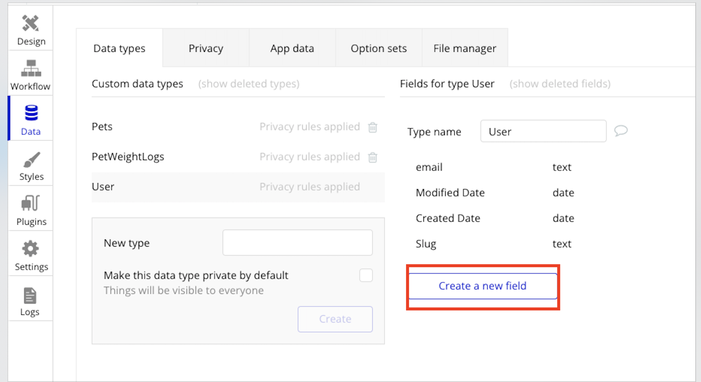

---

- ​​Enter `Role` in `Field name`

- You can use any name as long as it is easy to understand

- Select `Role` in `Field type`

- What is specified here is the `Option` created earlier It will be `Role` as `set`.

- Press the Create button

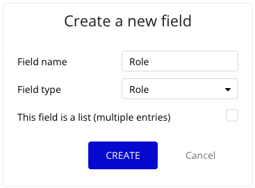

---

Since a new field has been added, Role will be empty for users who have already been created. This will cause inconsistencies later on, so let's apply a patch (data correction) to the existing data.

- Go to the `App Data` tab and select `All Users`

- A table will appear, so click the pen icon on the left side of the table to edit each one

- All the users created now should be owners, so specify `Pet Owner` for `Role`

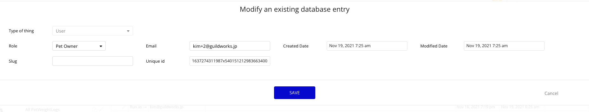

---

If the `Role` of all the rows in Users is `Pet Owner`, then it's OK

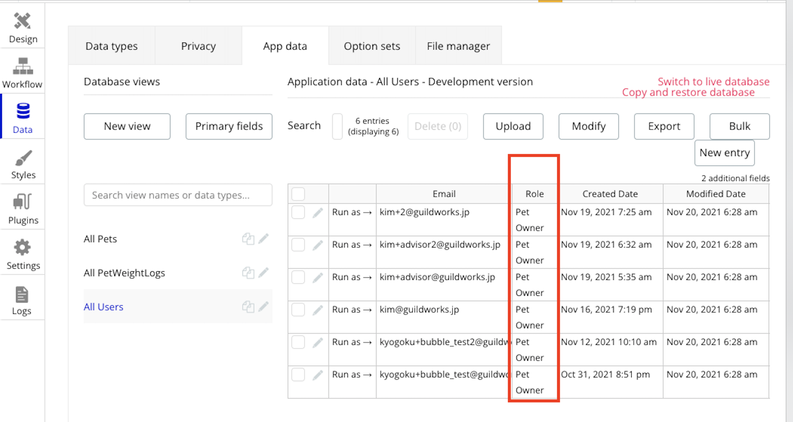

---

## Allow users to specify roles when registering

Next, we will allow users to specify whether they are owners or advisors when registering.

We have been reusing the registration screen provided by Bubble, but we will make some changes to it.

---

- ​​Go to the login page `index`
- Copy the `Password` label and place a label called `Role`
- Select `Dropdown` from `Input forms` in the `Design` menu and place it below the password input field

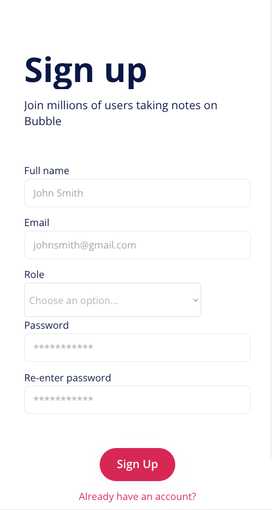

---

- ​​Set Dropdown as follows
- Element name: `Dropdown Role`
- Placeholder: `Choose a role...`
- `Choice style`: `Dynamic choices`
- `Type of choices`: `Role`
- `Choices source`: `All Role`
- `Option caption`: `Current option`>`'s Display`
- `Default value`: `Pet Owner`
- `This input should not be empty`: Check

\*Screen image is on the next page

---

Image after input
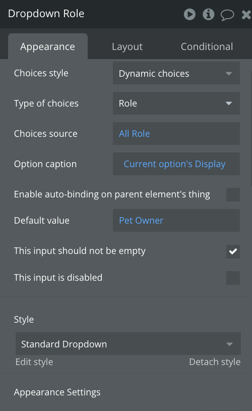

---

Next, make sure that the entered Role is set when the user registers

- From the left menu, go to `Workflow` > `Button Sign up is clicked` from the squares lined up > `Sign the user up` from the Actions lined up

- Click the `Change another field` button in the Action settings screen

- An input field will appear, so select `Role` = `Dropdown Role` `'s value`

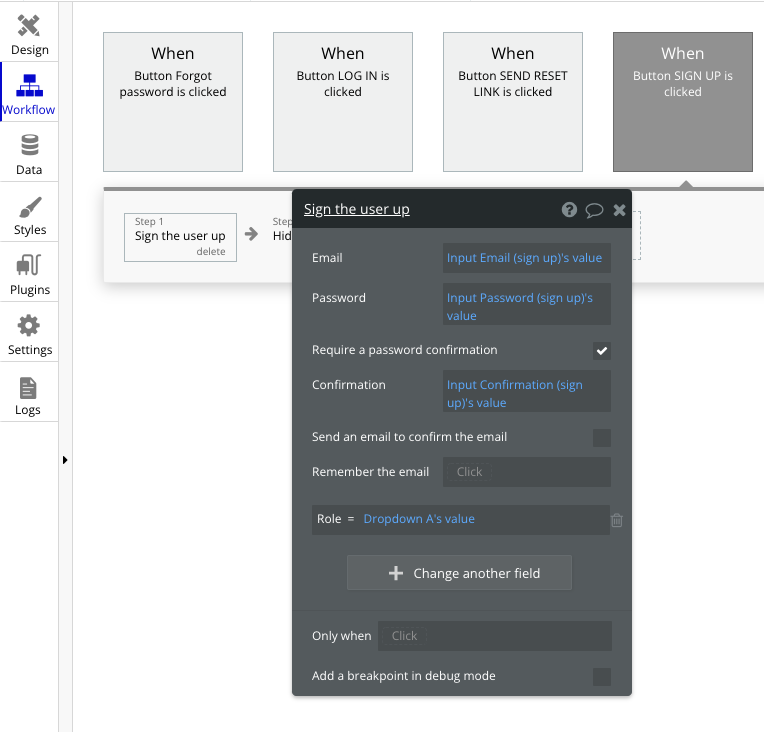

---

## Preview and check the operation

Register an account as an advisor and check the data.

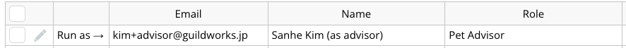

---

## Create an advisor list screen

Let's create an advisor list screen

- b Open the menu next to the logo and click `Add a new page...`
- Enter `pet_list_for_advisor` in `Page name`
- Select `pet_list` in `Clone from`
- A new screen will be created

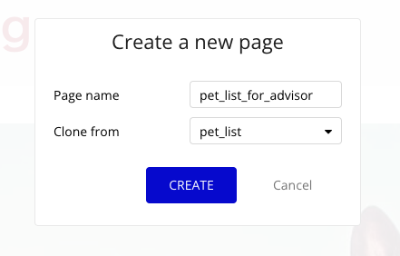

---

Advisors will be able to view all registered pets.

- Delete the original search conditions
- Select pet list and click `Do search for` in Data source
- Click the trash icon to delete the part with the condition `Created By = Current User`
- Since advisors need to view many pets, make the cell size smaller.
- Set `Min width` to 120 and `Min height` to 100px

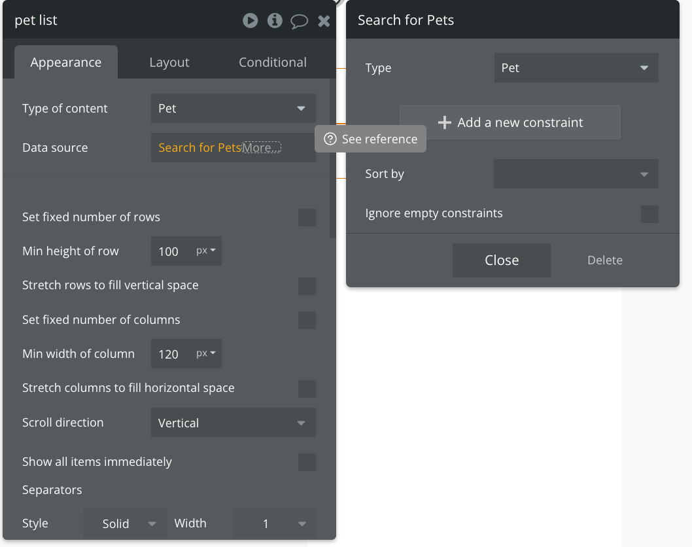

---

### Preview

After logging in, you will be redirected to the normal pet list, so open the advisor pet list directly from the Preview button.

...Nothing! ? Why? ?

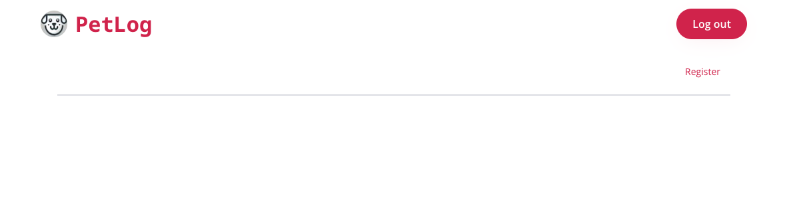

Because you do not have the permissions.

---

### Permission control in Bubble

I didn't have to worry about it until now, but access to Data is strictly restricted in Bubble.

Go to `Data` in the left menu > `Privacy` in the tab.

By default, only the creator can access the data.

Of course, that's only natural.

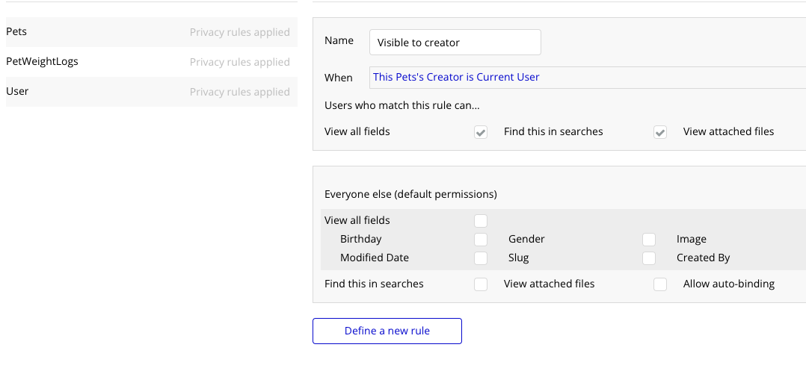

---

Now, let's add the permission to allow advisors to see all data.

- From the `Data` tab, select `Pets` in the `Privacy` tab

- Click the `Define a new rule` button

- Enter `Visible to advisor` in Rule name

- Select `Current User` `'s Role` `is` `Pet Advisor` in When

- This is the condition when the user is an advisor

Now, if you are an advisor, you can see all pet data.

You can also limit the fields that can be referenced for each rule, but we will not use that this time.

\*The screen image is on the next page

---

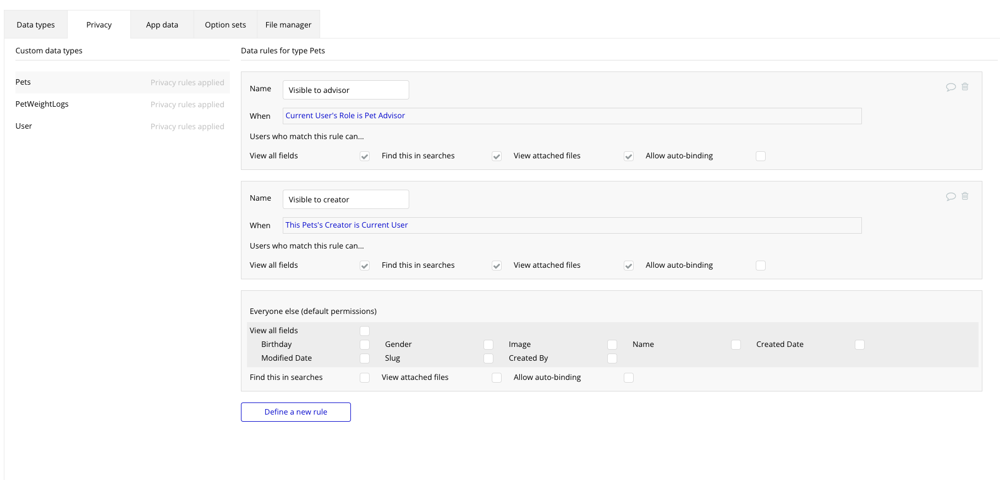

Now, add a rule to `PetWeight` in the same way.

The advisor should now be able to see all the data.

---

## Preview

Does it appear in the list? If you create another Pet Owner user and register a pet, it will also appear here.

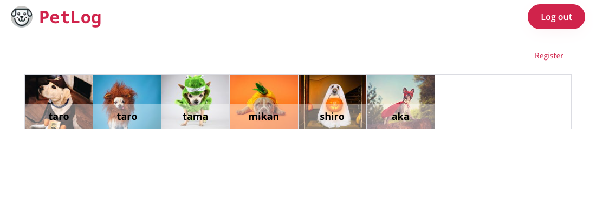

---

Next, we will control the transition destination when logging in.

For advisors, add an action to transition to pet_list_for_advisor when transitioning to pet_list

---

- ​​Open Workflow for the pet_list page

- Click `Click here to add an event..`
- Select `General` > `Page is loaded`
- Click `Click here to add an action..`
- Click `Navigation` > `Go to page..`
- The settings will open, so select `pet_list_for_advisor` for Destination
- Select `Current User` `'sRole` `is` `Pet Advisor` for `Only when`

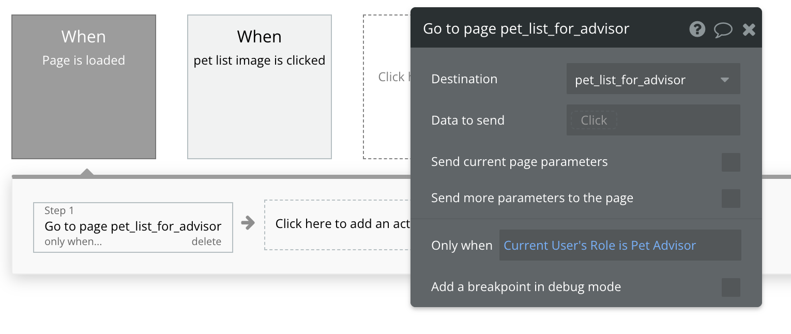

---

## Preview and check operation

When you log in as an advisor
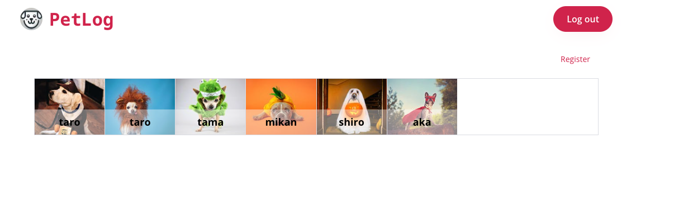

---

When you log in as an owner


Good job

---

#### ＜ Advanced ＞

## An account was created by an advisor without my permission

## Is it okay for them to view my information without my permission?

---

#### ＜ Advanced ＞

## Let's make it so that users cannot start using the system without approval from the system administrator

---

#### ＜ Advanced ＞

## We will do the following

- Add a field to the user information to indicate whether they are approved as an advisor
- Add the condition that the access to data is approved as an advisor as well as being an advisor
- If the pet list for advisors is not approved, a message will be displayed saying that it is under review

---

#### ＜ Advanced ＞

## Add a field to the user information to indicate whether they are approved as an advisor

- From the left menu, click `User` in `Data`>tab`Data types`>
- Click the `Create a new field` button at the bottom right of the screen
- Enter `Approved As Advisor` in Field name
- Select `yes/no` in Field type
- Click the Create button

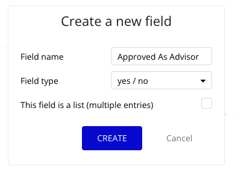

---

#### ＜ Advanced >

In the added field, there is a column called `default`, so set it to `no` (or `no`).
When it is created, it will be in an unapproved state.

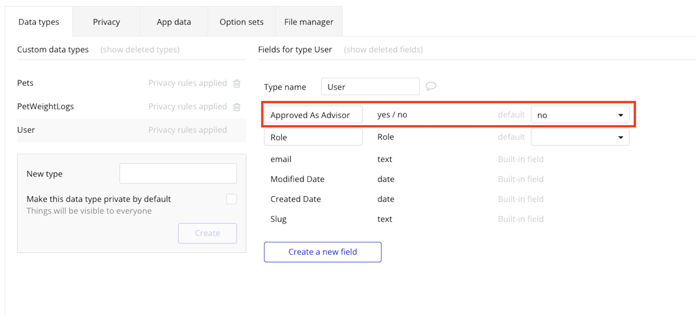

---

#### ＜ Advanced ＞

For existing users, set all `Approved As Advisor` to `no`

(It's a pain and a little depressing... but it's important!)

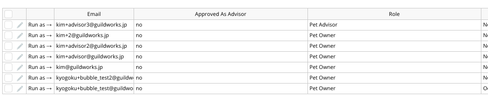

---

#### ＜ Advanced ＞

## Check whether data access rights have been approved

- From the left menu, click `Pets` in `Privacy`>> of `Data`>tab
- Click `Pet Advisor` at the end of the section where the When conditions for `Visible to advisor` are written
- `More` will appear, so click `More`
- Select `and` `Current User` `'s Approved As Advisor` `is "yes"`
- Do the same for `PetWeight`

---

#### ＜ Advanced ＞

Let's check the operation
Try logging in as a user with `Approved As Advisor` set to `no`

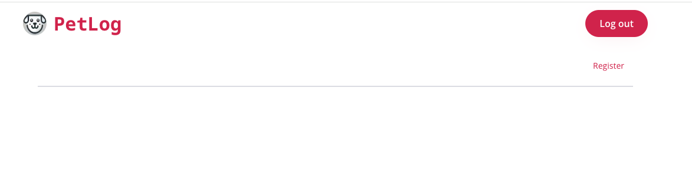

Okay

---

#### ＜ Advanced ＞

What if you edit the data directly and set `Approved As Advisor` to `yes`?

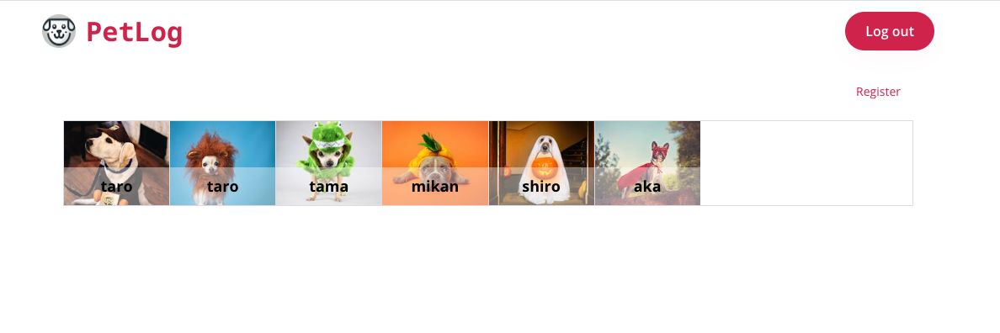

Okay

---

#### ＜ Advanced ＞

## If it is not approved, display a message saying it is under review

- Open the `Design` menu on the pet_list_for_advisor screen
- Add a `Popup`
- In the `Layout` tab, specify `Align to parent` for `Container layout`.
- Add a text element above `Popup`.
- Write a message that the item is under review.
- In the `Layout` tab, specify that the item should be displayed in the center of the parent element.
  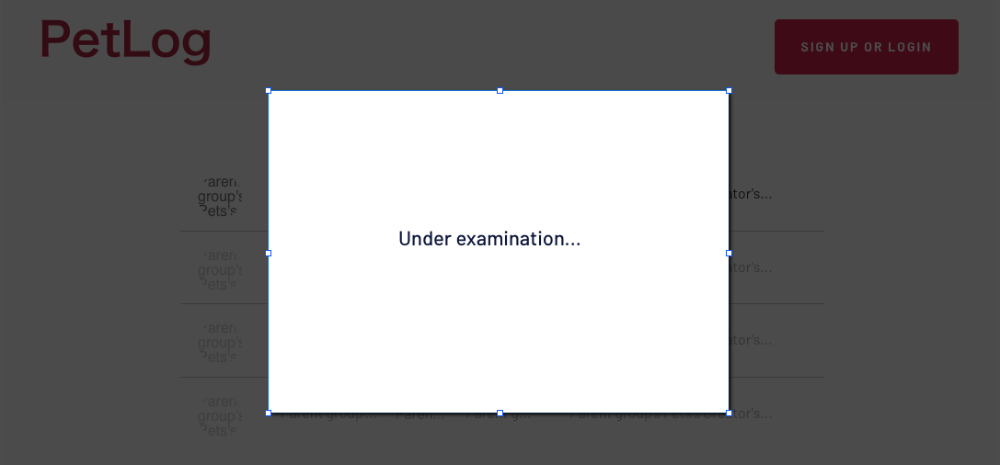

---

#### ＜ Advanced ＞

- Go to Workflow from the menu.
- Click `Click here to add an event..`>`Page is loaded`
- Click `Click here to add an action..`>`Element Actions`>`Show`
- Specify `Popup A` for Element
- Specify `Current User` `'s Approved As Advisor` `is "no"` for Only when

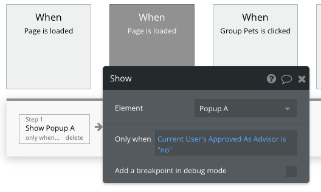

---

#### ＜ Advanced ＞

## Let's check the operation

yes If you are an advisor

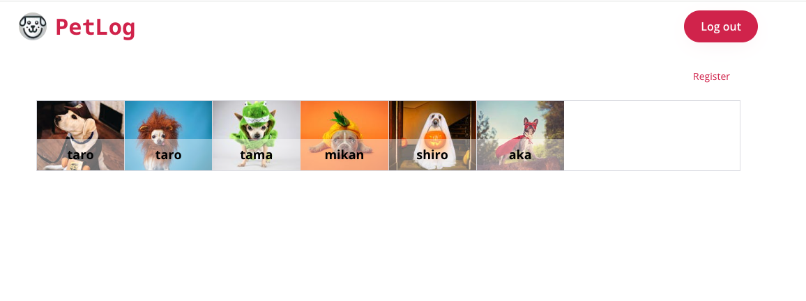

Okay

---

#### ＜ Advanced ＞

If no

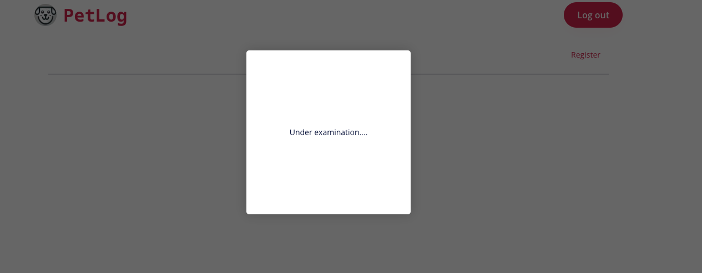

Okay

---

#### ＜ Advanced ＞

## How will the system administrator know?

---

#### ＜ Advanced ＞

## Let's set up an email notification to be sent to the system administrator when an advisor is registered.

---

#### ＜ Advanced ＞

## Let's send an email to the system administrator

- Open the `index` page
- Go to Workflow from the menu and select `Button Sign up is clicked`
- Click `Click here to ad an action...`> `Email`>`Send Email`
- Drag and move the position of the action to before `Go to page pet_list`

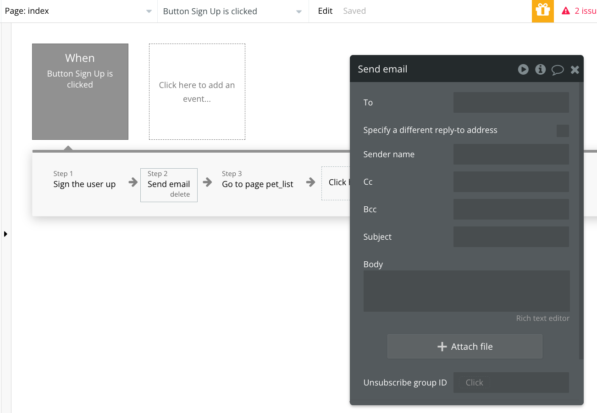

---

#### ＜ Advanced ＞

- Set your email address in To
- Sender name is `PetLog`
- Subject is `New Advisor Requested`
- For Body, select `Current User` `'s email` at the end of the following text with `dynamic data isert`

```
New Advisor has been Registered.
Please check it.

Email:
```

---

#### ＜ Advanced ＞

- Specify `Current User` `'s Role` `is` `Pet Advisor` in Only when

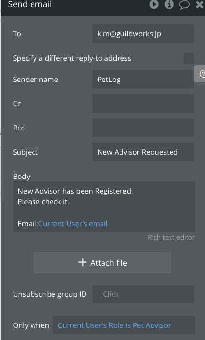

---

#### ＜ Advanced ＞

## Let's check the operation

When you sign up as an advisor
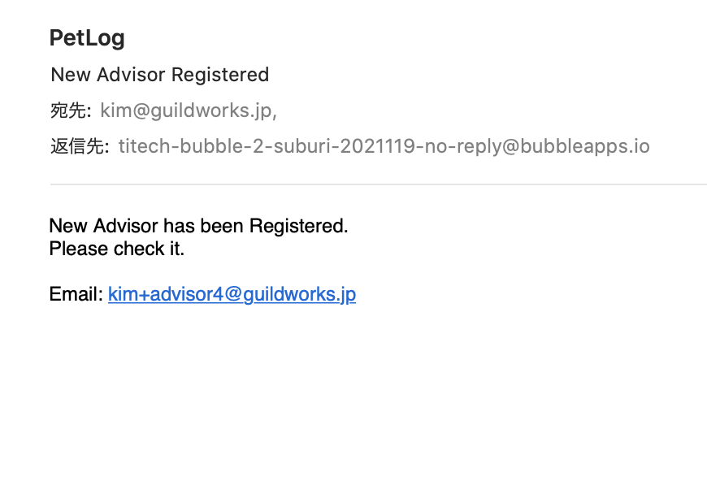
Here he comes

---

#### ＜ Advanced ＞

If you are the owner

Yes, he won't come. Yay!

---

### Review of what we've learned so far

---

### We've created a design

- We've created a screen that matches the display size

- We've used a technique called responsive web design to control the appearance to match the display size using the following rules.

- Placement rules within parent elements

- Rules for determining the size of elements

- Rules for displaying or not

- We've tried using Style

- We've edited and added Styles, and applied styles individually

---

## We've created logic

- We've given feedback on screen operations

- We've extracted and processed data

- We've switched screens based on permissions

We've seen together how you can embed logic in various places with Bubble

---

#### ＜ Excercise ＞

## Exercise

Let's add functions using the design and logic we've learned so far.

For example, let's create a function that allows the advisor to approach the owner, or the owner to approach the advisor.

- Example: Send advice to the owner

- Example: Post an advertisement

- Example: Ask the advisor for advice, etc.

---

## Review so far

This concludes the lecture on Bubble alone.

There are many functions that we did not touch on, but
Bubble has a comprehensive manual and reference, so
if you adopt Bubble, please make use of it.

The manual is here.
https://manual.bubble.io/

The reference will appear when you place the cursor over something on the screen that you do not understand.
A link to the reference will appear for most functions.

After this, we will learn how to link Bubble with other systems and develop it as a team.

---

# Link with external systems

---

We will create functions by linking with various systems as follows.

- Create an AI pet advisor using ChatGPT
- Display YouTube video listings
- Social login using Google account
- Dynamic search of YouTube video listings

---

## Create an AI pet advisor using ChatGPT

First, in the first system integration, we will create a function that can integrate with ChatGPT to provide advice that takes into account the condition of your pet.

To integrate with ChatGPT, we will use the API provided by Open AI.

---

## What is an API?

API (Application Programming Interface) is a way for software and applications to communicate with other software and services. Through APIs, applications can share data and expose and use the functions of other applications.

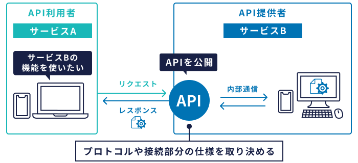

---

## Preparing for API integration with Bubble

Bubble provides a plugin that makes it easy to connect to APIs. Let's get ready.

- Select Plugins from the left menu and click the Add plugins button

- Search for "API" and install the plugin called `API Connector`

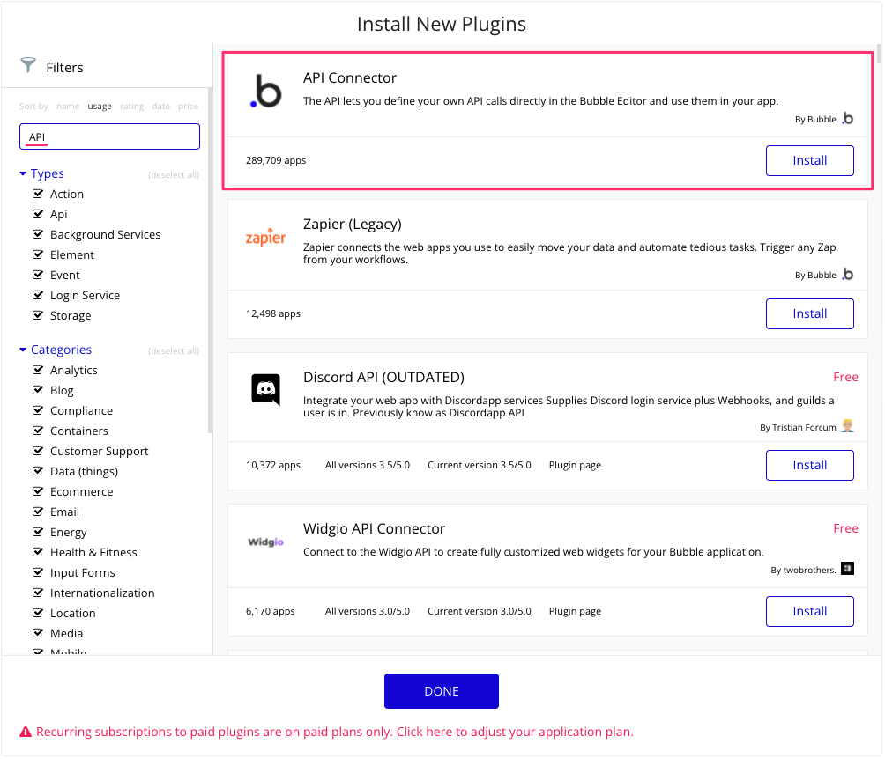

---

- ​​This plugin is for connecting Bubble to information on the other side of the API using APIs published in the world from the Bubble app.

- Some Bubble plugins are specialized for specific APIs, and some of these plugins have simpler settings than this API Connector.

- This time, we will incorporate functions using the ChatGPT API and YouTube API via the API Connector plugin, which is the most basic form.

---

## Preparation for API integration with ChatGPT (Open AI)

To use the Open AI API, you need to create an Open AI account from the screen below, register a payment method, and issue an API key.

https://platform.openai.com/

We will skip those steps this time and use the API key we prepared in advance, which we will share with Slack.

However, please be careful not to share it outside of this forum or overuse it here. (Because the charges will explode lol)

---

## Reference URL

Documentation
https://platform.openai.com/docs/overview

API Reference
https://platform.openai.com/docs/api-reference/introduction

Usage Fee
https://openai.com/api/pricing/

Administration Screen
https://platform.openai.com/settings/organization/projects

---

- ​​Now, let's set up the ChatGPT API
- In the Plugins tab, select "API Connector" from Installed Plugins
- The overview of this plugin is written in the right panel, so click "Add another API" below it to start setting up a new API connection

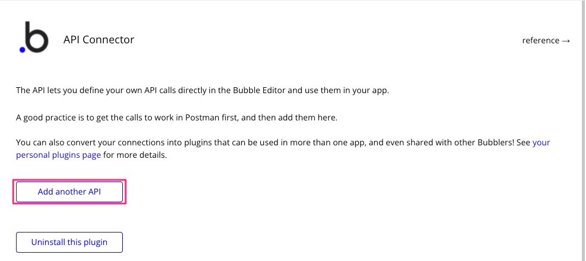

---

- ​​When you click "Add another API", you will see an API setting part like this
- We will provide a brief explanation and settings for each item.

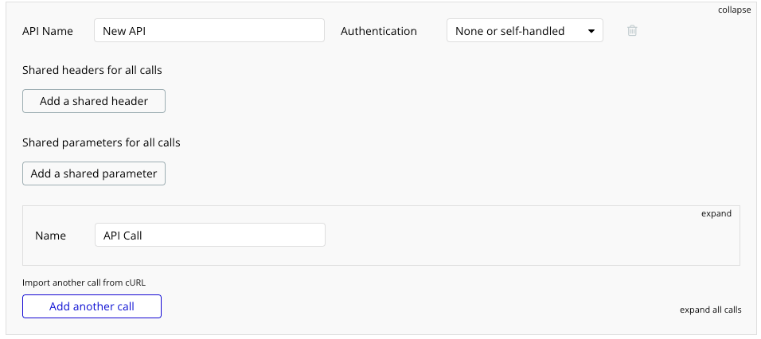

---

1. API Name: Group name for this API integration

- ChatGPT in this case

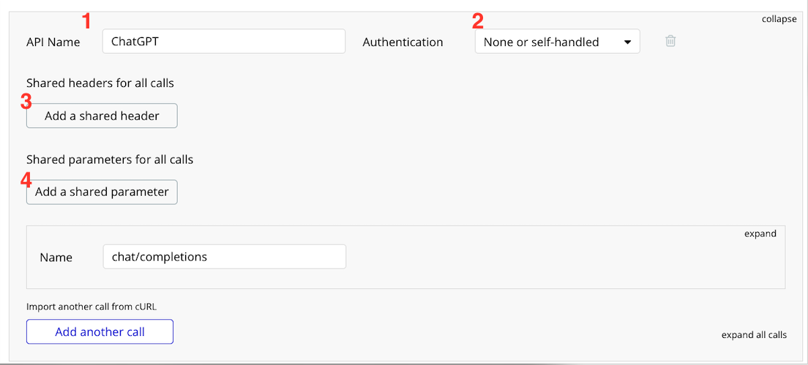

---

2. Authentication: Common authentication method for APIs under this group

- "None or self-handled" in this case


---

3. Shared headers for all calls: Common header information to be specified for all APIs under this group

ChatGPT API requires an API key to be added to the header when connecting. Let's set the key.

- Click `Add a shared header`
- Enter `Authorization` in `Key`
- Enter `Bearer` + ` `(half-width space) + the API key shared in slack in `Value`.

---

When you've entered everything, it will look like this.

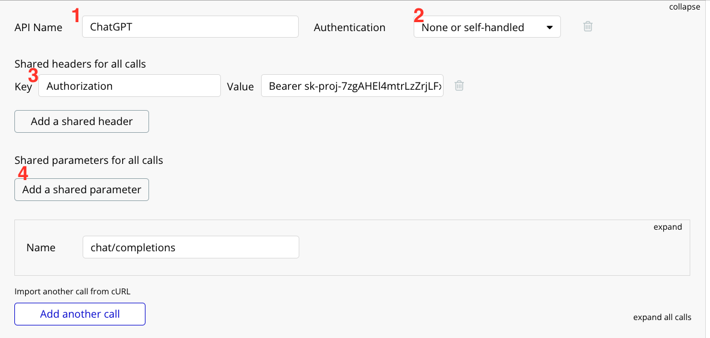

---

4. Shared parameters for all calls: Common parameter information specified for all APIs under this group

- No specific specification this time


---

- ​​Next, we will set the specific API contents for this group
- On the previous screen, there is a link called "expand" to the right of the block that says "API Call", so click on it
- This will display the specific API settings, so we will briefly explain them

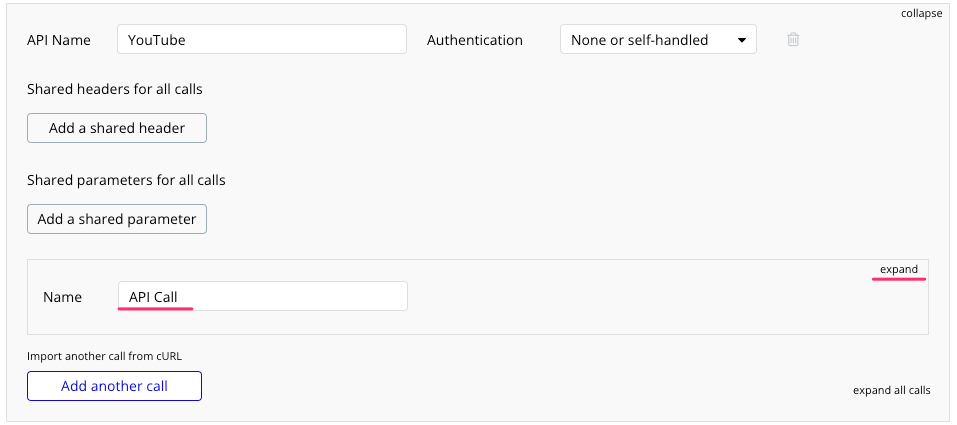

---

1. Name: Name of the specific API

- In this case, "chat/completions" Enter


---

2. Method: HTTP method to connect

- Select `POST` this time


---

3. Path: Specific API URL

- Enter `https://api.openai.com/v1/chat/completions` this time


---

4. Body: This is the body of the request

- Please enter the contents described below first this time.


---

```
{
"model": "gpt-4o-mini",
"messages": [
{
"role": "system",
"content": "You are a helpful assistant."
},
{
"role": "user",
"content": "Hello!"
}
]
}
```

This is the sample request from the ChatGPT API documentation.
https://platform.openai.com/docs/api-reference/chat

---

This is what it will look like once you've filled everything in.

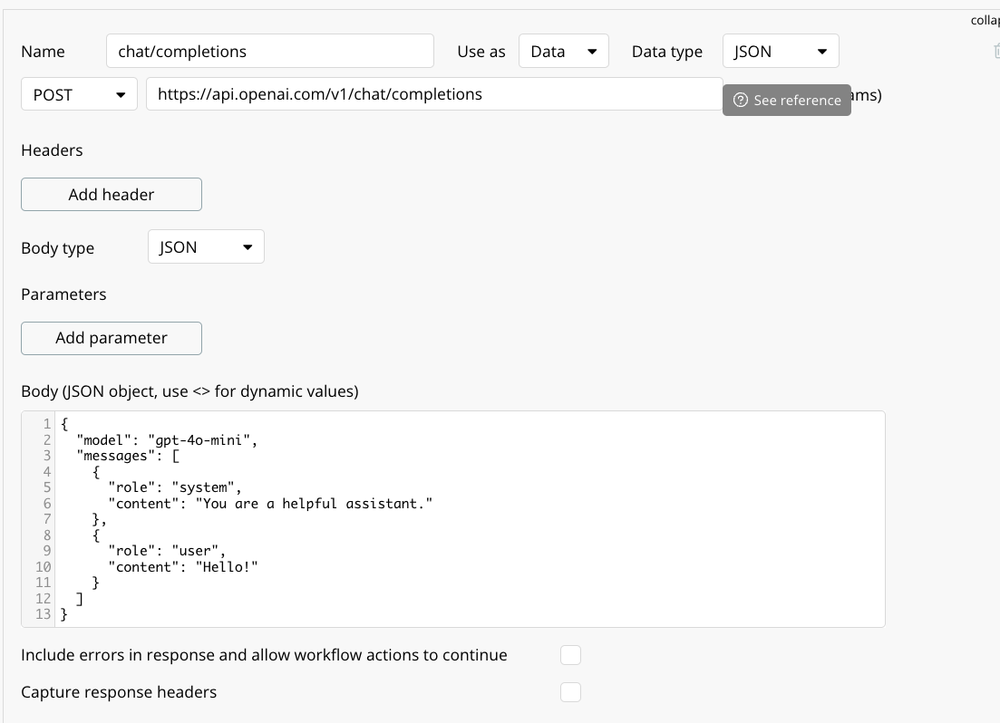

---

- ​​Once you've finished the settings, check that they are correct.

- Click the "Initialize call" button at the bottom.

- If successful, a popup that says "Returned values ​​- search" should appear.

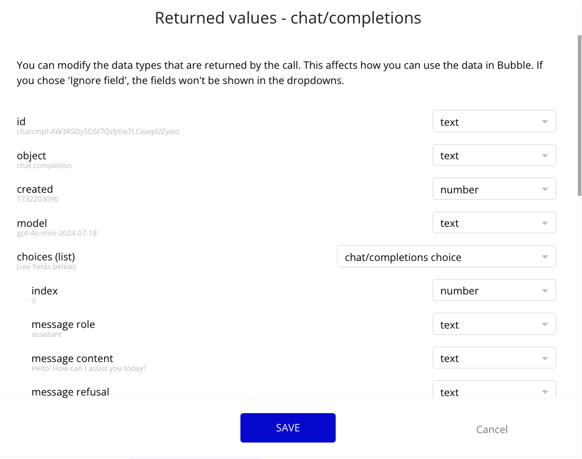

---

- ​​This shows the results (response) of the API call "https://api.openai.com/v1/chat/completions" that we just set up.

- Bubble's API Connector actually sends a request like this, analyzes the results received, and sets it up so that it's easy to use on Bubble.

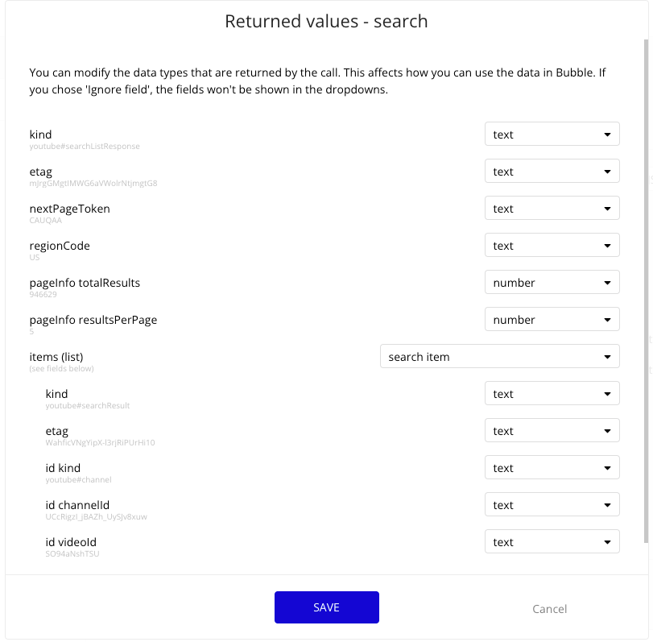

---

I won't go into details, but there are three main points to note:

- The part marked `choices(list)` is the list where the answer messages are stored
- The type is `chat/completions choice`
- The answer content is the item marked `message content`

Reference: Chat completion object reference
https://platform.openai.com/docs/api-reference/chat/object

---

- ​​For items that are not particularly referenced, select `Ignore field` from the pull-down menu as it is confusing
- By doing this, the item will not be displayed in the options when treated as dynamic data, so you do not have to worry about selecting the setting item
- When the settings are complete, click "SAVE" to save the settings

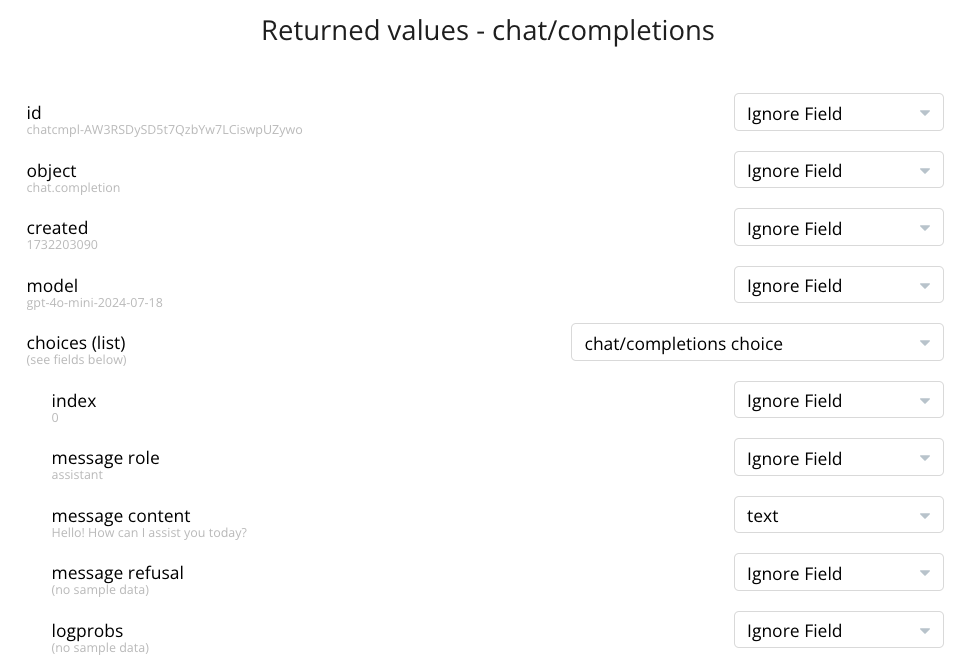

---

## Next, specify the body of the request

The request is written in a structured format called JSON. Each item has the following meaning.

- `model`: The model to be used. GPT is provided with several models with different sizes and performance. This time, we will use the lightweight and inexpensive `gpt-4o-mini` for verification.

- `messages`: The messages to be given to GPT as context. Roughly speaking, GPT is a language model that can write the continuation of a document very well. The context that is the source of the continuation is described as a set of `role` and `content`, and by linking them together, it will return a continuation (answer) that is in line with that context.

The given context is called a prompt because it is an instruction for the chat.

Reference: Reference for create chat completion
https://platform.openai.com/docs/api-reference/chat/create

---

This time, we will incorporate a function that returns advice based on the pet registration details and the buyer's consultation message.

The content to be written in the body should be named and enclosed in `<>` like `<name>`, and the content can be embedded from Bubble later when calling the API.

---

The context will be given as follows.

```
{
"model": "gpt-4o-mini",
"messages": [
{
"role": "system",
"content": "Answer as a pet care advisor.
The pet's name, date of birth, category, latest weight, and date of latest weight measurement will be provided by the pet's owner.
The pet's owner will also provide the details of their concerns about their pet.
Based on this, please provide advice on pet care.
At the beginning of your answer, please confirm the information provided:
name, date of birth, category, latest weight,
date of latest weight measurement, and details of the consultation."
},
{
"role": "user",
"content": "Pet's name: <name>, pet's date of birth: <birthday>,
pet's category: <category>, pet's latest weight: <weight>,
date of latest weight measurement: <weightDate>, details of the consultation: <content>"
}
]
}
```

\*The above content has been formatted with line breaks, so it cannot be used by pasting it as is.

---

Paste the following into the body.

```
{
"model": "gpt-4o-mini",
"messages": [
{
"role": "system",
"content": "Answer as a pet care advisor. The pet's name, date of birth, category, latest weight, and date of latest weight measurement will be provided by the pet's owner. The pet's owner will also provide any questions about the pet. Based on that, please provide advice on pet care. Please note that at the beginning of your answer, please include the given information: name, date of birth, category, latest weight, date of latest weight measurement, and question for confirmation."
},
{
"role": "user",
"content": "Pet's name: <name>, pet's date of birth: <birthday>, pet's category: <category>, pet's latest weight: <weight>, pet's latest weight measurement date: <weightDate>, question: <content>"
}
]
}
```

---

The items enclosed in `<>` will then be listed at the bottom of the Body input area. Uncheck `Private`. This will allow you to specify them dynamically when calling them later in Bubble.

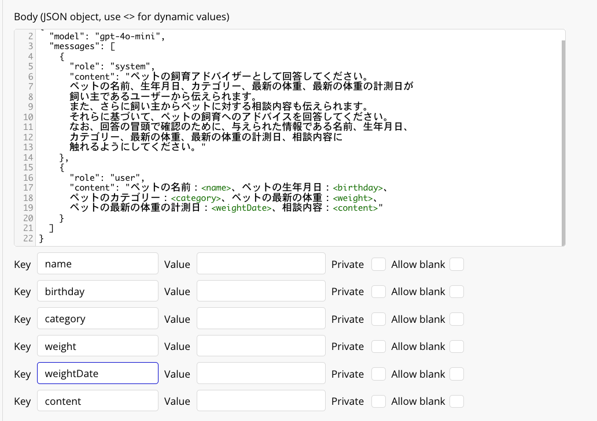

---

## Let's incorporate it into the screen.

Create a new page based on the pet_weight screen.

- Open the menu to the right of the b logo and select `Add a new page`

- Enter `pet_consult` in `Page name`

- Select `pet_weight` in `Clone from` and press the `Create` button.

- Once the screen is created, delete all elements below the graph.

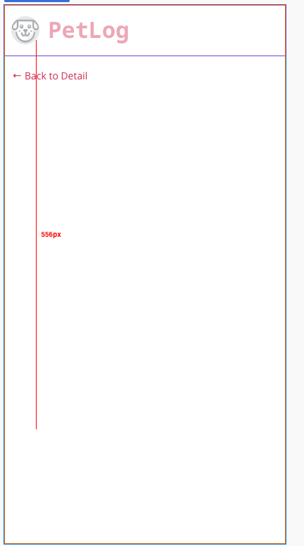

---

GPT answers are long, so make sure the screen is wide enough to display them all. (This screen is not responsive, so it will not stretch.)

- Click the outer frame of the screen to call up the `pet_consult` settings window.

- Set `Height` to `1500`.

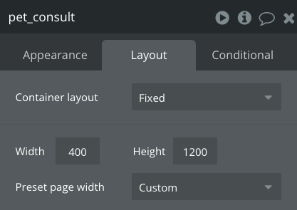

---

Next, we will place the elements for input. Let's place the elements as shown on the right.

- Explanation text
- Message input
- Submit button
- Text to display the answer

You can see how to do this, right?

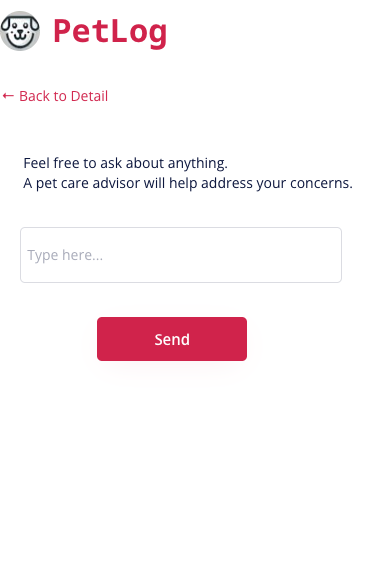

---

Next, we will place the elements for answer output. To receive the answer, it is necessary to receive it with a Container element such as `Group` or `RepeatingGroup`, which can specify the Type.

This time, we do not need to display the repeating display, so let's place a `Group`. Set `H` to `1000` so that the long answer can be displayed.

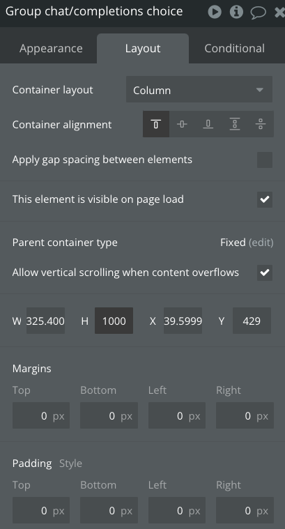

---

Please specify the Type. Specify the Type `chat/completions choice` that was previously defined in the API settings.

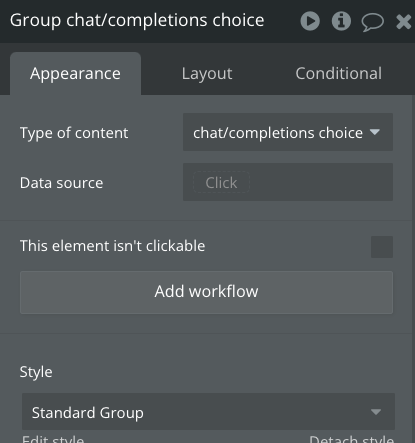

---

Now, let's place the text in the `Group` we created so that the answer text can be displayed. Set it as shown on the right so that it can be displayed to the full size of the `Group`.

The key point is that the width and height are not fixed, and the height is set to fit the content.

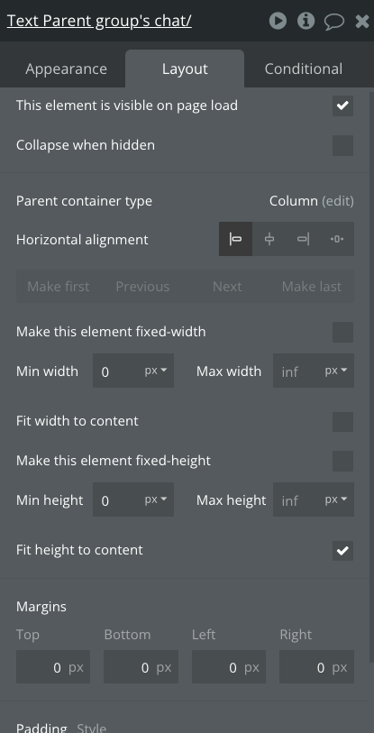

---

It will look something like this.

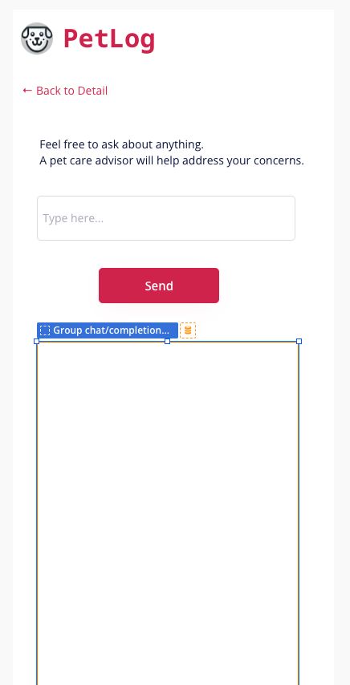

---

Now, let's set the action when the button is pressed.

- Click the `Send` button to open the settings window
- Press the `Add workflow` button in the `Appearance` tab
- Press `Click here add an action...` on the Workflow settings screen
- Select `Display data` in `Element Actions`

This is an action that displays the data obtained for the element.

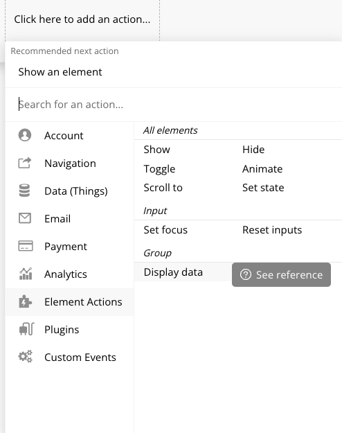

---

- Specify `Group chat/completions choice` in `Element`. This is the `Group` that we placed on the screen earlier.

- Specify `Get data from an external API` in `Data to display`. This specifies that data will be obtained from an external API.

- Specify `ChatGPT - chat/comletions` for `API provider`. This is the setting created in the API Connector in the preparation.

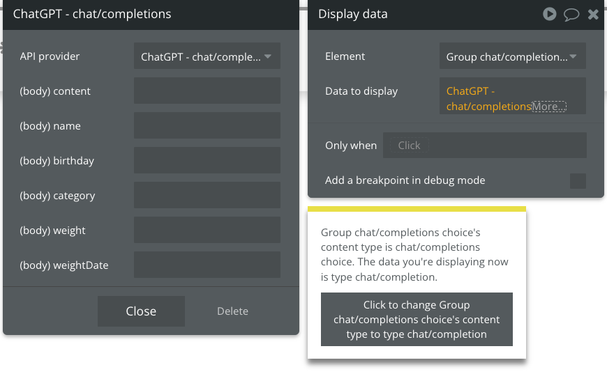

---

Next, specify the screen information. Set it as shown on the right.

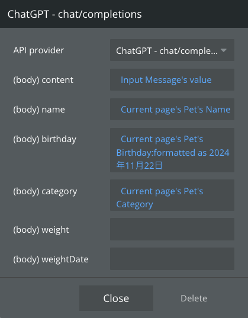

---

For `weight` and `weightDate`, you need to search within the PetWeight data.

- Select `Do a search for` in the `weight` field.

- Specify `PetWeight` for `Type`.

- Click `Add a new constraint` and specify ` Pet`` =  `Current page's Pet`.
- Specify `WeightDate` in `Sort by` and specify `yes` in `Descending`.

- Click `Close`.

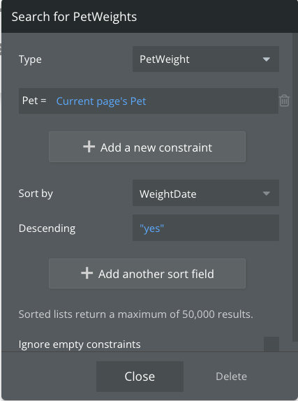

---

The weights of the displayed pets are obtained in order of most recent, so we will use the first weight among them.

- Specify `:first item`
- Specify `'s WeightKg`.

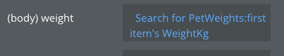

---

Similarly, set `weightDate` to obtain the date of the most recent weight.

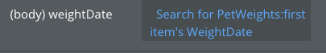

---

Go back to the `Display data` window and specify ` 's choices``:first item `.

ChatGPT is structured so that you can select from multiple answers, but for this example, we only need to get one answer, so specify the first one.

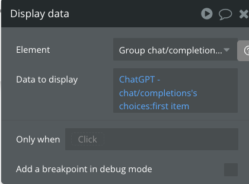

Now we're ready to display it.

---

Finally, let's place a link from the pet details.

- Open `pet_detail` in `Design` view
- Copy the `View Weights` link and place it below, then change the link name to `Consult`.

- Change the transition destination to `pet_consult`

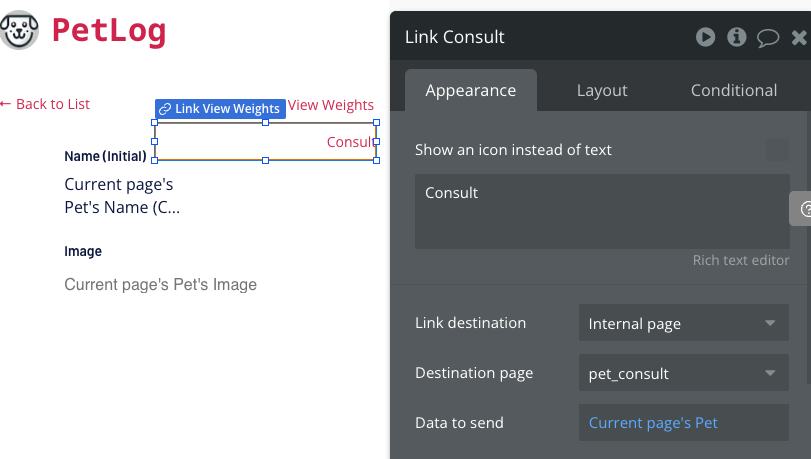

Ready to go.

---

## Let's check the operation.

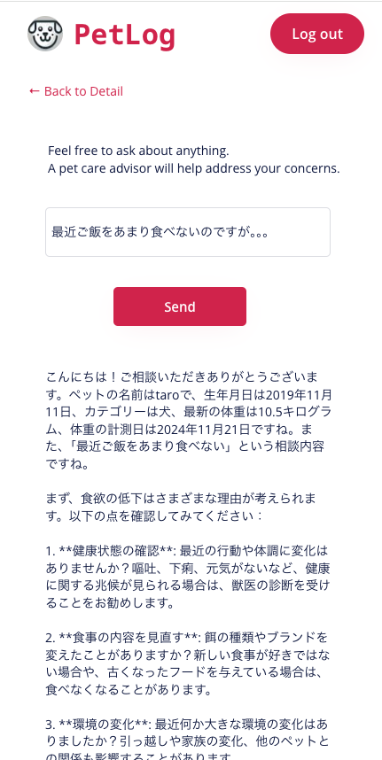

---

This completes the integration with ChatGPT.

ChatGPT and other LLMs can behave in various ways by devising the prompts, so if you combine them well with no-code and tools, you can easily create powerful functions.

You can also store the answers you get in a database to refer to the history or continue the conversation.

It's fun to create various ideas easily, so please give it a try.

---

## Display YouTube video list

---

##### First, prepare a new application as a base

- I would like to copy and reuse the application used in the first half of today

- Access https://bubble.io/home?tab=apps

---

- ​​A list of Bubble apps created with each account will be displayed
- Select the application you have created so far and click `Duplicate app` at the bottom of the pop-up

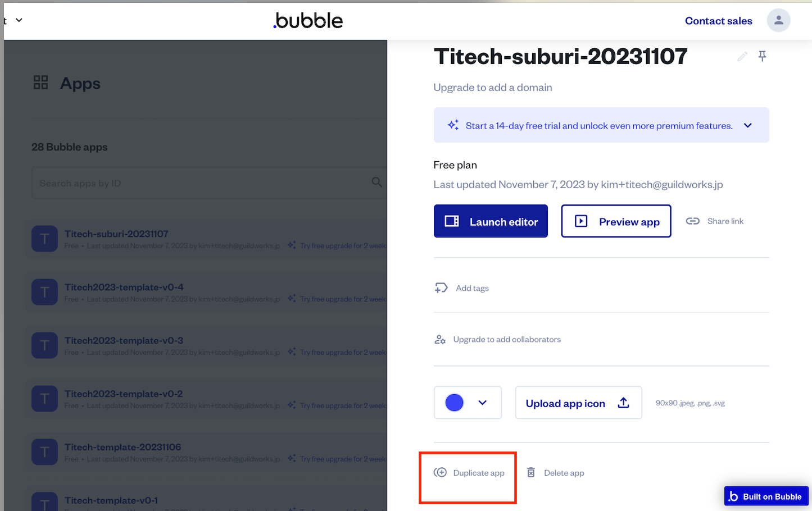

---

- ​​A dialog box for entering the name of the application after copying will be displayed, so enter an appropriate name
- Since we will not reuse the previous data, leave `Copy the application database content` unchecked
- Click COPY

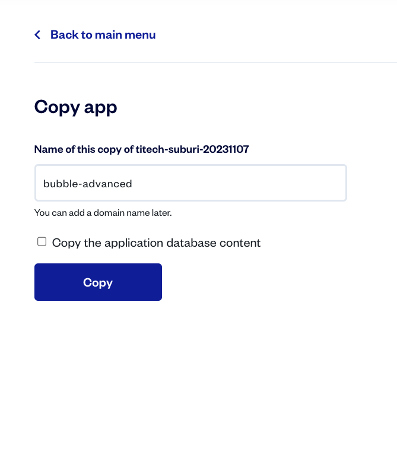

---

- Once copying is complete, if the editing screen (index) of the copied application is displayed, it's OK.

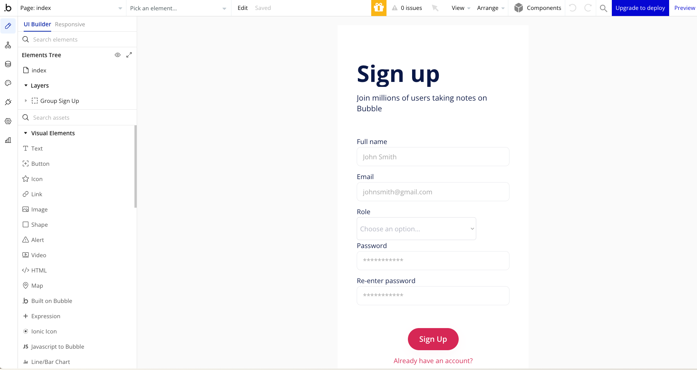

---

##### Preparation for YouTube integration

- Next, we will make the necessary preparations to display a list of YouTube videos.
- In this lecture, we will use various APIs provided by "Google Cloud Platform", a cloud service provided by Google.
- It is a platform that provides all the tools and infrastructure necessary for development, such as computing, storage, databases, and networks, as a service.
- Other well-known services include "Amazon Web Service" (AWS) provided by Amazon and Azure provided by Microsoft.
- (As an aside, the emergence of these services made it unnecessary to have your own server, and the threshold for software development in the world was suddenly lowered.)

---

- ​​Access the following URL
- https://console.developers.google.com/
- Log in with your Google account
- If you do not have a Google account, please create one

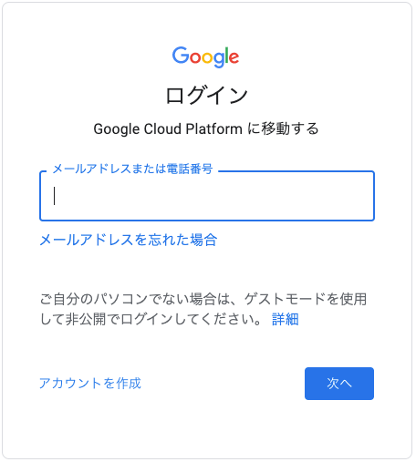

---

- ​​After logging in, when you access the Google Cloud Platform (GCP) screen for the first time, a dialog like the one shown below will be displayed, so select your country, check the terms of use, and click "Agree and continue"

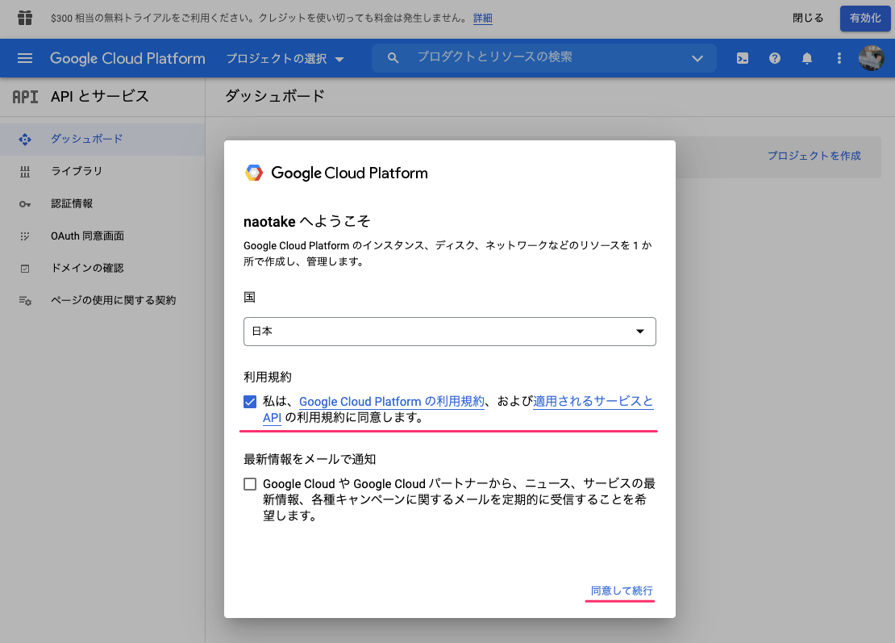

---

- ​​If you agree, you can use the API The service dashboard will be displayed, so click the Create Project link to create a project (box) for this lecture.

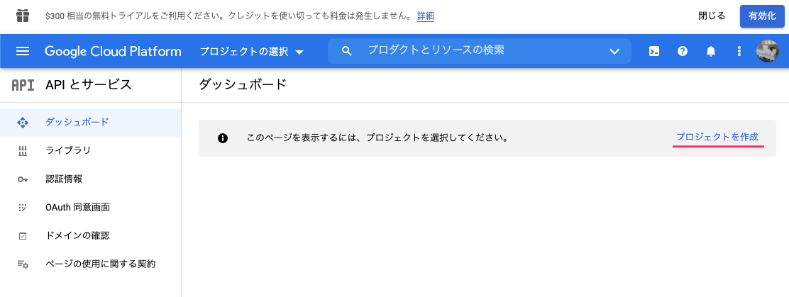

---

- ​​A new project creation screen will be displayed, so enter an appropriate name for the project name and create it.


---

- ​​Once creation is complete, the dashboard for the created project will be displayed.
- If the created project name is displayed to the left of Google Cloud at the top of the screen, it is OK.

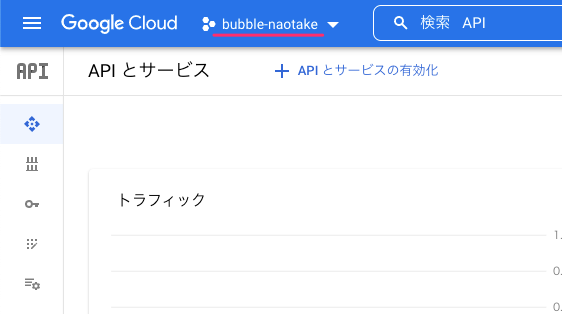

---

- ​​Next, we will issue the authentication key required to display the YouTube video list.
- To open the API and Services menu, enter "API" in the search box at the top of the screen.

- Select "APIs and Services" from the suggested candidates in the "Projects and Pages" block

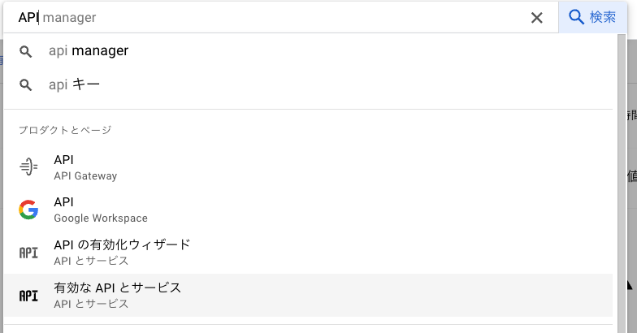

---

- ​​When the APIs and Services page opens, select "Credentials" from the left menu

- The right panel will change to Credentials, so click "+ Create Credentials" at the top of the screen

- Select "API Key" from the pop-up

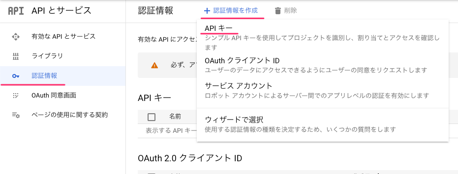

---

- ​​A pop-up will then appear indicating that the API key has been created, so make a note of the value

- You will be asked to restrict the keys, but we will delete these keys at the end of the lecture, so we will continue with this for now

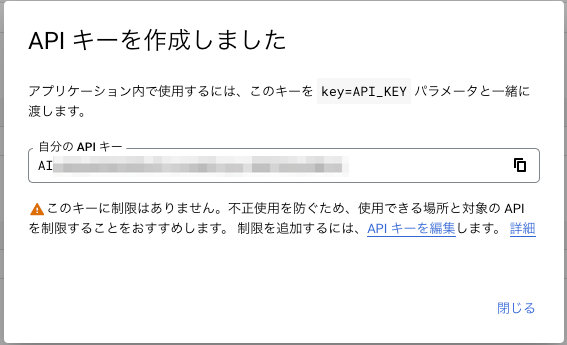

---

- ​​Now that we have issued a key to retrieve the YouTube list from Bubble, we will set up the Bubble side.
- First, we will prepare to retrieve the YouTube list from Bubble via API.

---

- ​​Now we will set up to use the YouTube API.
- We will use the "API Connector" that we used earlier to connect with the ChatGPT API.
- Select `API Connector` from the `Plugins` menu, click "Add another API" at the bottom of the screen, and start setting up a new API connection.

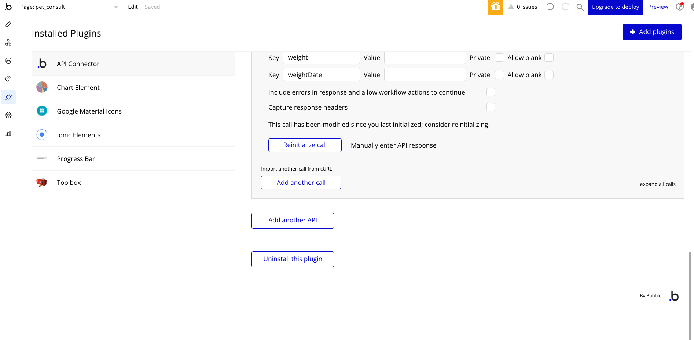

---

1. API Name: The group name for this API connection. This time it is YouTube

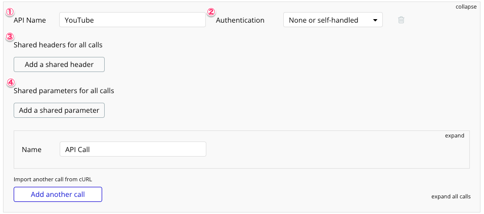

---

2. Authentication: Common authentication method for APIs under this group

- "None or self-handled" this time


---

3. Shared headers for all calls: Common header information specified for all APIs under this group

- Not specified this time


---

4. Shared parameters for all calls: Common parameter information specified for all APIs under this group

- This time we will not specify anything


---

- ​​Next, we will set the specific API content for this group

- On the previous screen, there is a link called "expand" to the right of the block that says "API Call", so click on it


---

- ​​Then, the specific API setting items will be displayed, so we will briefly explain them

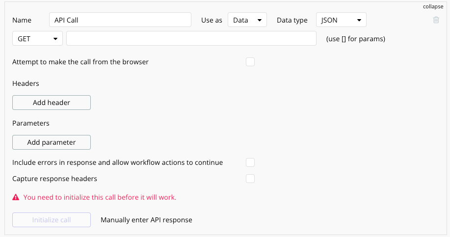

---

1. Name: Name of the specific API

- In this case, "search" Enter

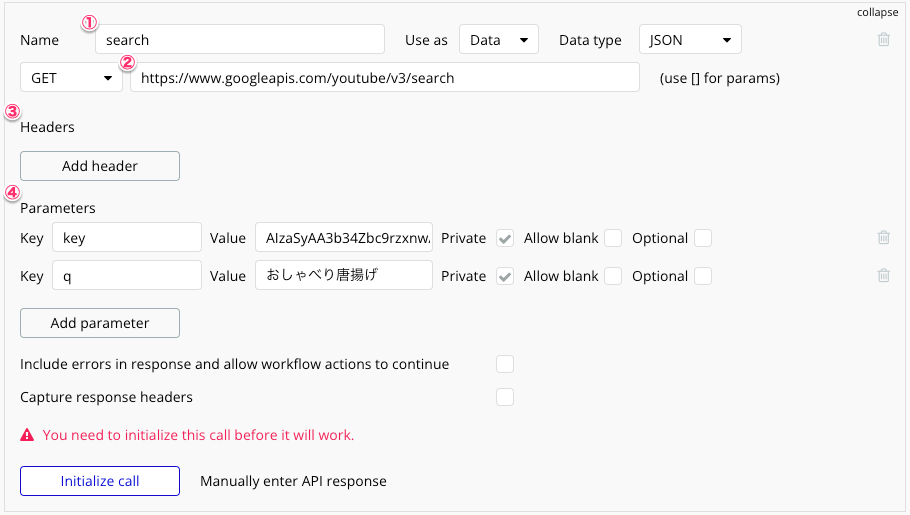

---

2. Path: Specific API URL

- This time, enter `https://www.googleapis.com/youtube/v3/search`


---

3. Headers: Header information specific to this API

- Not specified this time


---

4. Parameters: Parameter information specific to this API

- This time, specify the following two parameters. Private / Allow blank / Optional are as attached

1. Key: `key`, Value: API key issued by Google account

2. Key: `q`, Value: Keyword for searching for actions on YouTube (please specify freely)

---

- ​​This is what it looks like when you set everything up


---

- ​​Once you've finished setting it up, check that the settings are correct

- Click the "Initialize call" button at the bottom

---

- ​​You should probably get an error message with Status code 403

- The contents are as written, but to summarize it, it looks like this

> YouTube Data API v3 has been disabled in your project.

> Please go to this URL, enable it, and then try again.

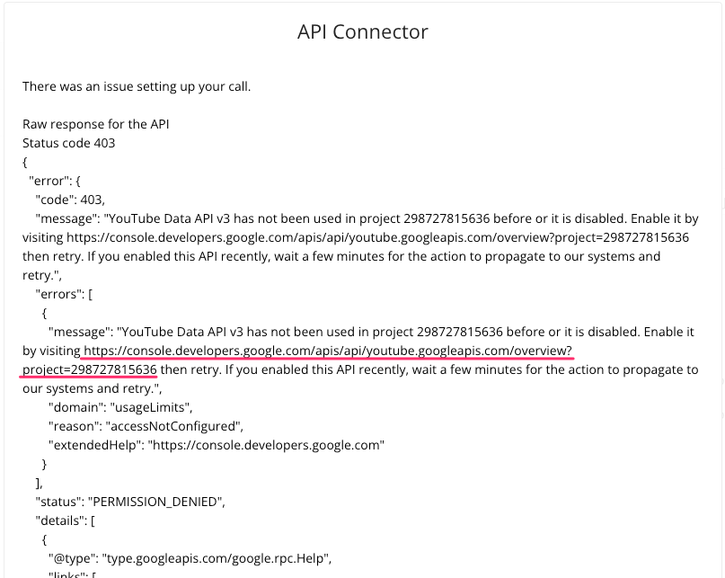

---

- ​​It seems that the YouTube Data API used this time is not enabled on each person's Google account.
- This is because Google has turned off the features that no one will use from the beginning, and only those who need it can turn them on themselves.
- Since we want to use the YouTube Data API this time, let's access the URL listed in the message and enable it.
  https://console.developers.google.com/apis/api/youtube.googleapis.com/overview?project={each person's project ID}

---

- ​​Then, you should be kindly redirected to the screen for "YouTube Data API v3" that you want to use this time.
- Click "Enable" as shown on the screen to enable it.

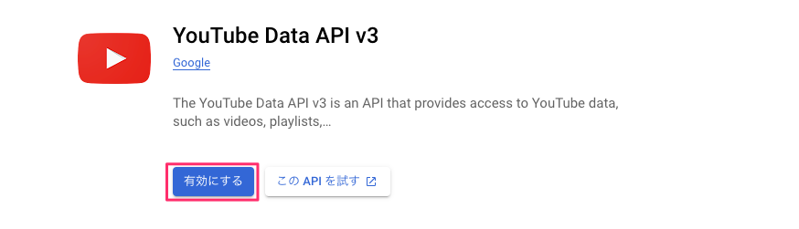

---

- After a while, you should be redirected to a screen like this
- If the red line at the top of the screen says "Disable API", the activation was successful

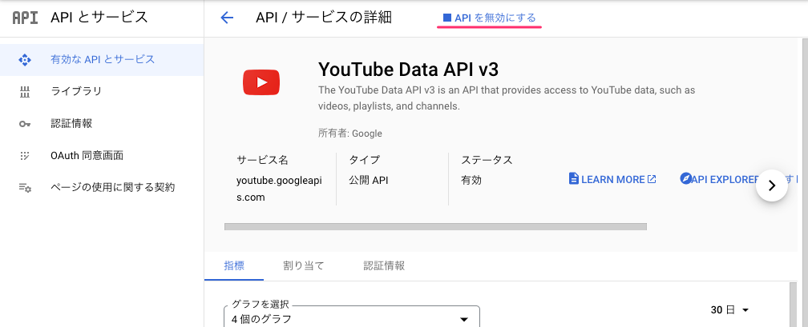

---

- ​​Now that the YouTube Data API has been activated, return to the Bubble screen and click the "Initialize call" button
- If successful, a pop-up that says "Returned values ​​- search" should appear

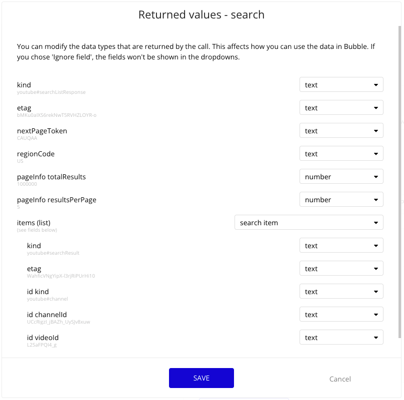

---

- ​​This shows the result (response) of executing the API "https://www.googleapis.com/youtube/v3/search" that was set up this time


---

I won't go into details, but there are three key points.

- The part marked `items(list)` is the list where the video results are stored
- The type is `search item`, which indicates that the search results contain multiple data
- And the item marked `id videoId` is particularly important in the settings that follow

---

- ​​As anyone who has watched YouTube will know, this VideoId is information that uniquely identifies each video, and this Id is also required when displaying the screen
- For other items that are not particularly referenced, select `Ignore field` from the pull-down menu, as they can be confusing
- By doing this, they will not be displayed in the options when treated as dynamic data, so you won't have to worry about choosing the settings

---

- ​​This is what it will look like when you set everything up
- When you're done setting up, click "SAVE" to save the settings

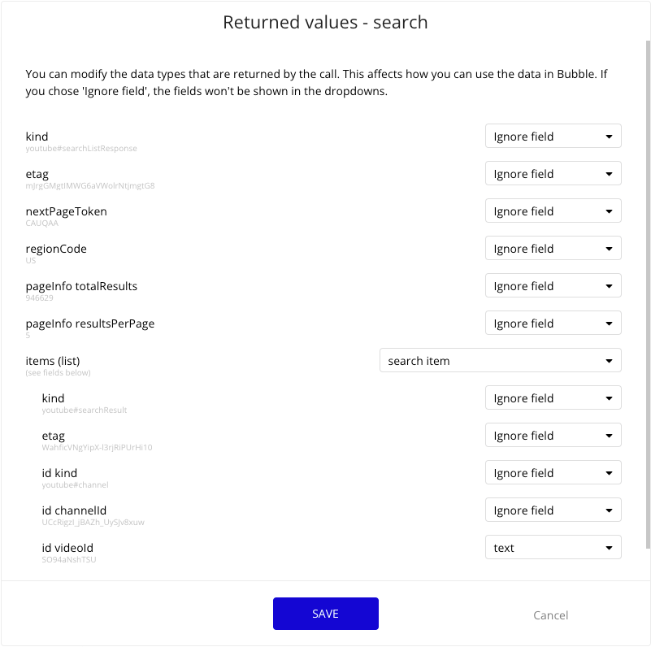

---

##### Preparing for screen display

- Now that we're ready to connect to Bubble's API, we're finally going to set up the screen.
- I think you've mastered screen settings in the last and this lectures, so I'll just give you an overview and try assembling the screen layout.

---

- ​​Create a "video_list" screen by cloning the pet_list page.
- Delete all the contents of each cell in the Repeating Group.
- Instead, place the Video visual elements so that they fill the cell.
- It should look something like this.


---

- ​​Now that we've created the layout, we'll actually set up the YouTube list display.
- First, the Type of content of the Repeating Group is the `search item` type that we confirmed when running the API earlier.
- Now the type of data to be repeated will be each YouTube video

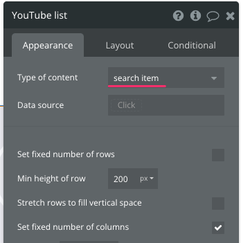

---

- ​​Next is Data source, but this time we will target the list of YouTube videos obtained from the API
- If you look at the candidates from Click, you will see an item called `Get data from an external API`, so select that

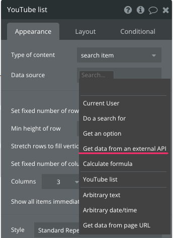

---

- ​​A popup for Get data from an external API will appear next to it, so select the API provider dropdown
- Then, in the dropdown, you will see the candidate `YouTube - search` that you set earlier, so select it
- The part before the hyphen is the API group name, and the part after it is the specific API is the name


---

- ​​Once the API Provider is set, close it with CLOSE

- Then select `'s items` as the Data source selection for the original Repeating Group

- Now you have specified that the list of videos (items) included in the API results will be displayed repeatedly

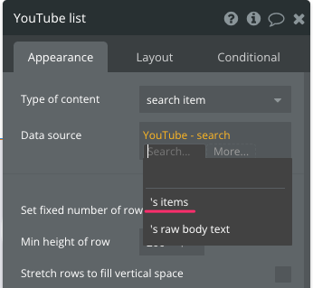

---

- ​​Next, we will set up each cell, but let's set it up first

- Hint :bulb:

- Video source is YouTube

- Then, a field called Video ID will be displayed, so it seems like it would be good to refer to the `Video Id` that we saw when setting up the API earlier

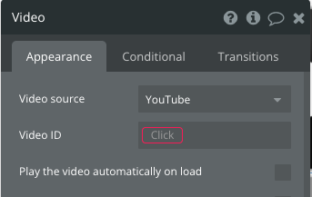

---

- ​​It looks like this

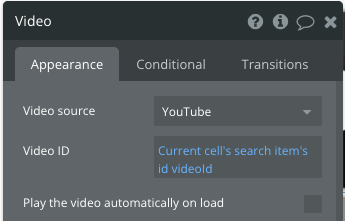

---

- ​​The settings are now complete! Let's preview it now!
- Did you see a list of videos for the keywords you specified in the API beforehand?

---

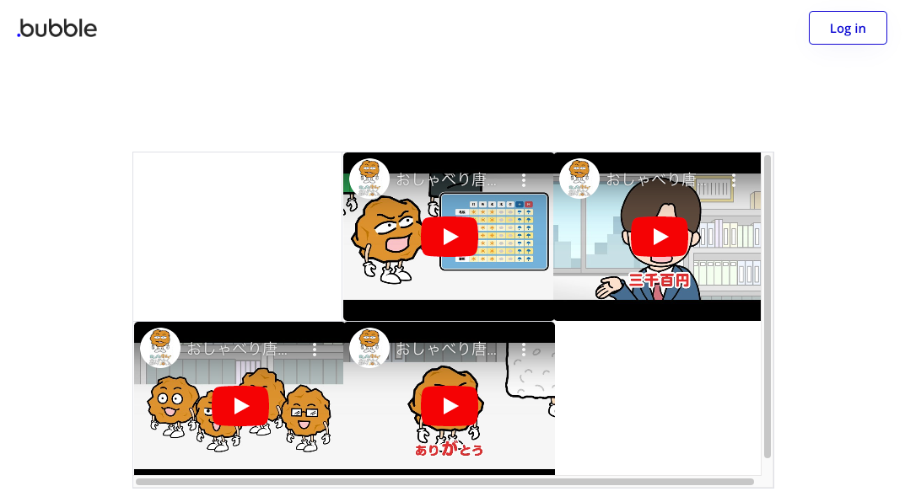

---

#### ＜ Advanced ＞

## Social login using a Google account

---

#### ＜ Advanced ＞

##### Try Google login

- Next, let's try logging in to the Bubble app using a Google account!
- First, install the Google plugin

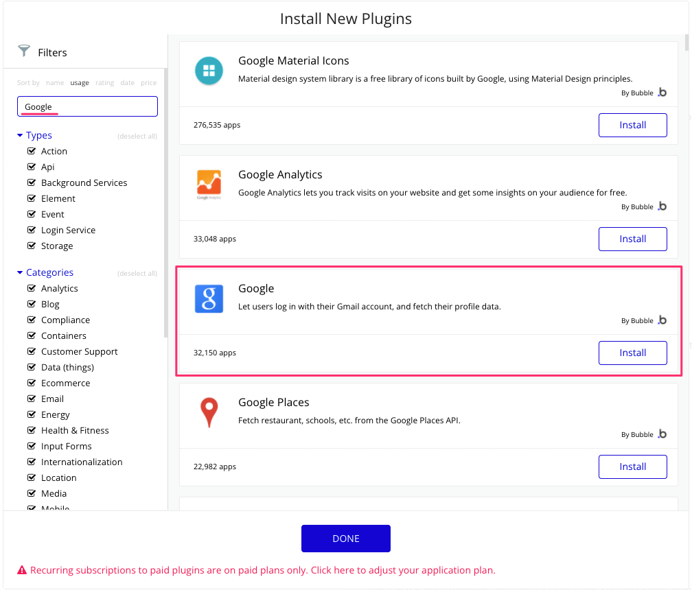

---

#### ＜ Advanced ＞

- Select the installed Google plugin

- Check the `Use a generic redirect URL` box displayed in the right panel

- Make a note of this URL as well, but since you cannot select it on the screen, please replace the app name part of the URL below with your own app name and make a note of it 😅

- `https://{Your App Name}.bubbleapps.io/api/1.1/oauth_redirect`

---

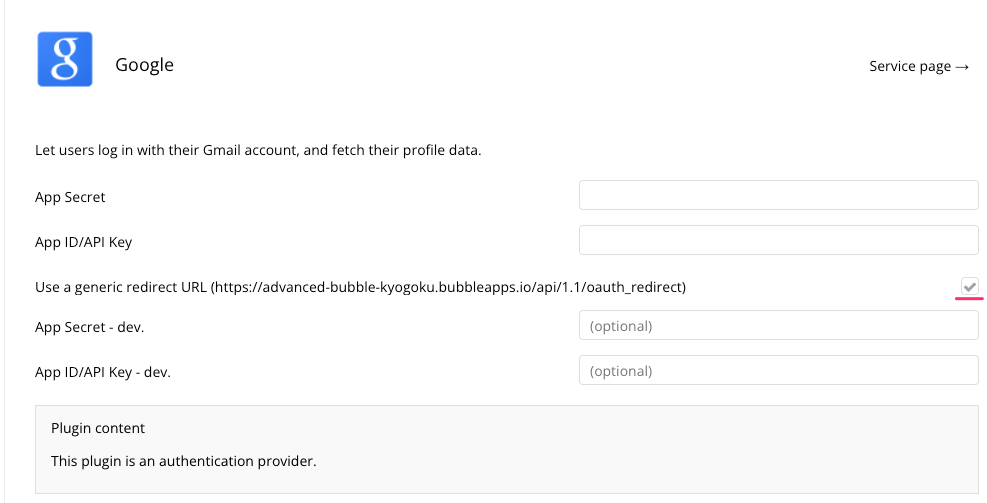

---

#### ＜ Advanced ＞

## What is OAuth?

OAuth is a mechanism on the Internet that allows one service to authenticate and access resources without revealing your password to another service. If you want to use another service (such as a pet management service) but don't want to create a new account for it, you can use OAuth to log in with an existing account (such as a Google or Facebook account).

---

#### ＜ Advanced ＞

## How it works

- Request login: Select "Log in with Google Account" for the pet management service.

- Confirm permission: Google asks "Can this service use some of your information?"

- Give "key": If you give permission, Google gives the service a special "key". The service will then have access to limited information, such as your name and email address.

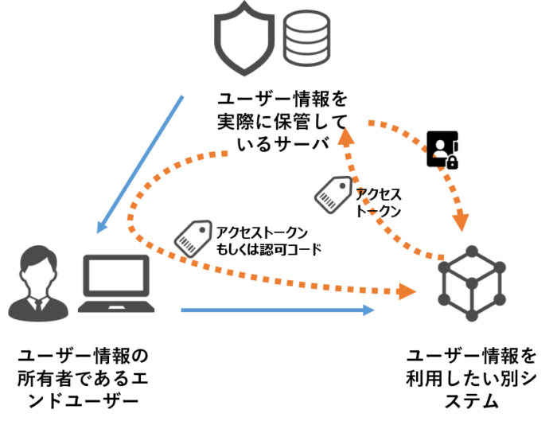

---

#### ＜ Advanced ＞

###### Preparation for authentication to return to the app after logging in to Google

- Access the Google Cloud Platform screen

https://console.developers.google.com/

- Display the same API and service screen as before

---

#### ＜ Advanced ＞

- Select the project and select "OAuth consent screen" from the left menu

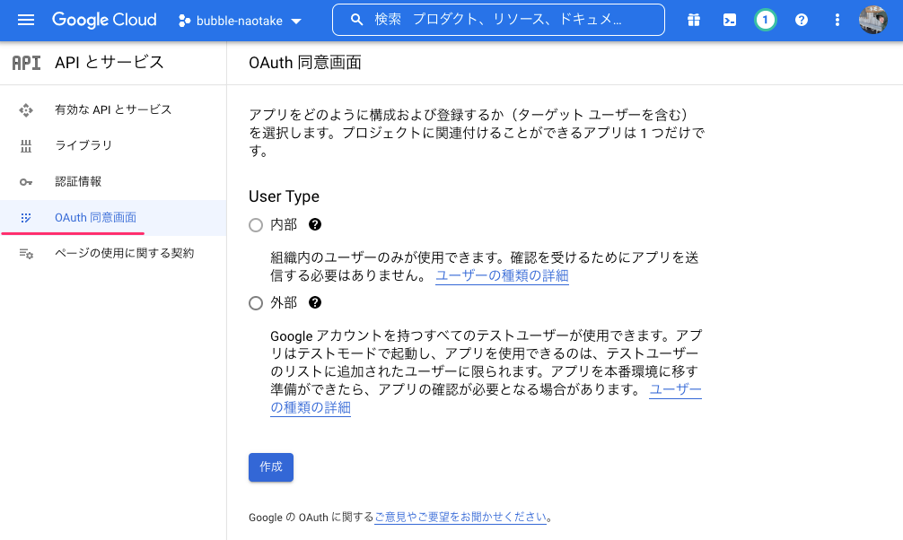

---

#### ＜ Advanced ＞

- Select "External" for User Type and click Create

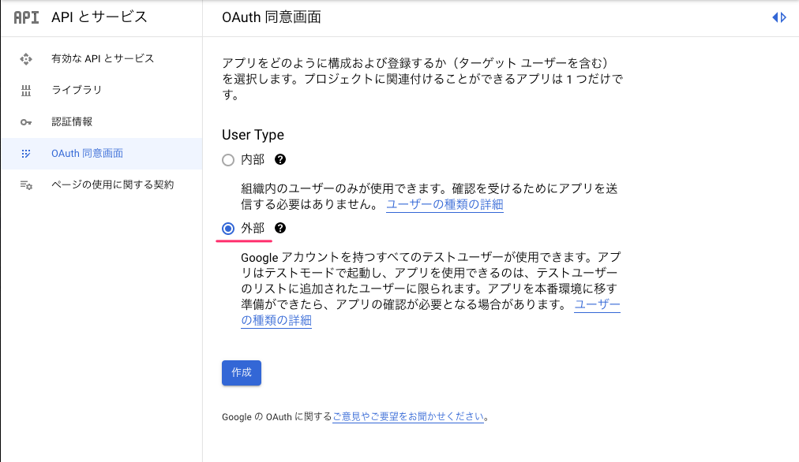

- Enter the required information on the next page

---

#### ＜ Advanced ＞

- App information
- App name: App name created in bubble
- User support email: Your Google account email address

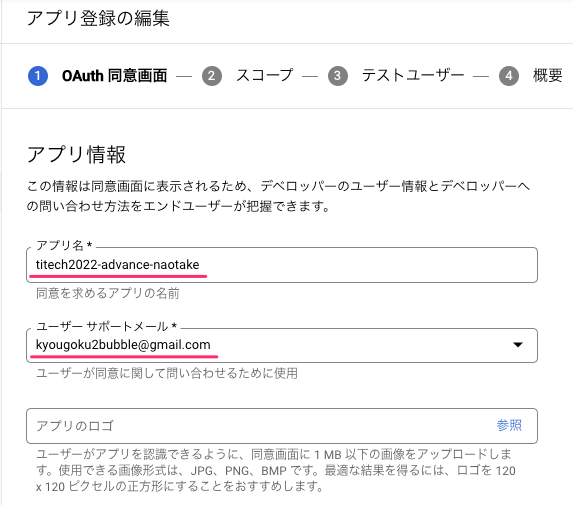

---

#### ＜ Advanced ＞

- Approved domains
- bubbleapps.io
- Developer contact information
- Your Google account email address
- "Save and continue"

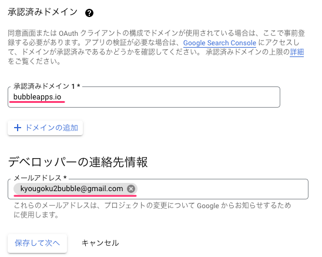

---

#### ＜ Advanced ＞

- Do not change the scope settings, just "Save and continue"

---

#### ＜ Advanced ＞

- Enter your own Google email address for the test user
- Once you've set it, save it and go to the next step.

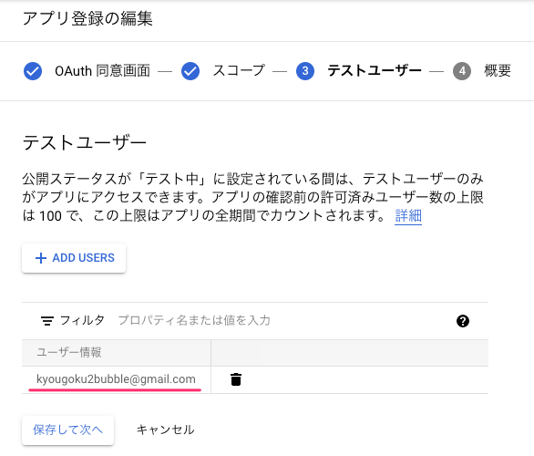

---

#### ＜ Advanced ＞

- Registration is now complete, so proceed to issue authentication information
- Select authentication information from the left menu and click "+ Create authentication information"
- Select OAuth client ID from the submenu

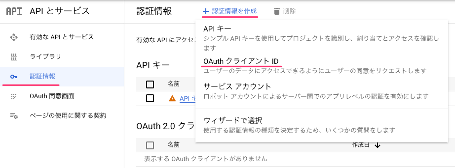

---

#### ＜ Advanced ＞

- The screen for creating an OAuth client ID will be displayed, so enter the information as shown below and click "Save"
- Application type: Web application
- Name: `Bubble OAuth`

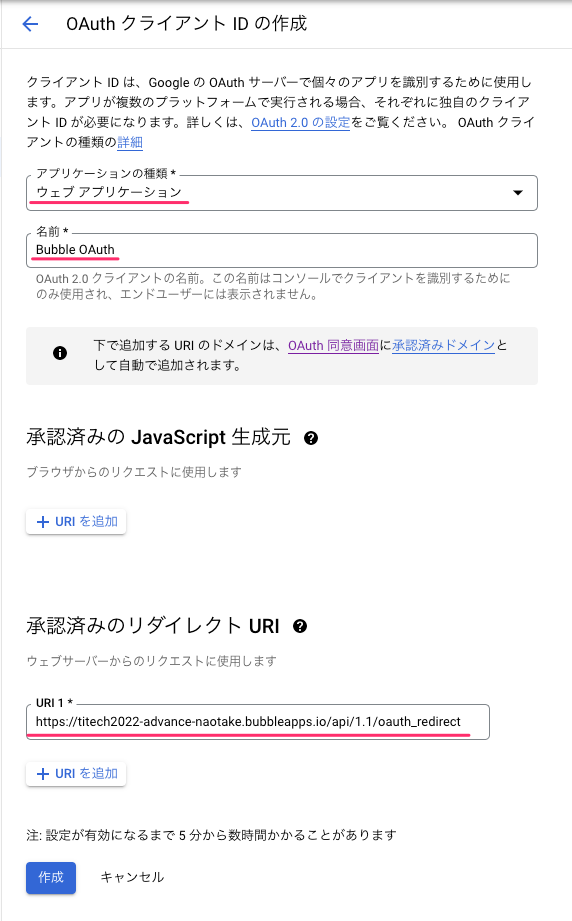

---

#### ＜ Advanced ＞

- Approved redirect URI: The URL noted down when installing the Google plugin on the Bubble side
  `https://{Your App Name}.bubbleapps.io/api/1.1/oauth_redirect`


---

#### ＜ Advanced ＞

- Click "Create"
- A pop-up will appear saying "OAuth client created", and the client ID and client secret will be displayed there, so make a note of them
- If you think you might forget them, you can download the JSON
- Once you have made a note of them, click OK to close

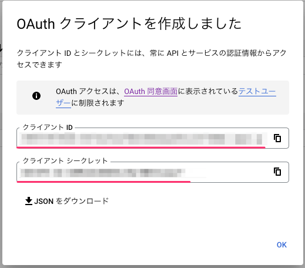

---

#### ＜ Advanced ＞

##### Set the issued authentication information on the Bubble side

- Return to the Google plugin screen in Bubble and enter the keys you obtained earlier into the respective fields
- Client ID → AppID/API Key
- Client Secret → App Secret


---

#### ＜ Advanced ＞

- This completes the pre-settings
- Next, we will create the login function

---

#### ＜ Advanced ＞

##### Replace the login mechanism with Google

- Open the index screen and delete all sign-up text boxes and buttons
- Place a new button and change the label to something like `Login by Google`

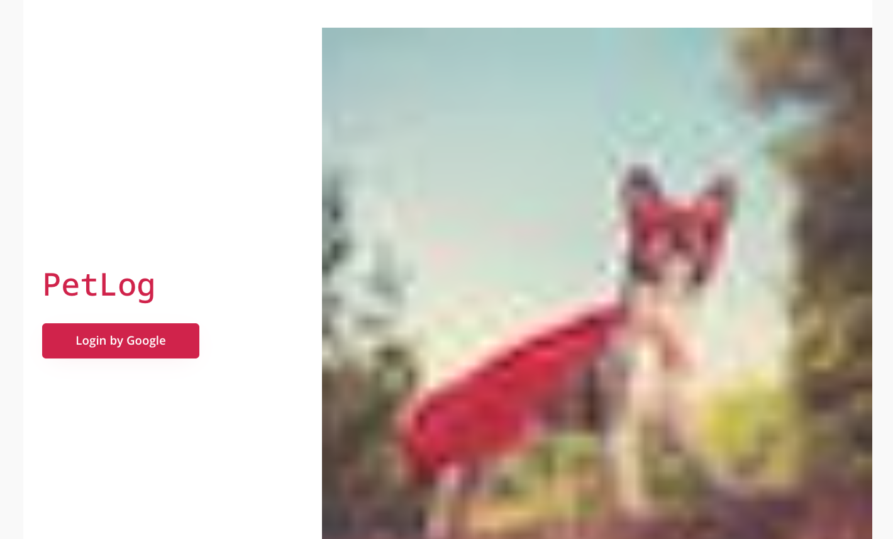

---

#### ＜ Advanced ＞

- Click `Edit workflow` in the settings window for the button you placed to start creating a workflow for when the button is clicked

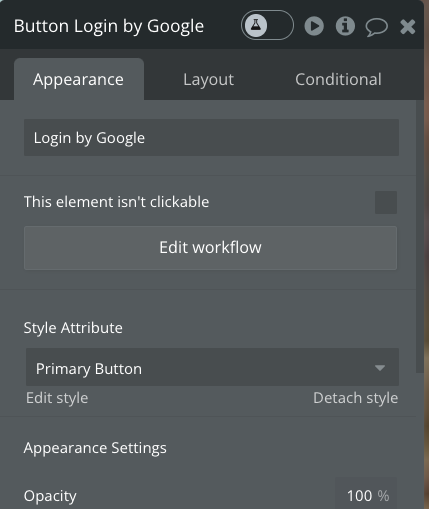

---

#### ＜ Advanced ＞

- Set up the Google login workflow

- Select Click here to add an action...

- Select Signup/login with a social network from Account

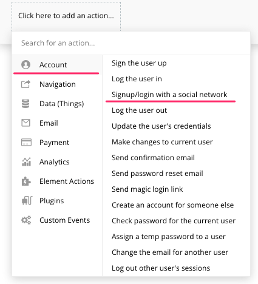

---

#### ＜ Advanced ＞

- A Signup/login with Google popup will appear

- Select Google as the OAuth provider


---

#### ＜ Advanced ＞

Let's specify that after logging in, you should move to the pet list

- Select Click here to add an action...

- Specify `Navigation`>`Go to page`
- Specify `pet_list` as the destination

That's all it takes to log in with your Google account. Easy!

---

#### ＜ Advanced ＞

- Since we're here, let's display the account name and image at the top of the header once the login is successful.

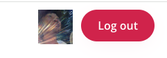

---

#### ＜ Advanced ＞

- Open the header of Reusable elements.

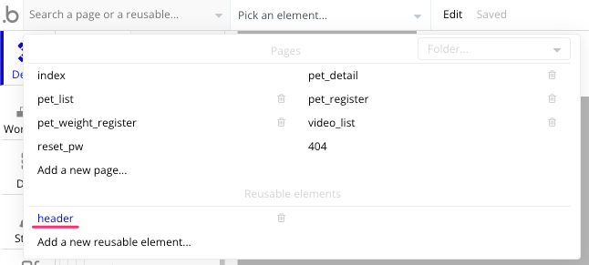

---

#### ＜ Advanced ＞

- Switch to the Design tab and display the currently hidden Log out button component from the Elements tree.

- If you don't do this, it will be difficult to see what the image will look like after the image is added.

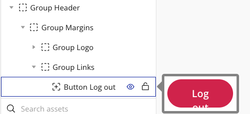

---

#### ＜ Advanced ＞

- Select Image from Visual elements. Select and place the image to the left of the "Log out" button

- Make it a square 50 x 50

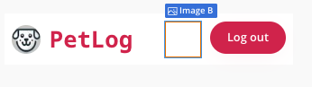

---

#### ＜ Advanced ＞

- Then set the image source

- If you're a Bubbler user, you can probably imagine how to set it up

- Dynamic display settings are Dynamic image
- What you want to display is the profile image of the Google account of the currently logged-in user

---

#### ＜ Advanced ＞

- It looks like this

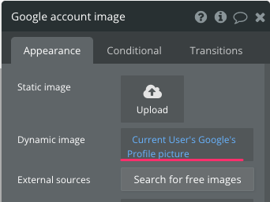

---

#### ＜ Advanced ＞

- Let's preview it! - If there is data in the Data User field that contains the same Google email address as the one you will use to check the operation, please delete it beforehand.
- When you press the login button, you will be taken to the Google login screen, and when you log in there, you will be returned to the Bubble side, right?
- By the way, when you log in, the email address information of the Google account you logged in to will be registered in the User data on the Bubble side.

- Of course, your password is not saved, so don't worry :smile:


---

#### ＜ Advanced ＞

# Dynamically search YouTube video list

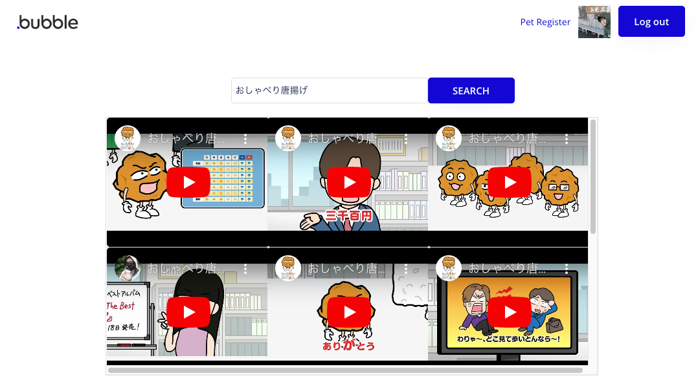

---

#### ＜ Advanced ＞

- Currently, the authentication key and search keywords for the YouTube API are fixed.

- So, let's change this as follows.

- The authentication key is obtained from the logged-in user information (add a new field).

- The search keyword can be entered and searched from the screen.

---

#### ＜ Advanced ＞

I'll write some hints on the next page, so let's try it first!

---

#### ＜ Advanced ＞

- First, add a field called `key` to User and set it in advance.

- Normally, it would be natural to have the user enter the value themselves, but due to time constraints, we will omit the API key setting screen this time.

- If you want to set API parameters dynamically during processing, first remove the fixed value and uncheck `Private`, so that you can specify the parameters when calling the API with DataSource, etc.

- Place a new search element (text box and search button) on the video_list page, and when the search button is clicked, search will be performed via the YouTube API and the results will be set in the Repeating Group.

---

# :hourglass_flowing_sand:

# :hourglass_flowing_sand:

# :hourglass_flowing_sand:

# :hourglass:

# :hourglass:

---

#### ＜ Advanced ＞

- Let's explain the important points.
- First, set `key` to the User type. Add a field called

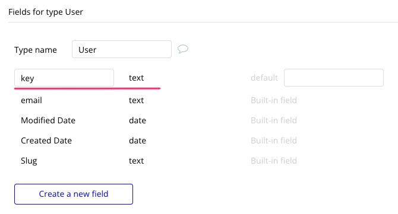

---

#### ＜ Advanced ＞

- Then, set the authentication key (API key) obtained this time to the registered User in advance

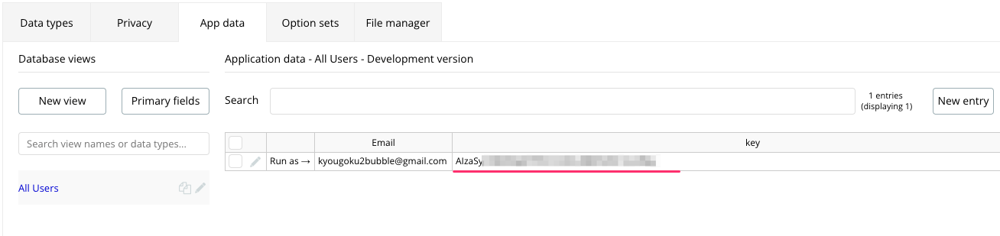

---

#### ＜ Advanced ＞

- Next, the settings on the YouTube API side look like this

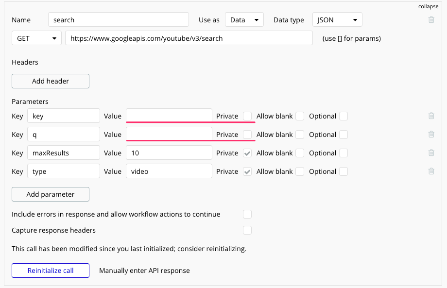

---

#### ＜ Advanced ＞

- The key point is that for items that you want to specify dynamically, you delete the Value value and uncheck Private

- This allows you to specify the values ​​of these parameters when using the API


---

#### ＜ Advanced ＞

- Let's add two search options as well
- key: `maxResults`, the number of data to be retrieved in one search
- Default is 5
- key: `type`, the type of data to search
- By specifying `video`, you can search only for videos

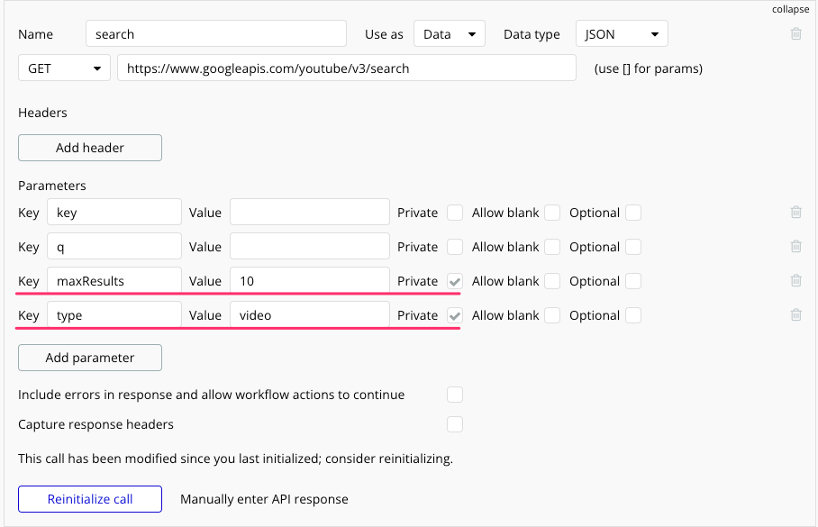

---

#### ＜ Advanced ＞

- Next, empty the Data source of the Repeating Group
- The target data to be displayed will be specified in the workflow of the new search function, so it is fine if this is empty

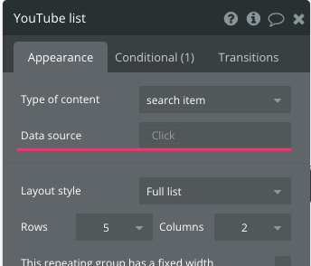

---

#### ＜ Advanced ＞

- Next, we will set the workflow for when a keyword search is performed, so we will set the workflow for the newly prepared search button.
- This time, it will be an action for an element (Repeating Group), so select "Display list" in "Element Actions".

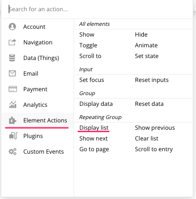

---

#### ＜ Advanced ＞

- Select Get data from an external API for Data source to display data via API.
- Then select `YouTube - search` for API provider, and two params that were not there before should be displayed.
- This is because we unchecked Private for the parameters we want to specify dynamically in the YouTube API settings.
- The value specified here is the usual Dynamic data.

---

#### ＜ Advanced ＞

- This is what it looks like when you set it up

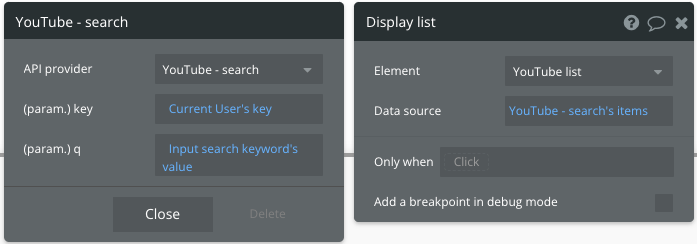

---

#### ＜ Advanced ＞

#### Let's preview

- When you are logged in, did the list of videos you entered in the keyword field appear?


---

#### ＜ Advanced ＞

- What did you think?

- I think that by integrating with the API, the range of things you can do with Bubble has been expanded!

- There may be teams at the training camp that use external APIs, so if that's the case, use what you learned today to put API integration into practice!

---

## Developing as a team

---

## Tips for collaborating with Bubble

Here is some information that will be useful when collaborating with a team using Bubble.

---

#### How to invite team members in Bubble

To co-edit an app with team members...

- Prepare one account for your team, and everyone will log in and use that account.

---

- ​​Bubble has a regular co-editing function, but... 💰💰💰

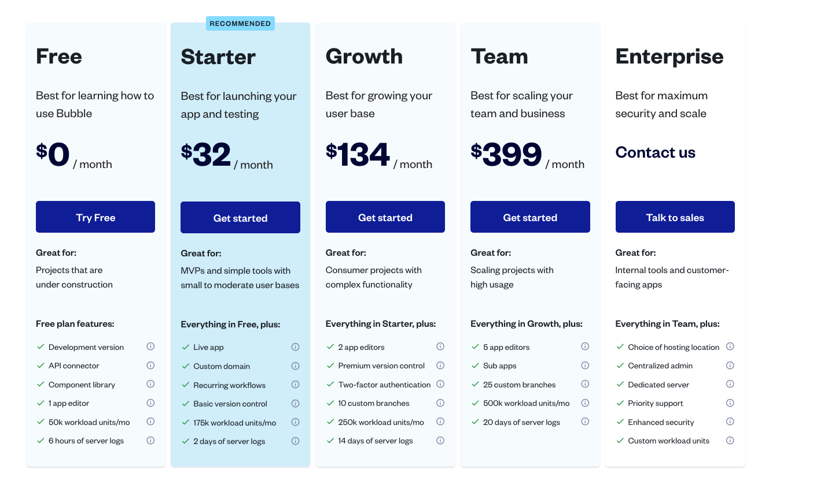

---

#### Notes on simultaneous editing in Bubble

- Avoid simultaneous editing of the same element (edits made later will overwrite existing ones).

- To do this, it is recommended to assign a person in charge of each screen and avoid simultaneous editing of the same screen.

- There are no other particular points to note.

- Edits are reflected in real time on other people's screens.

- Not only screen edits, but also database and workflow edits are reflected in real time.

- If you divide the work by screen, it seems that development will be easy.

---

## Team development exercise

- Try developing a new app as a DevelopmentPhase team
- Make it a different app from the one you plan to develop in DevelopmentPhase
- You can choose whichever you plan to use in DevelopmentPhase, or both
- Get everyone involved

---

#### Example of how to divide work

- First, work together to identify screens and functions and design the database
- Decide who will be in charge of each screen (e.g., registration screen, list screen, details screen, update screen)
- You can also have multiple people work on one PC. In that case, the person operating the PC and the person giving instructions should be switched regularly.

---

# :hourglass_flowing_sand:

# :hourglass_flowing_sand:

# :hourglass_flowing_sand:

# :hourglass:

# :hourglass:

---

#### Presentation of exercise results

Let's have each team present the app they created in the exercise!

---

That's all for today's lecture.

---

### Finally

- Delete the API key and OAuth information issued by Google Cloud Platform.

---

# That's it!

# Thank you for your hard work!
