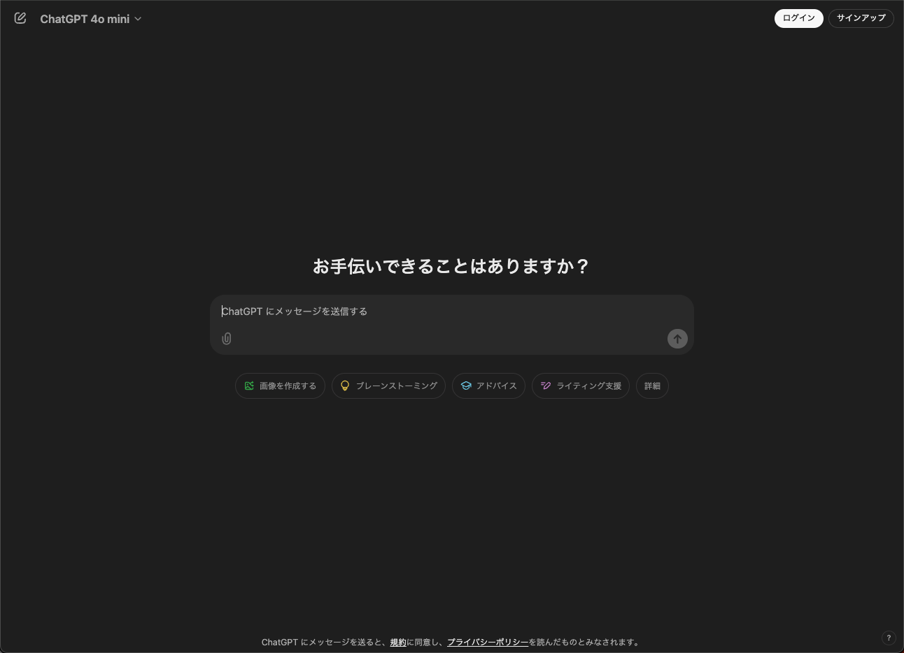
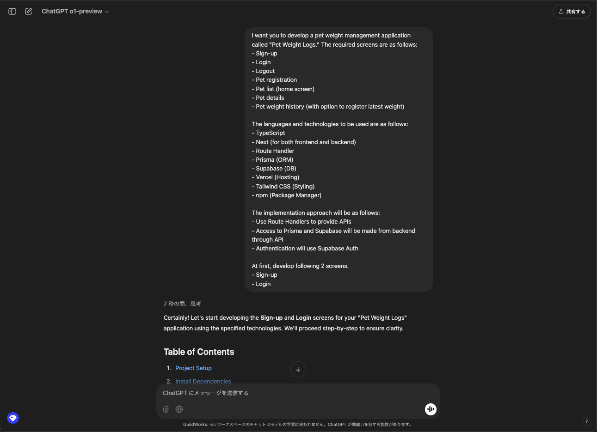
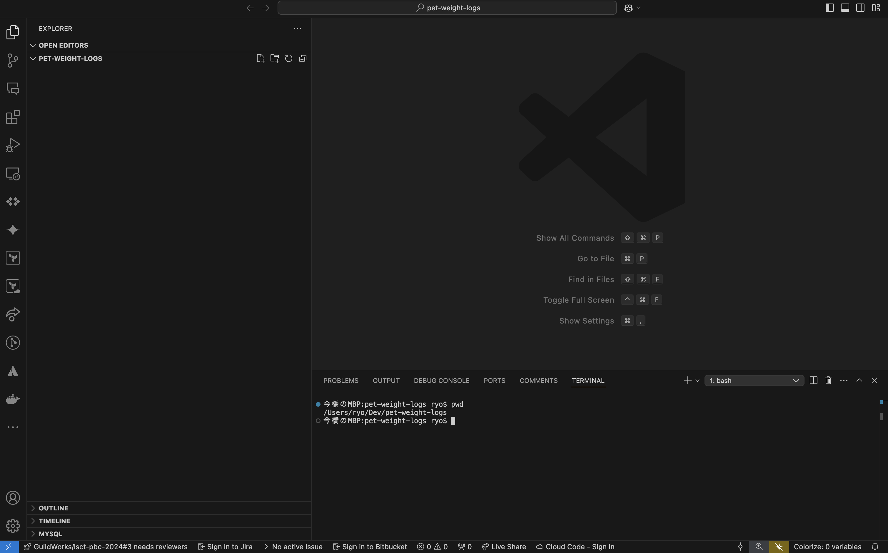

# 2. App development using generative AI

By telling the generative AI the application you wish to develop and the technology to be used, you can make generative AI create a procedure for developing the application.
If you use generative AI well, you can develop your application efficiently, so let's experience how to do it.

## Let's Try generative AI supported development
- Visit following url and sign in. If you don't have account, signup.
  - https://chatgpt.com/
  

- Ask following question.
```
I want you to develop a pet weight management application called "Pet Weight Logs." The required screens are as follows:
- Sign-up
- Login
- Logout
- Pet registration
- Pet list (home screen)
- Pet details
- Pet weight history (with option to register latest weight)

The languages and technologies to be used are as follows:
- TypeScript
- Next (for both frontend and backend)
  - Route Handler
- Prisma (ORM)
- Supabase (DB)
- Vercel (Hosting)
- Tailwind CSS (Styling)
- npm (Package Manager)

The implementation approach will be as follows:
- Use Route Handlers to provide APIs
- Access to Prisma and Supabase will be made from backend through API
- Authentication will use Supabase Auth
```

日本語でもOK(Japanese is also available)
```
ペットの体重管理アプリケーションである「Pet Weight Logs」を開発してください。
必要な画面は以下の通りです。

- サインアップ
- ログイン
- ログアウト
- ペット登録
- ペット一覧(ホーム画面)
- ペット詳細
- ペットの体重履歴(最新の体重も登録可能)

使用する言語や技術は以下のとおりです。
- Typescript
- Next(フロントエンド、バックエンド共に)
  - Route Handler
- Prisma(ORM)
- Suparbase(DB)
- Vercel(Hosting)
- tailwind css(Styling)
- npm(Package Manager)

実装の方針は以下のとおりです。
- Route Handlerを使ってAPIを提供する
- PrismaやSupabaseへのアクセスはAPIを通じてバックエンドから行われる
- 認証はSupabase Authを使う
```

You will get answers like the following.


## App development according to Phind's answer
Even if you ask the same question to the generative AI, the answer may change each time. So, in this lecture, I want all of you to develop according to the answers to my questions to GPT.
I will do it with you, so please follow me.

---

# Preparation
- Create a new folder "pet-weight-logs" on your PC, separate from the “isct-pbc-2024” you have been using so far, open that folder with Visual Studio Code.
  

# My Question 1
```
I want you to develop a pet weight management application called "Pet Weight Logs." The required screens are as followss:
- Sign-up
- Login
- Logout
- Pet registration
- Pet list (home screen)
- Pet details
- Pet weight history (with option to register latest weight)

The languages and technologies to be used are as follows:
- TypeScript
- Next (for both frontend and backend)
  - Route Handler
- Prisma (ORM)
- Supabase (DB)
- Vercel (Hosting)
- Tailwind CSS (Styling)
- npm (Package Manager)

The implementation approach will be as follows:
- Use Route Handlers to provide APIs
- Access to Prisma and Supabase will be made from backend through API
- Authentication will use Supabase Auth
```

# GPT's Answer 1
Certainly! Let's start developing the **Sign-up** and **Login** screens for your "Pet Weight Logs" application using the specified technologies. We'll proceed step-by-step to ensure clarity.

## Table of Contents

1. [Project Setup](#project-setup)
2. [Install Dependencies](#install-dependencies)
3. [Configure Supabase](#configure-supabase)
4. [Set Up Prisma](#set-up-prisma)
5. [Create Sign-up Page](#create-sign-up-page)
6. [Create Login Page](#create-login-page)
7. [Protect Routes and Implement Logout](#protect-routes-and-implement-logout)

---

## Project Setup

### 1. Initialize a New Next.js Project with TypeScript

```bash
npx create-next-app@latest pet-weight-logs --typescript
cd pet-weight-logs
```

### 2. Set Up Tailwind CSS

Install Tailwind CSS and its dependencies:

```bash
npm install -D tailwindcss postcss autoprefixer
npx tailwindcss init -p
```

Configure `tailwind.config.js`:

```javascript
/** @type {import('tailwindcss').Config} */
module.exports = {
  content: [
    './pages/**/*.{js,ts,jsx,tsx}', // Include pages directory
    './components/**/*.{js,ts,jsx,tsx}', // Include components directory
    './app/**/*.{js,ts,jsx,tsx}', // Include app directory if using Next.js 13+
  ],
  theme: {
    extend: {},
  },
  plugins: [],
};
```

Create `globals.css` in `styles/` and include Tailwind directives:

```css
@tailwind base;
@tailwind components;
@tailwind utilities;
```

Import `globals.css` in `pages/_app.tsx`:

```tsx
import '../styles/globals.css';
import type { AppProps } from 'next/app';

export default function App({ Component, pageProps }: AppProps) {
  return <Component {...pageProps} />;
}
```

---

## Install Dependencies

### 1. Supabase Client

```bash
npm install @supabase/supabase-js
```

### 2. Prisma ORM

```bash
npm install prisma --save-dev
npm install @prisma/client
npx prisma init
```

### 3. Additional Dependencies

- **Next Auth (Optional for route protection):**

  ```bash
  npm install next-auth
  ```

---

## Configure Supabase

### 1. Set Up Supabase Project

- Go to [Supabase](https://supabase.io/) and create a new project.
- Obtain the **API URL** and **ANON KEY** from your project's settings.

### 2. Store Environment Variables

Create a `.env.local` file at the root of your project:

```env
NEXT_PUBLIC_SUPABASE_URL=your_supabase_url
NEXT_PUBLIC_SUPABASE_ANON_KEY=your_supabase_anon_key
```

### 3. Create Supabase Client

Create a `utils/supabaseClient.ts` file:

```typescript
import { createClient } from '@supabase/supabase-js';

const supabaseUrl = process.env.NEXT_PUBLIC_SUPABASE_URL!;
const supabaseAnonKey = process.env.NEXT_PUBLIC_SUPABASE_ANON_KEY!;

export const supabase = createClient(supabaseUrl, supabaseAnonKey);
```

---

## Set Up Prisma

### 1. Configure Prisma Schema

Edit `prisma/schema.prisma`:

```prisma
datasource db {
  provider = "postgresql"
  url      = env("DATABASE_URL")
}

generator client {
  provider = "prisma-client-js"
}
```

### 2. Set Up Database URL

In `.env.local`, add:

```env
DATABASE_URL=your_supabase_database_url
```

- Obtain the `DATABASE_URL` from Supabase under **Settings > Database > Connection string**.

### 3. Initialize Prisma Client

Run:

```bash
npx prisma generate
```

---

## Create Sign-up Page

### 1. Create `pages/signup.tsx`

```tsx
import { useState } from 'react';
import { supabase } from '../utils/supabaseClient';
import { useRouter } from 'next/router';

export default function SignUp() {
  const [email, setEmail] = useState('');
  const [password, setPassword] = useState('');
  const router = useRouter();

  const handleSignUp = async (e: React.FormEvent) => {
    e.preventDefault();
    const { user, error } = await supabase.auth.signUp({
      email,
      password,
    });
    if (error) {
      alert(error.message);
    } else {
      alert('Sign-up successful! Please check your email to confirm.');
      router.push('/login');
    }
  };

  return (
    <div className="flex items-center justify-center h-screen bg-gray-100">
      <form
        onSubmit={handleSignUp}
        className="p-6 bg-white rounded shadow-md w-80"
      >
        <h2 className="mb-4 text-2xl font-bold text-center">Sign Up</h2>
        <input
          className="w-full p-2 mb-4 border rounded"
          type="email"
          placeholder="Email"
          value={email}
          onChange={(e) => setEmail(e.target.value)}
          required
        />
        <input
          className="w-full p-2 mb-4 border rounded"
          type="password"
          placeholder="Password"
          value={password}
          onChange={(e) => setPassword(e.target.value)}
          required
        />
        <button
          className="w-full p-2 text-white bg-blue-500 rounded hover:bg-blue-600"
          type="submit"
        >
          Sign Up
        </button>
      </form>
    </div>
  );
}
```

### 2. Explanation

- **State Management**: We use React's `useState` to manage the email and password inputs.
- **Sign-up Handler**: The `handleSignUp` function calls `supabase.auth.signUp` to register the user.
- **Redirect**: Upon successful sign-up, the user is redirected to the login page.

---

## Create Login Page

### 1. Create `pages/login.tsx`

```tsx
import { useState } from 'react';
import { supabase } from '../utils/supabaseClient';
import { useRouter } from 'next/router';

export default function Login() {
  const [email, setEmail] = useState('');
  const [password, setPassword] = useState('');
  const router = useRouter();

  const handleLogin = async (e: React.FormEvent) => {
    e.preventDefault();
    const { user, error } = await supabase.auth.signInWithPassword({
      email,
      password,
    });
    if (error) {
      alert(error.message);
    } else {
      router.push('/'); // Redirect to home or pet list page
    }
  };

  return (
    <div className="flex items-center justify-center h-screen bg-gray-100">
      <form
        onSubmit={handleLogin}
        className="p-6 bg-white rounded shadow-md w-80"
      >
        <h2 className="mb-4 text-2xl font-bold text-center">Login</h2>
        <input
          className="w-full p-2 mb-4 border rounded"
          type="email"
          placeholder="Email"
          value={email}
          onChange={(e) => setEmail(e.target.value)}
          required
        />
        <input
          className="w-full p-2 mb-4 border rounded"
          type="password"
          placeholder="Password"
          value={password}
          onChange={(e) => setPassword(e.target.value)}
          required
        />
        <button
          className="w-full p-2 text-white bg-green-500 rounded hover:bg-green-600"
          type="submit"
        >
          Login
        </button>
      </form>
    </div>
  );
}
```

### 2. Explanation

- **Sign-in Handler**: The `handleLogin` function uses `supabase.auth.signInWithPassword` to authenticate the user.
- **Redirect**: On successful login, the user is redirected to the home page.

---

## Protect Routes and Implement Logout

### 1. Create a Higher-Order Component for Route Protection

Create `components/ProtectedRoute.tsx`:

```tsx
import { useEffect, useState } from 'react';
import { supabase } from '../utils/supabaseClient';
import { useRouter } from 'next/router';

export default function ProtectedRoute({ children }: { children: JSX.Element }) {
  const [loading, setLoading] = useState(true);
  const router = useRouter();

  useEffect(() => {
    const session = supabase.auth.session();
    if (!session) {
      router.push('/login');
    } else {
      setLoading(false);
    }
  }, [router]);

  if (loading) return <div>Loading...</div>;
  return children;
}
```

### 2. Use ProtectedRoute in Pages

For example, in `pages/index.tsx`:

```tsx
import ProtectedRoute from '../components/ProtectedRoute';

export default function Home() {
  return (
    <ProtectedRoute>
      <div>
        <h1>Welcome to Pet Weight Logs</h1>
        {/* Rest of your home page */}
      </div>
    </ProtectedRoute>
  );
}
```

### 3. Implement Logout Functionality

In a navigation component or header, add a logout button:

```tsx
import { supabase } from '../utils/supabaseClient';
import { useRouter } from 'next/router';

export default function Header() {
  const router = useRouter();

  const handleLogout = async () => {
    await supabase.auth.signOut();
    router.push('/login');
  };

  return (
    <header className="flex justify-between p-4 bg-blue-500">
      <h1 className="text-xl text-white">Pet Weight Logs</h1>
      <button
        onClick={handleLogout}
        className="px-4 py-2 text-white bg-red-500 rounded"
      >
        Logout
      </button>
    </header>
  );
}
```

Include `<Header />` in your protected pages.

---

## Conclusion

You now have functional **Sign-up** and **Login** pages integrated with Supabase Auth, using Next.js, TypeScript, and Tailwind CSS. The **Logout** functionality and route protection ensure that only authenticated users can access certain pages.

---

## Next Steps

- **Pet Registration**: Allow users to add their pets.
- **Pet List**: Display a list of registered pets.
- **Pet Details and Weight History**: Show detailed information and weight logs.

Feel free to ask if you need assistance with these features or any other questions!

# My Question 2
Tell me the path and file name of logout button file.

# GPT's Answer 2
Certainly! The logout button is implemented within the **Header** component. You should create this component in the following file:

- **Path and File Name**: `components/Header.tsx`

---

### **File Structure**

```
pet-weight-logs/
├── components/
│   ├── Header.tsx         // Contains the logout button
│   └── ProtectedRoute.tsx
├── pages/
│   ├── login.tsx
│   ├── signup.tsx
│   └── index.tsx
├── utils/
│   └── supabaseClient.ts
├── prisma/
│   └── schema.prisma
├── styles/
│   └── globals.css
├── .env.local
├── package.json
└── ... (other configuration files)
```

---

### **`components/Header.tsx`**

Here is the complete code for the `Header` component with the logout button:

```tsx
// components/Header.tsx

import { supabase } from '../utils/supabaseClient';
import { useRouter } from 'next/router';

export default function Header() {
  const router = useRouter();

  const handleLogout = async () => {
    await supabase.auth.signOut();
    router.push('/login');
  };

  return (
    <header className="flex justify-between p-4 bg-blue-500">
      <h1 className="text-xl text-white">Pet Weight Logs</h1>
      <button
        onClick={handleLogout}
        className="px-4 py-2 text-white bg-red-500 rounded hover:bg-red-600"
      >
        Logout
      </button>
    </header>
  );
}
```

---

### **How to Use the `Header` Component**

Include the `Header` component in your protected pages (e.g., `pages/index.tsx`) to display the logout button:

```tsx
// pages/index.tsx

import ProtectedRoute from '../components/ProtectedRoute';
import Header from '../components/Header';

export default function Home() {
  return (
    <ProtectedRoute>
      <div>
        <Header />
        {/* Rest of your home page content */}
      </div>
    </ProtectedRoute>
  );
}
```

---

### **Explanation**

- **Path**: The `Header.tsx` file is located in the `components` directory at the root of your project.
- **Logout Button**: The logout button is defined within the `Header` component.
- **Functionality**: When the logout button is clicked, it calls the `handleLogout` function, which signs the user out using `supabase.auth.signOut()` and redirects them to the `/login` page.

---

### **Additional Notes**

- **Import Statements**: Ensure that the import paths are correct based on your project's structure.
- **Styling**: The `Header` component uses Tailwind CSS classes for styling. Feel free to customize it according to your design preferences.
- **Navigation**: The `Header` can also include navigation links to other parts of your application as you expand its functionality.

---

If you have any more questions or need further assistance, feel free to ask!

# My Question 3
I get a 404 error when I run the app with npm run dev command and access http://localhost:3000/signup. Please fix this problem.

# GPT's Answer 3
I'm sorry to hear that you're encountering a 404 error when trying to access the `/signup` page. Let's troubleshoot and resolve this issue together.

---

## **Possible Cause**

The 404 error likely occurs because the Next.js application is not correctly locating the `signup` page. This can happen due to:

1. **Directory Structure**: Using the `app` directory instead of the `pages` directory introduced in Next.js 13.
2. **File Naming**: Incorrect file names or paths.
3. **Next.js Configuration**: Misconfiguration in the project setup.

---

## **Solution**

### **Step 1: Verify Next.js Version and Directory Structure**

#### **1.1. Check Next.js Version**

- Run `npm list next` in your project directory to see the installed Next.js version.

```bash
npm list next
```

#### **1.2. Identify the Routing System**

- **Pages Router** (`pages` directory): Used in Next.js versions before 13 or when opting out of the `app` directory.
- **App Router** (`app` directory): Introduced in Next.js 13 for new routing patterns.

**If you used `create-next-app@latest`, it might have defaulted to the `app` directory.**

---

### **Step 2: Adjust Your Project to Use the Correct Directory**

#### **Option A: Using the App Router (`app` Directory)**

If your project uses the `app` directory, you need to place your pages inside it.

**File Structure:**

```
pet-weight-logs/
├── app/
│   ├── signup/
│   │   └── page.tsx
│   ├── login/
│   │   └── page.tsx
│   ├── globals.css
│   └── layout.tsx
├── components/
│   ├── Header.tsx
│   └── ProtectedRoute.tsx
├── utils/
│   └── supabaseClient.ts
├── prisma/
│   └── schema.prisma
├── .env.local
├── package.json
└── ... (other configuration files)
```

#### **2.1. Create the `app` Directory if It Doesn't Exist**

- If there's no `app` directory, create one at the root of your project.

#### **2.2. Move or Create Your Pages in the `app` Directory**

- **Signup Page**: `app/signup/page.tsx`
- **Login Page**: `app/login/page.tsx`

#### **2.3. Update Your Pages**

Here's how you can adjust your `signup` and `login` pages for the `app` directory.

---

### **Updated Signup Page (`app/signup/page.tsx`)**

```tsx
// app/signup/page.tsx

'use client';

import { useState } from 'react';
import { supabase } from '../../utils/supabaseClient';
import { useRouter } from 'next/navigation';

export default function SignUp() {
  const [email, setEmail] = useState('');
  const [password, setPassword] = useState('');
  const router = useRouter();

  const handleSignUp = async (e: React.FormEvent) => {
    e.preventDefault();
    const { error } = await supabase.auth.signUp({
      email,
      password,
    });
    if (error) {
      alert(error.message);
    } else {
      alert('Sign-up successful! Please check your email to confirm.');
      router.push('/login');
    }
  };

  return (
    <div className="flex items-center justify-center h-screen bg-gray-100">
      <form
        onSubmit={handleSignUp}
        className="p-6 bg-white rounded shadow-md w-80"
      >
        <h2 className="mb-4 text-2xl font-bold text-center">Sign Up</h2>
        <input
          className="w-full p-2 mb-4 border rounded"
          type="email"
          placeholder="Email"
          value={email}
          onChange={(e) => setEmail(e.target.value)}
          required
        />
        <input
          className="w-full p-2 mb-4 border rounded"
          type="password"
          placeholder="Password"
          value={password}
          onChange={(e) => setPassword(e.target.value)}
          required
        />
        <button
          className="w-full p-2 text-white bg-blue-500 rounded hover:bg-blue-600"
          type="submit"
        >
          Sign Up
        </button>
      </form>
    </div>
  );
}
```

---

### **Updated Login Page (`app/login/page.tsx`)**

```tsx
// app/login/page.tsx

'use client';

import { useState } from 'react';
import { supabase } from '../../utils/supabaseClient';
import { useRouter } from 'next/navigation';

export default function Login() {
  const [email, setEmail] = useState('');
  const [password, setPassword] = useState('');
  const router = useRouter();

  const handleLogin = async (e: React.FormEvent) => {
    e.preventDefault();
    const { error } = await supabase.auth.signInWithPassword({
      email,
      password,
    });
    if (error) {
      alert(error.message);
    } else {
      router.push('/'); // Redirect to home or pet list page
    }
  };

  return (
    <div className="flex items-center justify-center h-screen bg-gray-100">
      <form
        onSubmit={handleLogin}
        className="p-6 bg-white rounded shadow-md w-80"
      >
        <h2 className="mb-4 text-2xl font-bold text-center">Login</h2>
        <input
          className="w-full p-2 mb-4 border rounded"
          type="email"
          placeholder="Email"
          value={email}
          onChange={(e) => setEmail(e.target.value)}
          required
        />
        <input
          className="w-full p-2 mb-4 border rounded"
          type="password"
          placeholder="Password"
          value={password}
          onChange={(e) => setPassword(e.target.value)}
          required
        />
        <button
          className="w-full p-2 text-white bg-green-500 rounded hover:bg-green-600"
          type="submit"
        >
          Login
        </button>
      </form>
    </div>
  );
}
```

---

### **Important Changes**

1. **File Location**: Pages are now inside the `app` directory with the `page.tsx` naming convention.
2. **`'use client';` Directive**: Added at the top of each page to indicate client-side rendering, as hooks like `useState` are client-side only.
3. **`useRouter` Import**: Changed import from `next/router` to `next/navigation` to align with the `app` directory's routing.
4. **Supabase Import Path**: Adjusted relative import paths due to new file locations.

---

### **Step 3: Update Global Layout**

The `app` directory uses a `layout.tsx` file for shared layouts.

#### **Create `app/layout.tsx`**

```tsx
// app/layout.tsx

export const metadata = {
  title: 'Pet Weight Logs',
  description: 'Manage your pet\'s weight effectively.',
};

export default function RootLayout({
  children,
}: {
  children: React.ReactNode;
}) {
  return (
    <html lang="en">
      <body>{children}</body>
    </html>
  );
}
```

#### **Include Global Styles**

- Move your `globals.css` to the `app` directory.
- Update the import in `app/layout.tsx`:

```tsx
// app/layout.tsx

import './globals.css';

export const metadata = { /* ... */ };

// Rest of the code
```

---

### **Step 4: Verify the Routes**

With the updated structure, your routes should be:

- `/signup` → `app/signup/page.tsx`
- `/login` → `app/login/page.tsx`
- `/` → `app/page.tsx` (your home page)

---

### **Step 5: Restart the Development Server**

After making these changes, restart your development server:

```bash
npm run dev
```

---

### **Step 6: Test the Application**

- Visit [http://localhost:3000/signup](http://localhost:3000/signup) to access the Sign-up page.
- Visit [http://localhost:3000/login](http://localhost:3000/login) to access the Login page.

---

## **Alternative: Adjusting to Use the Pages Router**

If you prefer to use the `pages` directory instead of the `app` directory, you can adjust your project accordingly.

### **Step 1: Disable the App Router**

In `next.config.js`, add:

```js
// next.config.js

/** @type {import('next').NextConfig} */
const nextConfig = {
  experimental: {
    appDir: false,
  },
};

module.exports = nextConfig;
```

### **Step 2: Move Pages to the `pages` Directory**

Ensure your `signup.tsx` and `login.tsx` files are in the `pages` directory.

**File Structure:**

```
pet-weight-logs/
├── pages/
│   ├── signup.tsx
│   ├── login.tsx
│   └── index.tsx
├── components/
│   ├── Header.tsx
│   └── ProtectedRoute.tsx
├── utils/
│   └── supabaseClient.ts
├── prisma/
│   └── schema.prisma
├── styles/
│   └── globals.css
├── .env.local
├── package.json
└── ... (other configuration files)
```

### **Step 3: Adjust Imports and Code**

- Remove the `'use client';` directive, as it's not needed in the `pages` directory.
- Adjust `useRouter` import back to `next/router`.

---

## **Additional Tips**

### **1. Ensure Correct File Naming**

- In the `app` directory, the page files must be named `page.tsx`.
- Each route is represented by a folder inside `app`.

### **2. Supabase Session Handling in App Router**

When using the `app` directory, session handling with Supabase may require adjustments.

- Use the `cookies` API from `next/headers` to manage sessions.
- Consider creating a Supabase provider to wrap your application.

### **3. Update Dependencies**

Ensure all your packages are up-to-date:

```bash
npm install next@latest react@latest react-dom@latest
```

---

## **Recap**

- **Problem**: 404 error when accessing `/signup`.
- **Cause**: Misplaced files due to differences between `app` and `pages` directories in Next.js.
- **Solution**: Move your `signup` and `login` pages into the correct directory (`app` or `pages`) and adjust your code accordingly.

---

## **Next Steps**

- **Test Other Routes**: Ensure all other routes function correctly.
- **Implement Remaining Features**: Continue building the rest of your application.
- **Ask for Help**: If you encounter further issues, don't hesitate to ask.

---

Please let me know if this resolves your issue or if you need further assistance!

# My Question 3
Issue resolved.

# GPT's Answer 3
That's great to hear! I'm glad the issue is resolved. If you have any more questions or need further assistance with your "Pet Weight Logs" application, feel free to reach out. Happy coding!

# My Question 4
Fix following errors.
```
./components/ProtectedRoute.tsx
Error:   × You're importing a component that needs useEffect. This React hook only works in a client component. To fix, mark the file (or its parent) with the "use client" directive.
  │
  │  Learn more: https://nextjs.org/docs/app/building-your-application/rendering/client-components
  │
  │
   ╭─[/Users/ryo/Dev/pet-weight-logs/pet-weight-logs/components/ProtectedRoute.tsx:1:1]
 1 │ import { useEffect, useState } from 'react';
   ·          ─────────
 2 │ import { supabase } from '../utils/supabaseClient';
 3 │ import { useRouter } from 'next/router';
   ╰────
  × You're importing a component that needs useState. This React hook only works in a client component. To fix, mark the file (or its parent) with the "use client" directive.
  │
  │  Learn more: https://nextjs.org/docs/app/building-your-application/rendering/client-components
  │
  │
   ╭─[/Users/ryo/Dev/pet-weight-logs/pet-weight-logs/components/ProtectedRoute.tsx:1:1]
 1 │ import { useEffect, useState } from 'react';
   ·                     ────────
 2 │ import { supabase } from '../utils/supabaseClient';
 3 │ import { useRouter } from 'next/router';
   ╰────
  × You have a Server Component that imports next/router. Use next/navigation instead.\nLearn more: https://nextjs.org/docs/app/api-reference/functions/use-router
   ╭─[/Users/ryo/Dev/pet-weight-logs/pet-weight-logs/components/ProtectedRoute.tsx:3:1]
 1 │ import { useEffect, useState } from 'react';
 2 │ import { supabase } from '../utils/supabaseClient';
 3 │ import { useRouter } from 'next/router';
   · ────────────────────────────────────────
 4 │
 5 │ export default function ProtectedRoute({ children }: { children: JSX.Element }) {
 6 │   const [loading, setLoading] = useState(true);
   ╰────
```

# GPT's Answer 4
Certainly! The errors you're encountering are common when working with Next.js 13's new **App Router** and the **`app` directory**. Let's address each error and fix your `ProtectedRoute.tsx` component.

---

## **Understanding the Errors**

### **Error 1: Hooks Used in a Server Component**

```
× You're importing a component that needs `useEffect`. This React hook only works in a client component. To fix, mark the file (or its parent) with the "use client" directive.
```

- **Cause**: You're using React hooks (`useEffect`, `useState`) in a component that's being treated as a **Server Component**.
- **Solution**: Add the `'use client';` directive at the top of the file to mark it as a **Client Component**.

### **Error 2: Importing `useRouter` from `next/router` in App Router**

```
× You have a Server Component that imports next/router. Use next/navigation instead.
```

- **Cause**: In the **App Router** (using the `app` directory), you should import navigation hooks from `next/navigation` instead of `next/router`.
- **Solution**: Update the import statement to use `next/navigation`.

---

## **Step-by-Step Fix**

### **1. Add `'use client';` Directive**

At the very top of your `ProtectedRoute.tsx` file, add `'use client';` to indicate that this is a **Client Component**.

```tsx
// components/ProtectedRoute.tsx

'use client';

import { useEffect, useState } from 'react';
// ...
```

### **2. Update `useRouter` Import**

Change the import of `useRouter` from `next/router` to `next/navigation`.

```tsx
import { useRouter } from 'next/navigation';
```

### **3. Adjust `supabase.auth` Session Retrieval**

In the App Router, you might need to adjust how you retrieve the authentication session. Since `supabase.auth.session()` is deprecated in newer versions, you should use `getSession` instead.

However, in a client component, you can use `supabase.auth.getSession()`.

---

## **Updated `ProtectedRoute.tsx`**

Here is the corrected and updated code for `ProtectedRoute.tsx`:

```tsx
// components/ProtectedRoute.tsx

'use client';

import { useEffect, useState } from 'react';
import { supabase } from '../utils/supabaseClient';
import { useRouter } from 'next/navigation';

export default function ProtectedRoute({
  children,
}: {
  children: React.ReactNode;
}) {
  const [loading, setLoading] = useState(true);
  const router = useRouter();

  useEffect(() => {
    const checkSession = async () => {
      const {
        data: { session },
      } = await supabase.auth.getSession();

      if (!session) {
        router.push('/login');
      } else {
        setLoading(false);
      }
    };

    checkSession();

    // Optionally, listen for auth changes
    const { data: authListener } = supabase.auth.onAuthStateChange(
      (event, session) => {
        if (!session) {
          router.push('/login');
        }
      }
    );

    return () => {
      authListener.subscription.unsubscribe();
    };
  }, [router]);

  if (loading) return <div>Loading...</div>;
  return <>{children}</>;
}
```

---

## **Explanation of Changes**

1. **Added `'use client';`**:

   - Placed at the top of the file to indicate this is a Client Component.

2. **Updated `useRouter` Import**:

   - Changed from `next/router` to `next/navigation`.

3. **Modified Session Retrieval**:

   - Used `await supabase.auth.getSession()` to get the current session.
   - This is the recommended method in the latest versions of Supabase.

4. **Optional: Added Auth State Listener**:

   - Used `supabase.auth.onAuthStateChange` to listen for authentication changes.
   - Ensures the component responds to logout events.

5. **Type Adjustments**:

   - Changed `children: JSX.Element` to `children: React.ReactNode` for broader compatibility.

---

## **Additional Steps**

### **1. Ensure Supabase Client is Up-to-Date**

Make sure you're using the latest version of the `@supabase/supabase-js` library.

```bash
npm install @supabase/supabase-js@latest
```

### **2. Verify Supabase Initialization**

In your `supabaseClient.ts`, ensure that the client is initialized correctly.

```typescript
// utils/supabaseClient.ts

import { createClient } from '@supabase/supabase-js';

const supabaseUrl = process.env.NEXT_PUBLIC_SUPABASE_URL!;
const supabaseAnonKey = process.env.NEXT_PUBLIC_SUPABASE_ANON_KEY!;

export const supabase = createClient(supabaseUrl, supabaseAnonKey);
```

---

## **Testing the Changes**

1. **Restart the Development Server**:

   After making changes, restart your development server.

   ```bash
   npm run dev
   ```

2. **Navigate to a Protected Page**:

   - Try accessing a protected page (e.g., your home page).
   - If not logged in, you should be redirected to `/login`.

3. **Login and Access Protected Page**:

   - Log in using your credentials.
   - You should now be able to access the protected content.

---

## **Summary**

- **Problem**: Errors due to using client-side hooks (`useEffect`, `useState`) and `useRouter` in a Server Component.
- **Solution**:
  - Added `'use client';` at the top of `ProtectedRoute.tsx`.
  - Updated `useRouter` import to `next/navigation`.
  - Adjusted session retrieval using `supabase.auth.getSession()`.

---

## **Additional Tips**

### **1. Consistency with the App Router**

When using the App Router (`app` directory), be mindful of:

- **Client vs. Server Components**:
  - Server Components are the default.
  - Use `'use client';` for components that need client-side features.

- **Imports**:
  - Use `next/navigation` instead of `next/router`.
  - For data fetching, prefer server-side methods when possible.

### **2. Handling Authentication in App Router**

- **Server Components**:
  - Cannot use client-side hooks like `useEffect`.
  - Ideal for data fetching that doesn't rely on client-side state.

- **Client Components**:
  - Necessary when using stateful logic or side effects.
  - Use for components that need `useState`, `useEffect`, or access to `localStorage`.

### **3. Using Context for Auth State (Optional)**

Consider creating an authentication context to manage user state across your application.

---

## **Example: Auth Context (Optional)**

### **Create `AuthContext.tsx`**

```tsx
// contexts/AuthContext.tsx

'use client';

import { createContext, useContext, useEffect, useState } from 'react';
import { supabase } from '../utils/supabaseClient';

interface AuthContextProps {
  session: Session | null;
}

const AuthContext = createContext<AuthContextProps>({ session: null });

export function AuthProvider({ children }: { children: React.ReactNode }) {
  const [session, setSession] = useState<Session | null>(null);

  useEffect(() => {
    supabase.auth.getSession().then(({ data: { session } }) => {
      setSession(session);
    });

    const { data: authListener } = supabase.auth.onAuthStateChange(
      (_event, session) => {
        setSession(session);
      }
    );

    return () => {
      authListener.subscription.unsubscribe();
    };
  }, []);

  return (
    <AuthContext.Provider value={{ session }}>{children}</AuthContext.Provider>
  );
}

export const useAuth = () => useContext(AuthContext);
```

### **Update `app/layout.tsx`**

```tsx
// app/layout.tsx

import './globals.css';
import { AuthProvider } from '../contexts/AuthContext';

export default function RootLayout({
  children,
}: {
  children: React.ReactNode;
}) {
  return (
    <html lang="en">
      <body>
        <AuthProvider>{children}</AuthProvider>
      </body>
    </html>
  );
}
```

### **Update `ProtectedRoute.tsx`**

```tsx
// components/ProtectedRoute.tsx

'use client';

import { useEffect } from 'react';
import { useRouter } from 'next/navigation';
import { useAuth } from '../contexts/AuthContext';

export default function ProtectedRoute({
  children,
}: {
  children: React.ReactNode;
}) {
  const { session } = useAuth();
  const router = useRouter();

  useEffect(() => {
    if (session === null) {
      router.push('/login');
    }
  }, [session, router]);

  if (session === null) return <div>Loading...</div>;
  return <>{children}</>;
}
```

---

## **Conclusion**

By adjusting your `ProtectedRoute.tsx` component and ensuring it's treated as a Client Component, you should resolve the errors you're experiencing.

---

Please let me know if this helps or if you have any further questions!

# My Question 5
Next, develop following 3 screens.
- Pet registration
- Pet list (home screen)
- Pet details

# GPT's Answer 5
Certainly! Let's proceed to develop the next three screens for your "Pet Weight Logs" application:

1. **Pet Registration**
2. **Pet List (Home Screen)**
3. **Pet Details**

We'll continue using the technologies and approaches you've specified. Here's an outline of what we'll cover:

- **Update the Database Schema**: Define a `Pet` model in your Prisma schema and migrate the changes to your Supabase database.
- **Implement Backend APIs (Route Handlers)**: Create API routes for pet registration, retrieval, and details.
- **Build the Frontend Pages**: Develop the corresponding frontend pages using Next.js and Tailwind CSS.

---

## Table of Contents

1. [Update Prisma Schema](#1-update-prisma-schema)
2. [Migrate Database Changes](#2-migrate-database-changes)
3. [Implement Backend APIs (Route Handlers)](#3-implement-backend-apis-route-handlers)
4. [Develop Pet Registration Page](#4-develop-pet-registration-page)
5. [Develop Pet List (Home Screen)](#5-develop-pet-list-home-screen)
6. [Develop Pet Details Page](#6-develop-pet-details-page)
7. [Conclusion](#7-conclusion)
8. [Next Steps](#8-next-steps)

---

## 1. Update Prisma Schema

First, we'll define a `Pet` model in your Prisma schema.

### **Prisma Schema (`prisma/schema.prisma`)**

```prisma
datasource db {
  provider = "postgresql"
  url      = env("DATABASE_URL")
}

generator client {
  provider = "prisma-client-js"
}

model User {
  id        String  @id @default(uuid())
  email     String  @unique
  password  String?
  pets      Pet[]
}

model Pet {
  id        String   @id @default(uuid())
  name      String
  species   String
  breed     String?
  age       Int?
  userId    String
  user      User     @relation(fields: [userId], references: [id])
  createdAt DateTime @default(now())
  updatedAt DateTime @updatedAt
}
```

**Explanation:**

- **User Model**: Represents users in your application.
- **Pet Model**:
  - **Fields**:
    - `id`: Unique identifier.
    - `name`: Pet's name.
    - `species`: Species (e.g., dog, cat).
    - `breed`: Optional breed.
    - `age`: Optional age.
    - `userId`: Foreign key linking to the `User` model.
    - `createdAt`, `updatedAt`: Timestamps.
- **Relations**:
  - Each `Pet` belongs to one `User`.
  - Each `User` can have multiple `pets`.

---

## 2. Migrate Database Changes

After updating the Prisma schema, migrate your changes to Supabase.

### **Step-by-Step Migration**

1. **Generate Prisma Client:**

   ```bash
   npx prisma generate
   ```

2. **Create a Migration:**

   ```bash
   npx prisma migrate dev --name add_pet_model
   ```

   - Ensure your `DATABASE_URL` in `.env.local` is set to your Supabase database URL.

---

## 3. Implement Backend APIs (Route Handlers)

Create API routes to handle pet registration and retrieval.

### **3.1. Pet Registration API**

**File:** `app/api/pets/route.ts`

```typescript
import { NextResponse } from 'next/server';
import { supabase } from '../../../utils/supabaseClient';
import { PrismaClient } from '@prisma/client';

const prisma = new PrismaClient();

export async function POST(request: Request) {
  try {
    const { name, species, breed, age } = await request.json();

    // Get the authenticated user
    const {
      data: { session },
    } = await supabase.auth.getSession();

    if (!session || !session.user) {
      return NextResponse.json({ error: 'Unauthorized' }, { status: 401 });
    }

    const userId = session.user.id;

    // Create a new pet
    const pet = await prisma.pet.create({
      data: {
        name,
        species,
        breed,
        age,
        userId,
      },
    });

    return NextResponse.json(pet, { status: 201 });
  } catch (error) {
    console.error(error);
    return NextResponse.json({ error: 'Internal Server Error' }, { status: 500 });
  }
}
```

### **3.2. Fetch User's Pets API**

Extend the same file to handle fetching pets.

```typescript
export async function GET(request: Request) {
  try {
    // Get the authenticated user
    const {
      data: { session },
    } = await supabase.auth.getSession();

    if (!session || !session.user) {
      return NextResponse.json({ error: 'Unauthorized' }, { status: 401 });
    }

    const userId = session.user.id;

    // Fetch pets for the user
    const pets = await prisma.pet.findMany({
      where: { userId },
    });

    return NextResponse.json(pets, { status: 200 });
  } catch (error) {
    console.error(error);
    return NextResponse.json({ error: 'Internal Server Error' }, { status: 500 });
  }
}
```

### **3.3. Fetch Pet Details API**

**File:** `app/api/pets/[id]/route.ts`

```typescript
import { NextResponse } from 'next/server';
import { supabase } from '../../../../utils/supabaseClient';
import { PrismaClient } from '@prisma/client';

const prisma = new PrismaClient();

export async function GET(
  request: Request,
  { params }: { params: { id: string } }
) {
  try {
    const petId = params.id;

    // Get the authenticated user
    const {
      data: { session },
    } = await supabase.auth.getSession();

    if (!session || !session.user) {
      return NextResponse.json({ error: 'Unauthorized' }, { status: 401 });
    }

    const userId = session.user.id;

    // Fetch the pet details
    const pet = await prisma.pet.findFirst({
      where: { id: petId, userId },
    });

    if (!pet) {
      return NextResponse.json({ error: 'Pet not found' }, { status: 404 });
    }

    return NextResponse.json(pet, { status: 200 });
  } catch (error) {
    console.error(error);
    return NextResponse.json({ error: 'Internal Server Error' }, { status: 500 });
  }
}
```

---

## 4. Develop Pet Registration Page

### **File:** `app/pets/register/page.tsx`

```tsx
'use client';

import { useState } from 'react';
import { useRouter } from 'next/navigation';

export default function RegisterPet() {
  const [name, setName] = useState('');
  const [species, setSpecies] = useState('');
  const [breed, setBreed] = useState('');
  const [age, setAge] = useState<number | ''>('');
  const router = useRouter();

  const handleSubmit = async (e: React.FormEvent) => {
    e.preventDefault();

    const res = await fetch('/api/pets', {
      method: 'POST',
      headers: { 'Content-Type': 'application/json' },
      body: JSON.stringify({
        name,
        species,
        breed,
        age: age === '' ? null : Number(age),
      }),
    });

    if (res.ok) {
      router.push('/'); // Redirect to the pet list page
    } else {
      const errorData = await res.json();
      alert(errorData.error || 'Failed to register pet');
    }
  };

  return (
    <div className="max-w-md p-4 mx-auto mt-10 bg-white rounded shadow">
      <h1 className="mb-4 text-2xl font-bold text-center">Register Pet</h1>
      <form onSubmit={handleSubmit}>
        <input
          type="text"
          placeholder="Name"
          className="w-full p-2 mb-4 border rounded"
          value={name}
          onChange={(e) => setName(e.target.value)}
          required
        />
        <input
          type="text"
          placeholder="Species"
          className="w-full p-2 mb-4 border rounded"
          value={species}
          onChange={(e) => setSpecies(e.target.value)}
          required
        />
        <input
          type="text"
          placeholder="Breed (Optional)"
          className="w-full p-2 mb-4 border rounded"
          value={breed}
          onChange={(e) => setBreed(e.target.value)}
        />
        <input
          type="number"
          placeholder="Age (Optional)"
          className="w-full p-2 mb-4 border rounded"
          value={age}
          onChange={(e) => setAge(e.target.value === '' ? '' : Number(e.target.value))}
          min="0"
        />
        <button
          type="submit"
          className="w-full p-2 text-white bg-blue-500 rounded hover:bg-blue-600"
        >
          Register Pet
        </button>
      </form>
    </div>
  );
}
```

---

## 5. Develop Pet List (Home Screen)

### **File:** `app/page.tsx`

```tsx
'use client';

import { useEffect, useState } from 'react';
import Link from 'next/link';

interface Pet {
  id: string;
  name: string;
  species: string;
  breed?: string;
  age?: number;
}

export default function PetList() {
  const [pets, setPets] = useState<Pet[]>([]);

  useEffect(() => {
    const fetchPets = async () => {
      const res = await fetch('/api/pets');
      if (res.ok) {
        const data = await res.json();
        setPets(data);
      } else {
        console.error('Failed to fetch pets');
      }
    };

    fetchPets();
  }, []);

  return (
    <div className="max-w-2xl p-4 mx-auto mt-10">
      <h1 className="mb-4 text-3xl font-bold text-center">Your Pets</h1>
      <div className="mb-4 text-right">
        <Link href="/pets/register">
          <a className="px-4 py-2 text-white bg-blue-500 rounded hover:bg-blue-600">
            Register New Pet
          </a>
        </Link>
      </div>
      {pets.length === 0 ? (
        <p>You have no pets registered.</p>
      ) : (
        <ul>
          {pets.map((pet) => (
            <li key={pet.id} className="p-4 mb-2 bg-white rounded shadow">
              <h2 className="text-xl font-bold">{pet.name}</h2>
              <p>{pet.species}</p>
              <Link href={`/pets/${pet.id}`}>
                <a className="text-blue-500 hover:underline">View Details</a>
              </Link>
            </li>
          ))}
        </ul>
      )}
    </div>
  );
}
```

---

## 6. Develop Pet Details Page

### **File:** `app/pets/[id]/page.tsx`

```tsx
'use client';

import { useEffect, useState } from 'react';
import { useRouter } from 'next/navigation';

interface Pet {
  id: string;
  name: string;
  species: string;
  breed?: string;
  age?: number;
}

export default function PetDetails({ params }: { params: { id: string } }) {
  const [pet, setPet] = useState<Pet | null>(null);
  const router = useRouter();
  const petId = params.id;

  useEffect(() => {
    const fetchPet = async () => {
      const res = await fetch(`/api/pets/${petId}`);
      if (res.ok) {
        const data = await res.json();
        setPet(data);
      } else {
        console.error('Failed to fetch pet details');
      }
    };

    fetchPet();
  }, [petId]);

  if (!pet) {
    return <div>Loading...</div>;
  }

  return (
    <div className="max-w-md p-4 mx-auto mt-10 bg-white rounded shadow">
      <h1 className="mb-4 text-2xl font-bold">{pet.name}</h1>
      <p>
        <strong>Species:</strong> {pet.species}
      </p>
      {pet.breed && (
        <p>
          <strong>Breed:</strong> {pet.breed}
        </p>
      )}
      {pet.age !== undefined && (
        <p>
          <strong>Age:</strong> {pet.age}
        </p>
      )}
      <div className="mt-4">
        <button
          onClick={() => router.push('/')}
          className="px-4 py-2 mr-2 text-white bg-gray-500 rounded hover:bg-gray-600"
        >
          Back to List
        </button>
      </div>
    </div>
  );
}
```

---

## 7. Conclusion

You now have:

- **Pet Registration Page**: Users can register new pets.
- **Pet List (Home Screen)**: Displays the user's pets.
- **Pet Details Page**: Shows detailed information about a pet.

These screens are integrated with your Supabase database via Prisma and use Route Handlers for backend logic.

---

## 8. Next Steps

- **Implement Pet Weight History**: Allow users to log and view their pet's weight over time.
- **Add Edit and Delete Functionality**: Enable users to update or remove pet information.
- **Enhance UI/UX**: Improve styling and user experience with Tailwind CSS.

---

**If you have any questions or need further assistance with any of these steps, feel free to ask!**

# My Question 6
Next, Implement Pet Weight History.

# GPT's Answer 6
Certainly! Let's proceed to implement the **Pet Weight History** feature for your "Pet Weight Logs" application. We'll follow these steps:

1. **Update Prisma Schema**: Define a `WeightEntry` model in your Prisma schema.
2. **Migrate Database Changes**: Apply the schema changes to your Supabase database.
3. **Implement Backend APIs (Route Handlers)**: Create API routes for adding and retrieving weight entries.
4. **Update Frontend**:
   - Display weight history on the Pet Details page.
   - Provide a form to add new weight entries.
5. **Ensure Security**: Make sure only authenticated users can access and modify their pets' weight data.

---

## **1. Update Prisma Schema**

First, we'll define a `WeightEntry` model in your Prisma schema.

### **Prisma Schema (`prisma/schema.prisma`)**

```prisma
datasource db {
  provider = "postgresql"
  url      = env("DATABASE_URL")
}

generator client {
  provider = "prisma-client-js"
}

model User {
  id        String  @id @default(uuid())
  email     String  @unique
  password  String?
  pets      Pet[]
}

model Pet {
  id            String        @id @default(uuid())
  name          String
  species       String
  breed         String?
  age           Int?
  userId        String
  user          User          @relation(fields: [userId], references: [id])
  weightEntries WeightEntry[]
  createdAt     DateTime      @default(now())
  updatedAt     DateTime      @updatedAt
}

model WeightEntry {
  id        String   @id @default(uuid())
  weight    Float
  date      DateTime @default(now())
  petId     String
  pet       Pet      @relation(fields: [petId], references: [id])
  createdAt DateTime @default(now())
  updatedAt DateTime @updatedAt
}
```

**Explanation:**

- **`WeightEntry` Model**:
  - **Fields**:
    - `id`: Unique identifier.
    - `weight`: The pet's weight at the time of entry.
    - `date`: The date when the weight was recorded.
    - `petId`: Foreign key linking to the `Pet` model.
    - `createdAt`, `updatedAt`: Timestamps.
  - **Relations**:
    - Each `WeightEntry` belongs to one `Pet`.
    - Each `Pet` can have multiple `WeightEntry` records.
- **Updated `Pet` Model**:
  - Added `weightEntries` field to represent the one-to-many relationship with `WeightEntry`.

---

## **2. Migrate Database Changes**

After updating the Prisma schema, migrate your changes to Supabase.

### **Step-by-Step Migration**

1. **Generate Prisma Client:**

   ```bash
   npx prisma generate
   ```

2. **Create a Migration:**

   ```bash
   npx prisma migrate dev --name add_weight_entry_model
   ```

   - Ensure your `DATABASE_URL` in `.env.local` is set to your Supabase database URL.

---

## **3. Implement Backend APIs (Route Handlers)**

Create API routes to handle adding and retrieving weight entries.

### **3.1. Add Weight Entry API**

**File:** `app/api/pets/[id]/weights/route.ts`

```typescript
import { NextResponse } from 'next/server';
import { PrismaClient } from '@prisma/client';
import { cookies } from 'next/headers';

const prisma = new PrismaClient();

export async function POST(
  request: Request,
  { params }: { params: { id: string } }
) {
  try {
    const petId = params.id;
    const { weight, date } = await request.json();

    // Get the user's session
    const supabaseAuthToken = cookies().get('supabase-auth-token')?.value;
    if (!supabaseAuthToken) {
      return NextResponse.json({ error: 'Unauthorized' }, { status: 401 });
    }

    const userId = supabaseAuthToken; // Adjust based on how you store session data

    // Verify that the pet belongs to the user
    const pet = await prisma.pet.findFirst({
      where: { id: petId, userId },
    });

    if (!pet) {
      return NextResponse.json({ error: 'Pet not found' }, { status: 404 });
    }

    // Create a new weight entry
    const weightEntry = await prisma.weightEntry.create({
      data: {
        petId,
        weight,
        date: date ? new Date(date) : new Date(),
      },
    });

    return NextResponse.json(weightEntry, { status: 201 });
  } catch (error) {
    console.error(error);
    return NextResponse.json(
      { error: 'Internal Server Error' },
      { status: 500 }
    );
  }
}
```

### **3.2. Get Weight Entries API**

Extend the same file to handle fetching weight entries.

```typescript
export async function GET(
  request: Request,
  { params }: { params: { id: string } }
) {
  try {
    const petId = params.id;

    // Get the user's session
    const supabaseAuthToken = cookies().get('supabase-auth-token')?.value;
    if (!supabaseAuthToken) {
      return NextResponse.json({ error: 'Unauthorized' }, { status: 401 });
    }

    const userId = supabaseAuthToken; // Adjust based on how you store session data

    // Verify that the pet belongs to the user
    const pet = await prisma.pet.findFirst({
      where: { id: petId, userId },
    });

    if (!pet) {
      return NextResponse.json({ error: 'Pet not found' }, { status: 404 });
    }

    // Fetch weight entries for the pet
    const weightEntries = await prisma.weightEntry.findMany({
      where: { petId },
      orderBy: { date: 'desc' },
    });

    return NextResponse.json(weightEntries, { status: 200 });
  } catch (error) {
    console.error(error);
    return NextResponse.json(
      { error: 'Internal Server Error' },
      { status: 500 }
    );
  }
}
```

**Note:** Adjust the session handling to match your application's authentication setup, especially how you retrieve the `userId` from the session.

---

## **4. Update Frontend**

### **4.1. Update Pet Details Page**

Modify `app/pets/[id]/page.tsx` to display the weight history and include a form to add new weight entries.

```tsx
// app/pets/[id]/page.tsx

'use client';

import { useEffect, useState } from 'react';
import { useRouter } from 'next/navigation';

interface Pet {
  id: string;
  name: string;
  species: string;
  breed?: string;
  age?: number;
}

interface WeightEntry {
  id: string;
  weight: number;
  date: string;
}

export default function PetDetails({ params }: { params: { id: string } }) {
  const [pet, setPet] = useState<Pet | null>(null);
  const [weightEntries, setWeightEntries] = useState<WeightEntry[]>([]);
  const [newWeight, setNewWeight] = useState<number | ''>('');
  const router = useRouter();
  const petId = params.id;

  useEffect(() => {
    const fetchPetDetails = async () => {
      const [petRes, weightsRes] = await Promise.all([
        fetch(`/api/pets/${petId}`),
        fetch(`/api/pets/${petId}/weights`),
      ]);

      if (petRes.ok) {
        const petData = await petRes.json();
        setPet(petData);
      } else {
        console.error('Failed to fetch pet details');
      }

      if (weightsRes.ok) {
        const weightsData = await weightsRes.json();
        setWeightEntries(weightsData);
      } else {
        console.error('Failed to fetch weight entries');
      }
    };

    fetchPetDetails();
  }, [petId]);

  const handleAddWeight = async (e: React.FormEvent) => {
    e.preventDefault();

    const res = await fetch(`/api/pets/${petId}/weights`, {
      method: 'POST',
      headers: { 'Content-Type': 'application/json' },
      body: JSON.stringify({
        weight: newWeight === '' ? null : Number(newWeight),
      }),
    });

    if (res.ok) {
      const newEntry = await res.json();
      setWeightEntries([newEntry, ...weightEntries]);
      setNewWeight('');
    } else {
      const errorData = await res.json();
      alert(errorData.error || 'Failed to add weight entry');
    }
  };

  if (!pet) {
    return <div>Loading...</div>;
  }

  return (
    <div className="max-w-md p-4 mx-auto mt-10 bg-white rounded shadow">
      <h1 className="mb-4 text-2xl font-bold">{pet.name}</h1>
      <p>
        <strong>Species:</strong> {pet.species}
      </p>
      {pet.breed && (
        <p>
          <strong>Breed:</strong> {pet.breed}
        </p>
      )}
      {pet.age !== undefined && (
        <p>
          <strong>Age:</strong> {pet.age}
        </p>
      )}

      <div className="mt-6">
        <h2 className="mb-2 text-xl font-bold">Add Weight Entry</h2>
        <form onSubmit={handleAddWeight} className="mb-4">
          <input
            type="number"
            placeholder="Weight (kg)"
            className="w-full p-2 mb-2 border rounded"
            value={newWeight}
            onChange={(e) =>
              setNewWeight(e.target.value === '' ? '' : Number(e.target.value))
            }
            required
            min="0"
          />
          <button
            type="submit"
            className="w-full p-2 text-white bg-blue-500 rounded hover:bg-blue-600"
          >
            Add Weight
          </button>
        </form>
      </div>

      <div className="mt-6">
        <h2 className="mb-2 text-xl font-bold">Weight History</h2>
        {weightEntries.length === 0 ? (
          <p>No weight entries recorded.</p>
        ) : (
          <ul>
            {weightEntries.map((entry) => (
              <li key={entry.id} className="p-2 mb-2 border rounded">
                <p>
                  <strong>Date:</strong>{' '}
                  {new Date(entry.date).toLocaleDateString()}
                </p>
                <p>
                  <strong>Weight:</strong> {entry.weight} kg
                </p>
              </li>
            ))}
          </ul>
        )}
      </div>

      <div className="mt-4">
        <button
          onClick={() => router.push('/')}
          className="px-4 py-2 mr-2 text-white bg-gray-500 rounded hover:bg-gray-600"
        >
          Back to List
        </button>
      </div>
    </div>
  );
}
```

**Explanation:**

- **State Management**:
  - `pet`: Stores the pet's details.
  - `weightEntries`: Stores the list of weight entries.
  - `newWeight`: Stores the new weight input from the user.
- **Data Fetching**:
  - Fetches pet details and weight entries when the component mounts.
- **Adding New Weight Entry**:
  - Submits a POST request to add a new weight entry.
  - Updates the `weightEntries` state with the new entry.
- **Displaying Weight History**:
  - Renders a list of weight entries, showing the date and weight.

---

## **5. Ensure Security**

Ensure that all API routes check for authentication and verify that the user owns the pet. This has been handled in the API route handlers by:

- Checking the user's session.
- Verifying that the `userId` matches the pet's `userId`.

---

## **6. Conclusion**

You now have implemented the **Pet Weight History** feature, allowing users to:

- **Add Weight Entries**: Users can record new weight measurements for their pets.
- **View Weight History**: Users can see a list of all weight entries for each pet.

This enhances the functionality of your "Pet Weight Logs" application, making it more valuable to users who want to track their pet's weight over time.

---

## **Next Steps**

- **Visualize Weight Trends**:
  - Use a charting library like **Chart.js** or **Recharts** to display weight trends over time.
- **Edit/Delete Weight Entries**:
  - Allow users to modify or remove weight entries.
- **Notifications and Reminders**:
  - Implement features to remind users to log their pet's weight periodically.
- **Mobile Responsiveness**:
  - Ensure the application looks good on mobile devices.

---

**Feel free to ask if you have any questions or need further assistance with any of these steps!**

# Excersise
Develop an application you want using Chat GPT and present it at the end of the lecture.
To ensure that the technology used is the same, I recommend you to include the following in your questions to Chat GPT.

```
The languages and technologies to be used are as follows:
- TypeScript
- Next (for both frontend and backend)
  - Route Handler
- Prisma (ORM)
- Supabase (DB)
- Vercel (Hosting)
- Tailwind CSS (Styling)
- npm (Package Manager)

The implementation approach will be as follows:
- Use Route Handlers to provide APIs
- Access to Prisma and Supabase will be made from backend through API
- Authentication will use Supabase Auth
```
