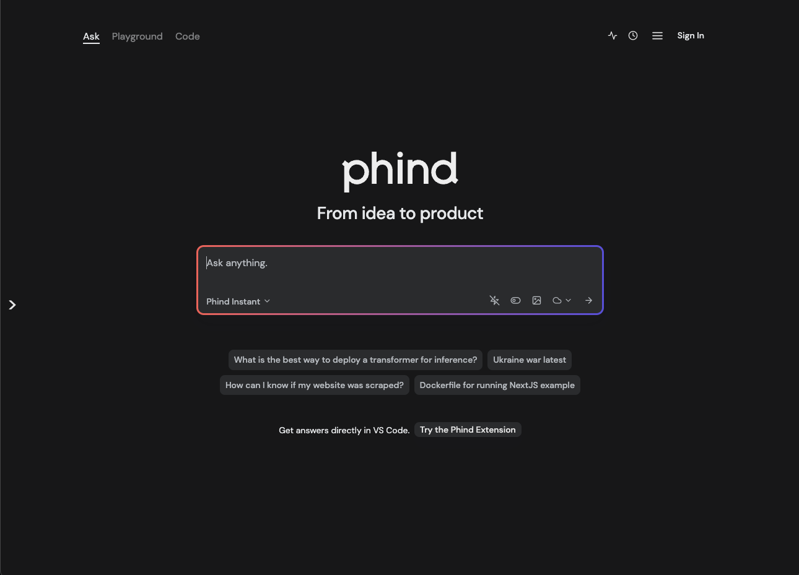
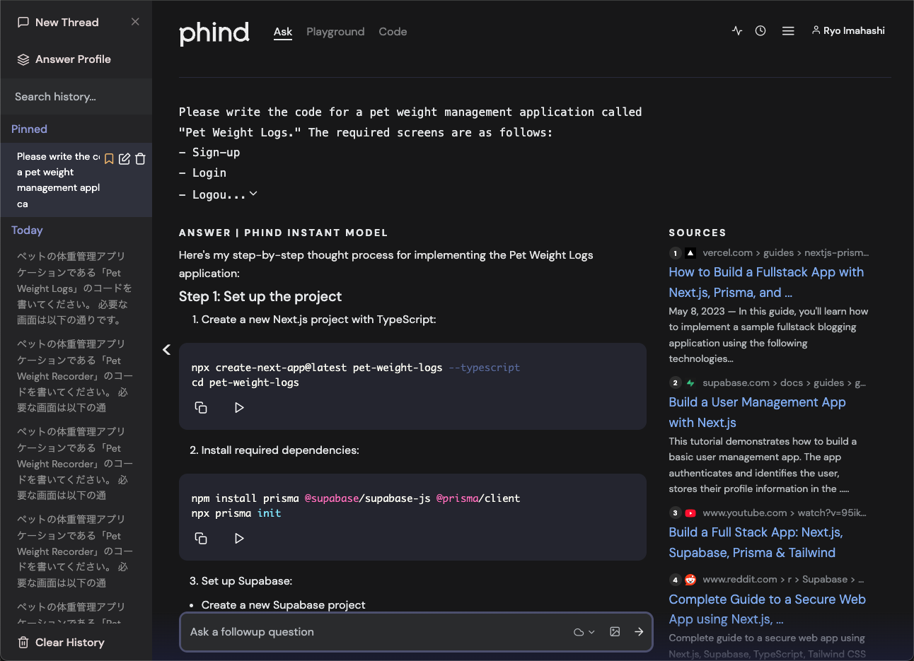
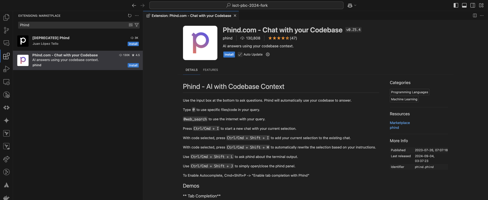
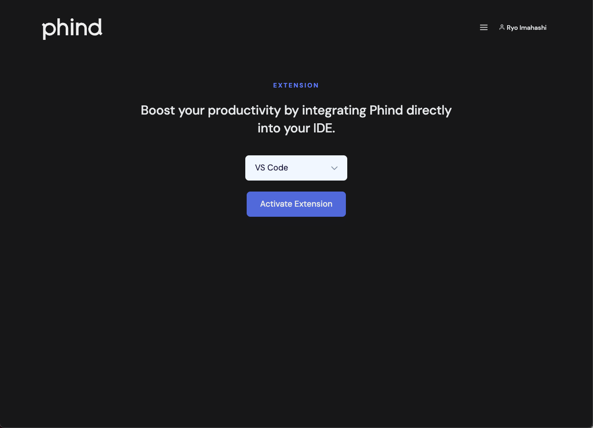

# 2. App development using generative AI

## Introduction of Phind
https://www.phind.com/




https://www.phind.com/about
> Phind is an intelligent answer engine for developers. Focused on helping you solve challenging problems, Phind uses generative AI to get you from an idea to a working product. Connected to the internet and, optionally, your codebase, Phind always maintains the right context.


https://www.phind.com/blog/phind-model-beats-gpt4-fast
> We're excited to announce that Phind now defaults to our own model that matches and exceeds GPT-4's coding abilities while running 5x faster. You can now get high quality answers for technical questions in 10 seconds instead of 50.


## Try Phind
- Visit following url and sign in.
  - https://www.phind.com/api/auth/signin
  

- Let's ask Phind following question.
```
Please write the code for a pet weight management application called "Pet Weight Logs." The required screens are as follows:
- Sign-up
- Login
- Logout
- Pet registration
- Pet list (home screen)
- Pet details
- Pet weight history (with option to register latest weight)

The languages and technologies to be used are as follows:
- TypeScript
- Next (for both frontend and backend)
- Route Handler
- Prisma (ORM)
- Supabase (DB)
- Vercel (Hosting)
- Tailwind CSS (Styling)
- npm (Package Manager)

The implementation approach will be as follows:
- Use Route Handlers to provide APIs
- Access to Prisma and Supabase will be made through API calls, performed on the backend
- Authentication will use Supabase Auth
- Do not use next-auth
```

日本語でもOK(Japanese is also available)
```
ペットの体重管理アプリケーションである「Pet Weight Logs」のコードを書いてください。
必要な画面は以下の通りです。

- サインアップ
- ログイン
- ログアウト
- ペット登録
- ペット一覧(ホーム画面)
- ペット詳細
- ペットの体重履歴(最新の体重も登録可能)

使用する言語や技術は以下のとおりです。
- Typescript
- Next(フロントエンド、バックエンド共に)
  - Route Handler
- Prisma(ORM)
- Suparbase(DB)
- Vercel(Hosting)
- tailwind css(Styling)
- npm(Package Manager)

実装の方針は以下のとおりです。
- Route Handlerを使ってAPIを提供する
- PrismaやSupabaseへのアクセスは全てAPIを呼び出し、バックエンド側で行う
- 認証はSupabase Authを使う
- next-authは使わない
```

You will get answers like the following.


## App development according to Phind's answer
Even if you ask the same question to the generating AI, the answer may change each time, so everyone should develop according to the answer to my question.

- Open this link.
  - https://www.phind.com/search?cache=vgttixdi3uc1z1m1dnstrwbi&source=sidebar
- Create a new folder "pet-weight-logs" on your PC, separate from the “isct-pbc-2024” you have been using so far, open that folder with Visual Studio Code.
  
- Follow the step-by-step guide to develop your app, starting with the following sections.
  


<!-- ## FYI: Phind VSCode Extension
https://marketplace.visualstudio.com/items?itemName=phind.phind






 -->
