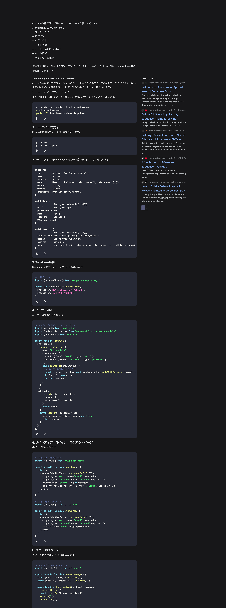

# 無料版 GPT でできること

無料版の ChatGPT では、最新の AI モデルである GPT-4o が利用可能です。ただし、GPT-4o の利用には 5 時間に 10 回までの制限があります。

この制限を超えると、自動的に GPT-4o mini が適用されます。GPT-4o mini は、GPT-4o の機能を一部制限したバージョンで、無料版ユーザーが引き続き ChatGPT を利用できるよう設計されています。

無料版の ChatGPT で利用できる GPT-4o mini には、以下の制限があります。

機能制限:

ブラウジング機能: GPT-4o mini では、インターネット上の最新情報を取得するブラウジング機能が利用できません。
カスタム GPT の作成: ユーザーが独自の GPT を作成する機能は、GPT-4o mini ではサポートされていません。
画像生成・認識: 画像の生成や認識機能は利用できません。
高度なデータ分析: データの高度な分析機能も提供されていません。
SHIFT AI
性能制限:

応答速度と精度: GPT-4o mini は、GPT-4o と比較して応答速度や精度が若干劣る場合があります。
SHIFT AI
これらの制限により、GPT-4o mini は主にテキストベースの基本的なタスクに適しています。高度な機能や最新情報へのアクセスが必要な場合は、GPT-4o の利用を検討してください。

# GPT-4o のデータソース

2023 年 10 月までの情報
https://exawizards.com/column/article/chatgpt/gpt-4o/

# GPT と v0 でのアプリ開発

- GPT 駆動開発：GPTs と共に進める効率的なアプリ開発
  https://zenn.dev/silverbirder/articles/8731693d3f3fca

- 巷で噂の shadcn/ui を Next.js で使ってみた
  https://qiita.com/twrcd1227/items/d4a67bb155503fde30f5

  - > shadcn/ui とは、これは Radix UI と Tailwind CSS を使って書かれた UI コンポーネントをまとめたもので、TailwindCSS を通じてスタイルをカスタマイズできる。2023 JavaScript Rising Stars では、全 Project で見事ランキング 1 位に輝いた!!

- 【AI 駆動開発】3 時間で完成！AI 勢揃い+Amplify を使って、弁当注文アプリを爆速開発＆リリース！(前編) #AI #v0 #ChatGPT #Phind #Amplify
  https://www.creationline.com/tech-blog/cloudnative/aws/70342

  - aa

- 【AI 駆動開発】ChatGPT はもう古い？Phind(フィンド)に乗り換えてみる！
  https://www.creationline.com/tech-blog/chatgpt-ai/ai/69246

  - https://qiita.com/mia106/items/c8f02fbb437d4c2654d4
    - Phind は無料で使える模様

- AI 開発ツール（Replit Agent, v0, chatGPT, Felo）をフル活用して Web アプリを爆速開発しました
  https://note.com/make_a_change/n/n75e3a0b6a06b

- 【AI 駆動開発】ChatGPT、v0、Cursor を組み合わせて爆速でアプリ開発してみよう！（バックエンド実装も含む） #ai-driven-dev #アプリ開発
  https://www.creationline.com/tech-blog/chatgpt-ai/ai/68971

- 2024.11.05【AI 駆動開発】「bolt.new」で UI デザイン＋フロント実装、デプロイまでを全自動化！AI 駆動開発が新フェーズへ #AI #v0 #bolt.new #ChatGPT
  https://www.creationline.com/tech-blog/chatgpt-ai/ai/75677
  - bolt.new でバックエンドまで作れて良さそうだけど、無料プランだと実用に耐えない。チャットのメッセージを 3 件送ったところで「You have hit the rate limit. Please Upgrade to keep chatting, or you can continue coding for free in the editor.」と表示された。

# 使いたい

## 技術スタック

- Next.js
- prisma
- supabase

## AI ツール

- GPT-4o mini ? Phind?
- v0
  - 200 クレジット/月
    - 無料だと利用上限があるので、実用に耐えないリスクがある。レクチャー内容には含めず、参考として紹介する程度に留めたほうが良いかも。あるいは、コード生成は試してもらいつつ、実際に使うコードはこちらから配布するのが良さそう。
    - vercel アカウントから作り直せば、クレジットが尽きてももう一度試せる。
- Cursor? VSCode?
  - Cursor は無料版だと使うメリットなさそう。GPT や Phind に聞いてそれを自分で反映するのと変わらない。
    - > Cursor の無料版における制限事項です。AI Chat からの Apply や、Composer は利用できません。Web メンション（Web 検索）は Gemini から使用できません。Open AI に対して Gemini の API キーを使おうとしてエラーになります。Open AI の API キーを登録して GPT 系のモデルを指定すれば使用できますが、費用が発生します。

# ToDo

- Phind で生成したコードの実行

# Phind

# 質問

## ペット

ペットの体重管理アプリケーションのコードを書いてください。
必要な画面は以下の通りです。

- サインアップ
- ログイン
- ログアウト
- ペット登録
- ペット一覧(ホーム画面)
- ペット詳細
- ペットの体重記録

使用する技術は、Next(フロントエンド、バックエンド共に)、Prisma(ORM)、suparbase(DB)でお願いします。

## アイデア

今から生成 AI を利用したプロダクトを開発します。
世界の AI 動向を踏まえてどのような AI プロダクトを作ると有益でしょうか？
売れるアプリ・システムを提案してください

## 要件定義

今から以下のアプリを開発します。UX に優れたアプリにしたいです。
完璧な要件定義書を作成してください。
またこの要件定義書は v0 に読み込ませてアプリを AI で自動生成する予定なので、AI が理解しやすいプロンプトになるように生成してください。

- **AI Youtube 動画 超まとめアプリ**
- ユーザーはまとめを見たい Youtube の URL をテキスト BOX に入力する
- すると長い Youtube を LLM がポイントを箇条書きでまとめてくれる
- また、まとめを表示している画面にはテキストボックスが配置されていて、知りたいこと（結局、今後アメリカ経済はどうなるの？など）を問いかけると、その動画の知識を使って LLM が回答してくれる

## v0 へのアプリ作成依頼

以下の要件定義に従ってモダンで洗練されたデザインの Web アプリを作成してください。
ヘッダーには、サイトロゴ、ユーザーアイコンを配置します。
メインセクションは要件定義を参照して作成してください
フッターには、会社情報、お問い合わせ、SNS リンクを含めてください。
カラーパレットは、ブランドカラーを使用し、全体的に統一感のあるデザインにしてください。
ブランドカラー：#91DFF1

要件定義書
{Felo で作成した要件定義書}

# 画面設計書の作成依頼

以下の要件定義書に従って、添付画面の画面設計書を作成してください
画面設計書には各画面の要素とアクション（ボタンクリックなど）に対する UI とバックエンドの動作を記載してください。

要件定義書
{Felo で生成した要件定義書}

# アプリ作成依頼

以下の設計書に従ってアプリを生成してください

要件定義書
{Felo で生成した要件定義書}

画面設計書
{ChatGPT で生成した画面設計書}

UI デザイン
添付画像を参照してください
